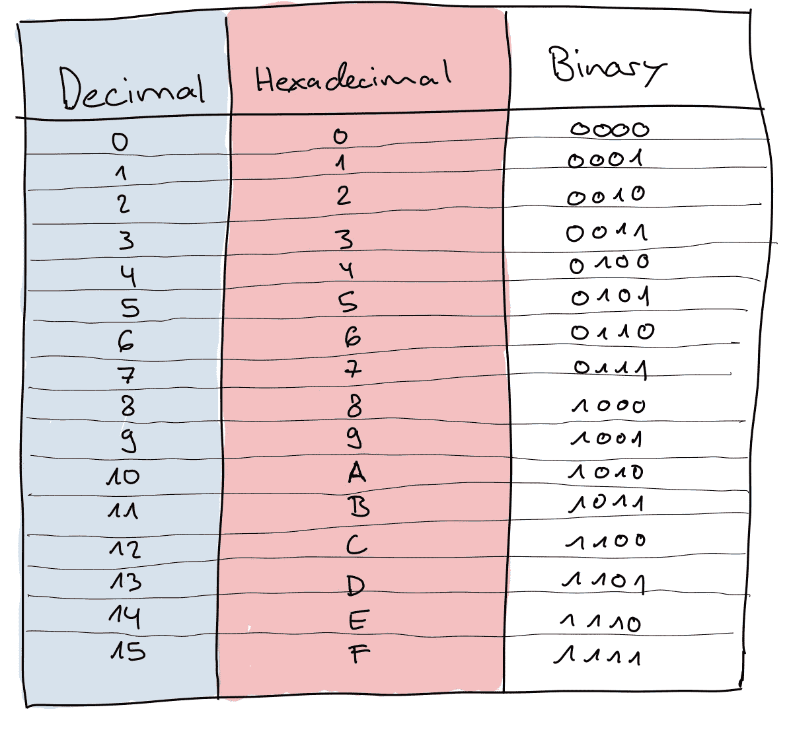
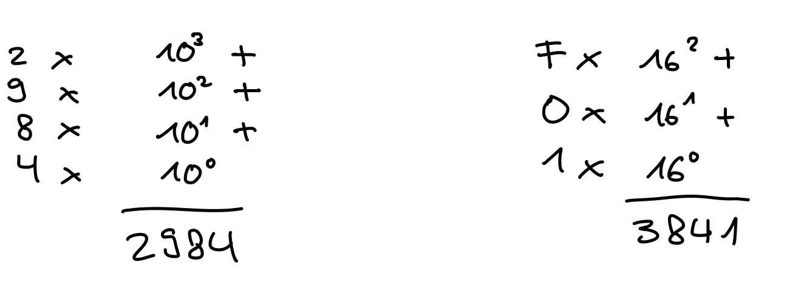

# 十六进制数字复习器

> 原文：<https://medium.com/codex/hexadecimal-numbers-refresher-d7649683f2ad?source=collection_archive---------7----------------------->

你有没有遇到过类似于`U+61`或`0xFF`或`#FFAA33`的东西，然后问自己这些字母和数字组合起来是什么意思？最近，我在学习 unicode。在人类创造的几乎所有语言中，Unicode 都为每个符号分配了数字(当然，只有那些有良好记录的语言)。这些数字通常表示为十六进制数(例如`U+61`)。

如果我看到这些数字，我会更有信心。因此，我决定修改我对十六进制数的不稳定理解。我想凭直觉知道这些数字有多大。此外，我希望能够从一个基地到另一个翻译。比方说从十六进制到十进制。

因为我相信通过博客文章分享我的学习之路，我为你总结了我关于十六进制系统的学习。我不时发布问题，解决方案在这篇短文的底部😊

在另一篇文章中，我可能会写我使用 unicode 的经历。

# 什么是数字系统

十六进制就像任何其他数字或计数系统。这些系统的基础在数学上有所不同。例如，你熟悉以 10 为基数的数字系统。这个系统有 10 个数字(0 到 9)组成所有可能存在的数字。

你开始数 0，1，2，3，4，5，6，7，8，9，然后用 10，11，12 之前的数字组合，以此类推。

十六进制的基数是 16。但是我们应该用哪些字母或数字数到 16 呢？

人们同意使用字母 A 到 f。然而，在 20 世纪 50 年代和 60 年代，许多其他的符号、字母和数字被提出。例如，一些旧电脑使用 u，v，w，x，y 和 z。

照片由 [Ugi K.](https://unsplash.com/@wizzyfx?utm_source=medium&utm_medium=referral) 在 [Unsplash](https://unsplash.com?utm_source=medium&utm_medium=referral) 上拍摄

但是让我们用十六进制数一次

`0, 1, 2, 3, 4, 5, 6, 7, 8, 9, A, B, C, D, E, F, 00, 01, 02, 03 …, 09, 0A, 0B, 0C, 0D, 0E, 0F, 10, 11, 12, 13, 14, 15, 16, 17, 18, 19, 1A, 1B, ... 1F, 20`

好吧，你觉得你明白了吗？`19F`后面是哪个数字？容易吗？`100`之前的数字是多少？

# 为什么十六进制在编程中被广泛使用？

它有实际的原因。与位编号计数系统(如`1011`)相比，十六进制对人类来说更易读。但它同时也具有这样的优点，即十六进制数允许快速转换成逐位数表示。也就是说，从十六进制代码转换成二进制代码比从十进制代码转换成二进制代码更容易，同时对人类仍然可读。

让我们看看如何从二进制转换成十六进制。在十六进制中，我们有 16 个不同的符号(基数为 16)。具有 4 位的半字节(半字节)可以代表 16 个不同的符号。

这意味着每个字节可以用两个十六进制符号来表示。我们可以把一个字节分成两个半字节。一个字节可以从

`0 0 0 0 0 0 0 0`到`1 1 1 1 1 1 1 1`。

在十六进制中我们可以写出一个字节可以从`00`到`FF`。这比写 8 位数或使用 256 个不同的数字要容易。

按作者

# 从十六进制到十进制的翻译

我已经向你展示了如何用十六进制计数，以及十六进制数如何表示半字节。我相信你知道`F`代表什么。`15`正是。但是十进制的`FFF`是什么？

从十六进制到十进制的转换在开始时可能不清楚，并且脱离了你的直觉。如果你以前尝试过，但失败了，我想我可以让你自己推导出公式。

让我们从一个符号开始。`A`、`A`在`9`之后，因此是`10`。那很容易。

那`F01`呢？容易吗？我为你计算这个例子。`3841`。

它是如何工作的？

对于小数来说很像，没什么大不了的！

你如何分解一个像 2984 这样的十进制数？也许你还记得中学或小学的时候。

`10^3 * 2 + 10^2 * 9 + 10^1 * 8 + 10^0 * 4 = 2000 + 900 + 80 + 4 = 2984`

这和把十进制数字翻译成十六进制数字没什么区别。我们可以按照同样的逻辑让我们熟悉十六进制。十六进制并不神奇，但它扰乱了人类推理的一个领域，这个领域对我们来说是如此自然，以至于对我们中的一些人来说，很难在 10 进制之外思考。在`F01`之前的示例评估为

`16^2 * 15 + 16^1 * 0 + 16^0 * 1 = 3841`

按作者

# 从十进制到十六进制的翻译

让我们把 3841 翻译回`F01`

我们知道我们必须找到一个常数的 16 次方的因子。16^3 = 4096 大于 3841，因此不是分解的一部分。但是 16^2=256 在 3841 年能容纳多少次呢？15 倍！余数是 1。

16 (16^1)不适合 1。只有 1 适合 1。16^0 = 1.这样结果就是`F01`。

我们来做第二个例子。

十六进制的 783？

1.  783 // 256 = **3**
2.  783 % 256 = 15
3.  15 // 16 = **0**
4.  15 % 16 = 15
5.  15 // 1 = **15 = F**

这使得 **30F** 。我希望你足够自信。你自己试试这个。解决方法在文末:十六进制的 6020？

# 你在野外会遇到什么形式的十六进制数字？

根据我的经验，十六进制数在开始时很难被发现，因为存在许多约定，并且每个约定决定以不同的方式书写十六进制数。我给你们看几个不同的例子，这些例子在实践中非常常见

*   Unix、C 和 C 后代编程语言使用前缀 0x，即。FF (255)变成 0xFF。
*   字符和字符串可以用前缀\x 表示十六进制，1B 变成\x1B
*   在 Unicode 中，使用前缀 U+。例如 U+122
*   HTML 或 CSS 中的颜色引用用 6 个十六进制数字表示。每种 RGB 颜色两个，它们使用#作为前缀。#FFAA33 是金橙色。

# 摘要

十六进制数与普通的十进制数有些不同。这就是你在阅读这篇文章之前的想法。现在，完成后，你有希望意识到它非常类似于常规的十进制数字系统。在介绍如何将十六进制转换成十进制的那一节中所做的比较可能让您明白了这一点。你有希望认识到十六进制数字的广泛使用，你可以在任何流行的命名约定中发现它们。

解决方案:

`19F`后面的数字是`1A0`

先前给`100`的号码是`FF`

基数 10 /基数 16

6020 = 1784

您可以随时在这里测试自己:

 [## 0x10FFFF = 1114111

### 0x10FFFF 转换为 1，114，111。将十六进制转换成十进制，二进制，八进制。

www.hexadecimaldictionary.com](https://www.hexadecimaldictionary.com/hexadecimal/0x10FFFF/) 

# 我的一些文章

**ML 项目的 Git 基础知识**

 [## 学习 ML 项目的 Git 基础知识

### 开始使用 Git，并通过使用模拟真实软件和机器学习工程师的工作方式…

towardsdatascience.com](https://towardsdatascience.com/learn-git-basics-for-your-ml-project-46ecf03865b) 

**ML 项目的 Git 分支**

 [## 用您的 ML 项目学习 Git 分支

### MLE 项目的版本控制至关重要。这是它的工作原理。

towardsdatascience.com](https://towardsdatascience.com/learn-git-branches-with-your-ml-project-7f58bdf1ae80)