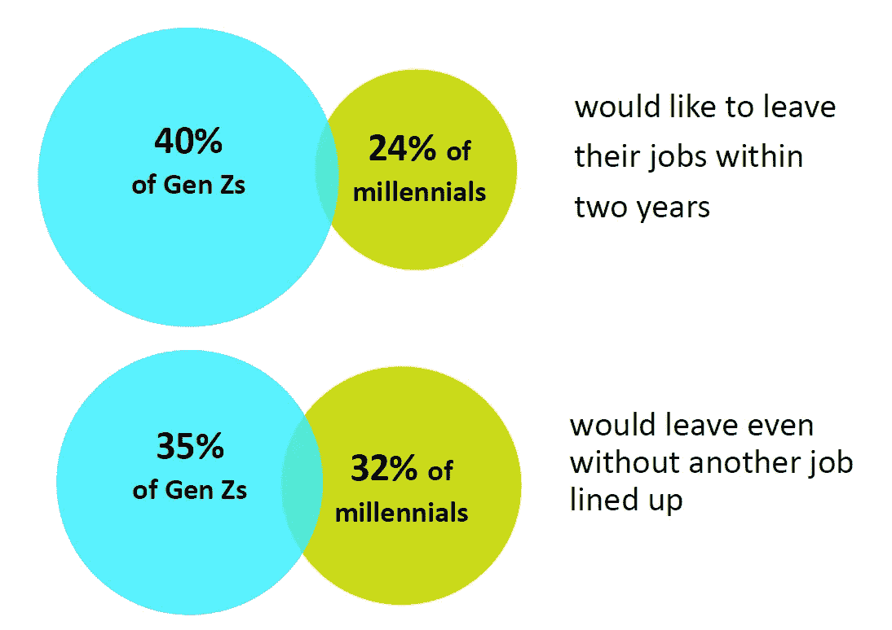

# 嘿，Z 世代的工人们，慢点…

> 原文：<https://medium.com/codex/hey-gen-z-workers-slow-down-82d3b15a8846?source=collection_archive---------11----------------------->

贾科莫·卢卡里尼在 [Unsplash](https://unsplash.com?utm_source=medium&utm_medium=referral) 上拍摄的照片

Zoomers 或 say GenZ 已经有一段时间没有进入主流企业了。作为一个在婴儿潮一代和千禧年早期工作过的千禧年后一代，现在指导 Zoomers，我可以清楚地指出 Z 世代工人与千禧一代不同的一些行为。它包括好的和坏的特质。

## 动物的一些不好的特性:

1.  他们往往在开始某件事时精力过剩，兴奋不已，随着时间的推移逐渐失去兴趣。
2.  做每件事都忙忙碌碌，不了解背后的意图或更大的图景。
3.  认为自己是“无所不知”的人。
4.  说得多，听得少，适应不了。
5.  有时候会很直白。
6.  什么都学，但不深究。——万事通，无所不能。
7.  雇主“什么都想要”的要求有时甚至是不合理和不现实的。

## 动物的一些优良特性:

1.  如果他们保持他们的兴奋完好无损，可以取得一些令人难以置信的结果。
2.  学东西比千年人还快。
3.  虽然他们要求“想要一切”，但他们愿意从自己的角度“付出一切”。
4.  他们的直率有时可以被认为是他们的被动。

这些是上千年动物学家的观察结果，但这就意味着这些是真的吗？真理只能从统计数据中定义。让我们来看一些统计数据。

## 统计？

我推荐你看一下[这份](https://www2.deloitte.com/global/en/pages/about-deloitte/articles/genzmillennialsurvey.html)德勤报告。但总而言之，以下是 zoomers 和千禧一代更希望从他们的潜在雇主那里得到的东西。

显而易见，千禧一代比千禧一代更注重工作/生活的平衡以及工作的意义感。

从心理上来说，人们无意从工作、爱好或一般生活中寻找意义，因此容易感到不满。这也反映在报告中。

很明显，GenZs 倾向于变得紧张和疲惫超过一千年。同样有几个原因。其中很多都是由上面提到的不好的特质造成的，比如开始时过度兴奋，忙碌，但随着时间的推移，失去了兴趣。

这种压力会导致类似于巨大的顺从。

这并不意味着一个人应该坚持他/她不喜欢的工作，但如果你在找到你的“快乐之地”后仍然不开心，有压力，那就需要一些自我反省了。

大辞职可能不会很快结束的原因是，那些参与大辞职的人，主要是 GenZ 和千禧年后期，他们往往是“想要一切”的员工。没有一个组织会慷慨地向他们“提供一切”。所以他们不停地跳来跳去，不断增加他们的压力。

## 所以这就是为什么我建议动物学家放慢脚步，深呼吸，观察，意识和适应。