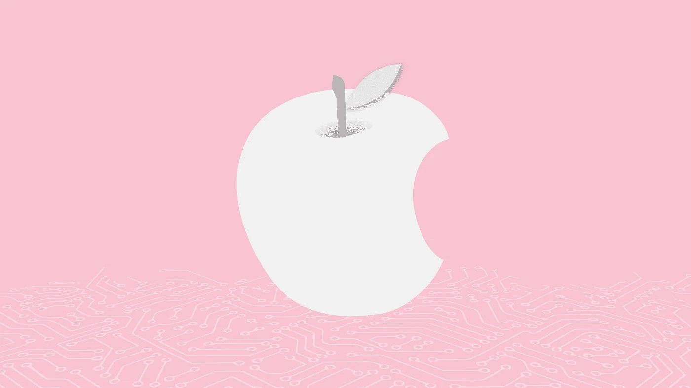

# 嘿 Siri，苹果对人工智能做了什么？

> 原文：<https://medium.com/codex/hey-siri-what-is-apple-is-doing-with-ai-c7d8274b59e9?source=collection_archive---------8----------------------->

由 Atsutaka Odaira 创建的图像

机器学习(ML)和人工智能(AI)现在几乎出现在 iPhone 的每个方面，但苹果没有像一些竞争对手那样积极地推动这些创新。苹果在过去并没有一个作为这个领域领导者的主流形象。这在一定程度上是由于人们将 AI 等同于数字助理，批评者经常将 Siri 描述为不如谷歌助理或亚马逊 Alexa 有帮助。而且，谈到机器学习，许多科技迷认为更多的数据等于改进的模型——但苹果不像谷歌那样受欢迎。这种情况很快就会改变。这是著名科技巨头如何与人工智能合作/开发系列的第三部分。

苹果对形势的重视程度，从他们收购 AI 相关公司就能看出来。根据 GlobalData 发布的报告，苹果是全球人工智能市场上公司的主要买家。苹果在 2016 年至 2020 年间收购了最多的人工智能公司，超过了埃森哲、谷歌、微软和脸书，这些公司都进行了大量的人工智能收购。

苹果近年来收购了 Emotient、Turi、Glimpse、RealFace、Shazam、SensoMotoric、Silk Labs、Drive.ai、Laserlike、SpectralEdge、Voysis、XNOR.ai 等公司，以提高其产品和服务的人工智能和机器学习能力。此外，苹果没有披露其所有的收购，因此很可能苹果已经收购了其他未被注意的人工智能公司。

苹果首席执行官蒂姆·库克在 2 月份的股东大会上表示，该公司在此前的六年中已经收购了近 100 家公司。“我们不惧怕任何规模的收购，”库克说。“我们关注的是那些补充我们产品并帮助推动其发展的创新型小公司。”苹果的许多投资都是为了加强 Siri。苹果购买 Inductiv 是为了增强 Siri 的数据，而 Voysis 是为了升级 Siri 的自然语言理解。与此同时，PullString 使 iOS 开发者可以轻松地将 Siri 功能融入他们的应用程序中。

苹果的人工智能狂欢并没有随着收购人工智能初创公司而结束。他们从直接竞争对手那里挖走了人才。苹果负责机器学习和人工智能战略的高级副总裁 John Giannandrea，以及产品营销副总裁 Bob Borchers，他们在过去几年加入苹果之前曾在谷歌工作。在短暂的中断后，Borchers 回到了苹果，担任 iPhone 的高级营销总监，直到 2009 年。而 Giannandrea 2018 年从谷歌离职到苹果，被大肆宣传；他当时是谷歌的人工智能和搜索负责人。

谷歌和苹果是两个非常独立的企业。谷歌以参与并在某些情况下领导人工智能研究小组而闻名，而苹果过去常常关起门来做大部分工作。这种情况近年来发生了变化，因为机器学习推动了苹果设备的几项功能，该公司扩大了对人工智能社区的参与，拥抱了人工智能研究的开放性，这可能归功于新的人员。

那么，苹果用 ML 和 AI 做什么呢？在最近的会议上，苹果已经习惯于将机器学习与增强 iPhone、Apple Watch 或 iPad 的某些功能相提并论，但它几乎没有涉及任何细节——大多数购买 iPhone 的人从来没有看过这样的演示。这与谷歌形成对比，谷歌将人工智能置于其大部分用户信息的核心。苹果的应用程序和应用程序中使用了几个机器学习的例子，其中大多数是在过去几年中推出的。

ML 用于帮助 iPad 的程序区分用户在用 Apple Pencil 绘图时无意中将手掌压在屏幕上和有意按压以提供反馈。它用于跟踪用户的消费模式，以最大限度地延长智能手机的电池寿命和充电时间，允许用户在充电之间投入更多时间，但仍然保护电池的长期生存能力。用来做 app 建议的。

然后是 Siri，这可能是任何 iPhone 用户听到“人工智能”一词时想到的第一件事。机器学习为 Siri 的许多方面提供了动力，从语音识别到 Siri 提供有用响应的努力。聪明的 iPhone 用户还会注意到，机器学习是 Images 应用程序能够自动将照片分类到预先制作的图库中，或者在 Jane 的名字被插入应用程序的搜索区域时正确返回她的照片的基础。

只有少数消费者可能意识到机器学习正在发挥作用。例如，当你按下 iPhone 上的快门按钮时，它可以快速连续拍摄几张照片。之后，ML 训练的算法分析每幅图像，并可以将每幅图像的最佳部分组合成单个结果。手机长期以来一直使用图像信号处理器(ISP)来改善数字和实时的图片输出，但苹果在 2018 年改进了这一过程，让 iPhone 中的 ISP 与该公司新推出的专注于机器学习的处理器神经引擎密切合作。

如果主要的科技公司和风险投资是可信的，人工智能和机器学习只会在未来几年变得更受欢迎。不管发生什么，Giannandrea 和 Borchers 认为，机器学习现在在苹果公司为其产品所做的许多事情中发挥着作用，以及用户经常使用的许多功能。而且，随着去年秋天 MAC 电脑中的神经引擎，人工智能在苹果的重要性可能会上升。与众不同是苹果的一个优点，它在人工智能领域的思维肯定是与众不同的。

如果您对我们的服务感兴趣，请在以下链接中注册您的电子邮件地址，以便尽早访问和测试我们全新的预印本平台，该平台通过人工智能引擎提供无压力的搜索体验。

https://onikle.io/

*作者:万诺诺·伊克蒂德*