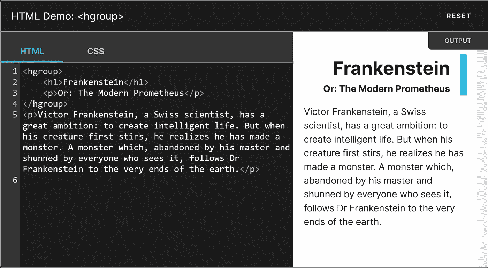

# 所以

<hgroup>又回到了 HTML 5，和以前一样笨！</hgroup>

> 原文：<https://medium.com/codex/so-hgroup-is-back-in-html-5-and-dumb-as-ever-c81e00f6320d?source=collection_archive---------0----------------------->

早在十多年前，当 WhatWG 首次致力于 HTML 5 时，他们引入了

<hgroup>标签，将标题和标语之类的数字标题组合在一起。这立即引起了理解 HTML 语义的人的愤怒，因为把 H1 和 H2 放在一起是无知的胡说八道。很多— *我自己包括* —把它作为**证明** — *与* ***<一并验收把>*** *嵌入 spec，他们的* …</hgroup>