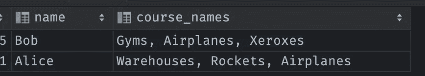
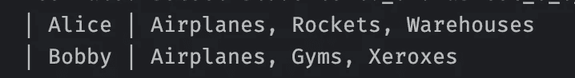

# Hibernate 对于 string_agg 或者按嵌套集合排序来说比较困难

> 原文：<https://medium.com/codex/hibernate-is-difficult-for-string-agg-or-sorting-by-a-nested-aggregated-collection-f1b3d3132729?source=collection_archive---------14----------------------->

当你需要它们的时候，有一些技巧和几乎没有用例。

分类鸟类

## 我们将在此介绍的内容:

1.设置通过嵌套集合排序的用例
2。提出一个问题
3。展示如何在原生 SQL
4 中实现这一点。展示如何使用 HQL 作为解决方案
5。结束这个故事

## 用例:有指定课程的学生

其中有一个管理员，出于某种原因，他希望将所有学生按他们的课程组合在一列中进行排序。

不仅课程本身必须在列中排序，我们还必须确保根据这种排序对学生进行排序😞。如今的要求是疯狂的。

这个模型对于这个练习来说非常简单:

没有课程的学生就像没有马的牛仔

## 问题 hibernate 没有现成的支持

你可以尝试用 hibernate magic 排序，不要太成功，因为它不会为你聚合课程

如果查看生成的 sql，失败是显而易见的。这是一个非常基本的分类，没有考虑到所有其他课程

## 原生 SQL 方法

首先，我们必须确保课程本身已经分类

不是我们想要的

我们可以用上面的原生 SQL 实现我们想要的，但是 Hibernate 本身没有任何好处。

但这很有效🤔让我们装运它。

## 用 Spring 数据逼近(或者 Hibernate？)

首先，我们需要为 Hibernate 注册自定义函数来启用聚合和内部排序(参见`ORDER BY ?3`技巧)

不要忘记在 application.properties 中启用此对话框，如“spring . JPA . properties . hibernate . dialect = com . example . hibernate fun . postgresrichdialect”

现在，我们可以使用聚合在几乎是普通的查询语言上构建一个查询，这正好给出了我们想要的结果:

方法调用和默认排序调用的用法很简单:

代码示例

期待已久的结果

**结论** —不使用 hibernate 或任何 ORM，坚持死简单 jdbc。但是如果你有兴趣尝试一下上面的代码，去回购[https://github.com/anatolyD/hibernate-aggs](https://github.com/anatolyD/hibernate-aggs)的测试部分