# 分层聚类

> 原文：<https://medium.com/codex/hierarchical-clustering-c78e76fa33f4?source=collection_archive---------10----------------------->

## 与 Kmeans 不同，在层次聚类中，我们不需要在开始时定义聚类的数量。

**类型**

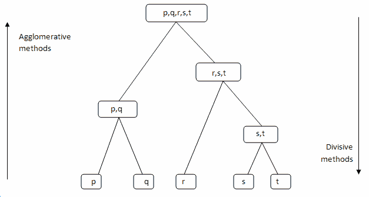

**凝聚式层次聚类**

凝聚层次聚类是最常见的层次聚类类型，用于根据相似性将对象分组。这是一种自下而上的方法，每个观察从自己的聚类开始，随着一个观察在层次结构中向上移动，聚类对被合并。

假设有 4 个数据点。我们将把这些点中的每一个分配给一个集群，因此在开始时将有 4 个集群。

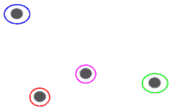

然后，在每次迭代中，我们合并最近的一对聚类，并重复这一步骤，直到只剩下一个聚类。

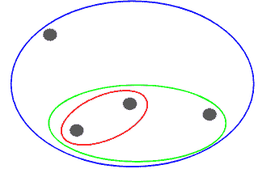

**分裂式层次聚类**

分裂式层次聚类在解决现实世界的问题时并不常用。它的工作方式与聚集聚类相反。在这种情况下，我们从所有数据点作为一个单独的集群开始。在每次迭代中，我们分离不相似的最远的点或聚类，直到每个数据点被认为是一个单独的聚类。这里我们将单个聚类分成 n 个聚类，因此称为分裂聚类。

不管我们有 10 或 1000 个数据点。所有这些点在开始时将属于同一个集群:

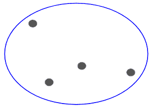

现在，在每次迭代中，我们分割聚类中最远的点，并重复这个过程，直到每个聚类只包含一个点:

**层次聚类使用两个重要参数**

1.  距离的度量(相似性)

a.可以使用以下指标计算相似性

b.汉娩距

c.曼哈顿距离(出租车或城市街区)

d.闵可夫斯基距离

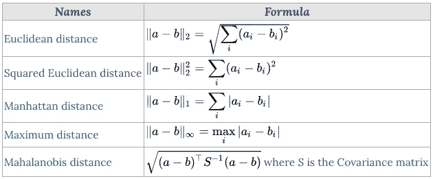

2.链接标准

选择距离度量后，需要确定距离的计算起点。链接标准指的是如何计算聚类之间的距离。

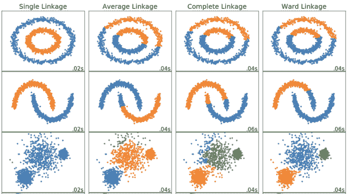

**单联动**

两个聚类之间的距离是每个聚类中两点之间的最短距离。

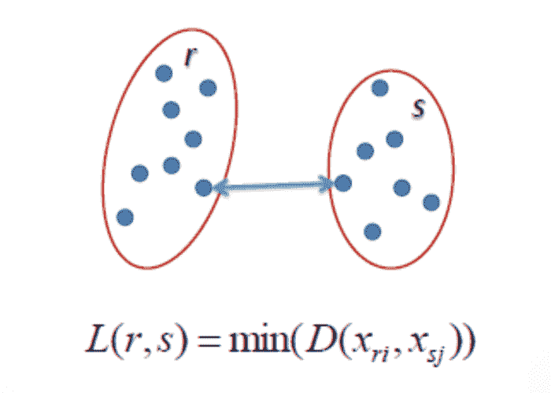

**完成联动**

两个聚类之间的距离是每个聚类中两点之间的最长距离。

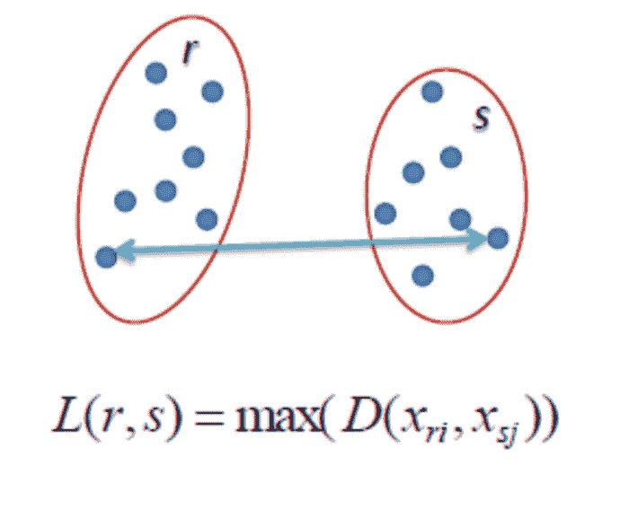

**平均联动**

聚类之间的距离是一个聚类中的每个点到另一个聚类中的每个点的平均距离。

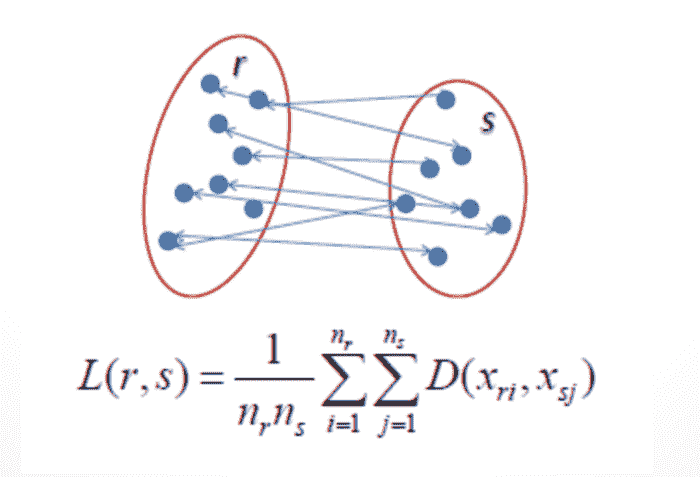

**病房联动**

聚类之间的距离是所有聚类内的平方差之和。

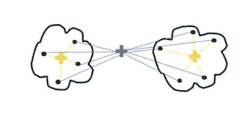

**算法工作流程:**

凝聚的基本算法是简单明了的。

*   计算邻近矩阵
*   让每个数据点成为一个集群
*   重复:合并两个最近的聚类并更新邻近矩阵
*   直到只剩下一个集群

关键操作是计算两个聚类的接近度

为了更好地理解，让我们看一个凝聚层次聚类技术的图示。假设我们有六个数据点{A，B，C，D，E，F}。

*   步骤 1:在初始步骤中，我们计算各个点的接近度，并将所有六个数据点视为独立的聚类，如下图所示。

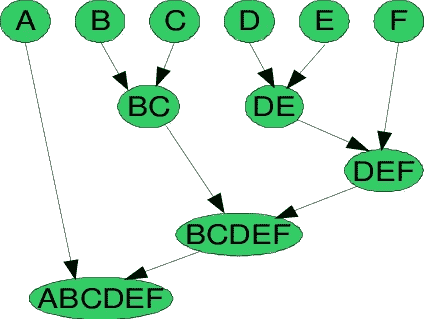

凝聚层次聚类技术

*   步骤 2:在步骤 2 中，相似的聚类被合并在一起并形成单个聚类。让我们考虑 B、C 和 D、E 是在第二步中合并的相似集群。现在，我们剩下四个集群，分别是 A，BC，DE，f。
*   步骤 3:我们再次计算新聚类的接近度，并合并相似的聚类以形成新的聚类 A、BC、DEF。
*   步骤 4:计算新群的接近度。聚类 DEF 和 BC 是相似的，并且合并在一起以形成新的聚类。我们现在剩下两个星团 A，BCDEF。
*   第 5 步:最后，所有的集群合并在一起，形成一个单一的集群。

层次聚类技术可以用**树状图来形象化。**

**树状图**是一个树形图，记录了合并或拆分的顺序。

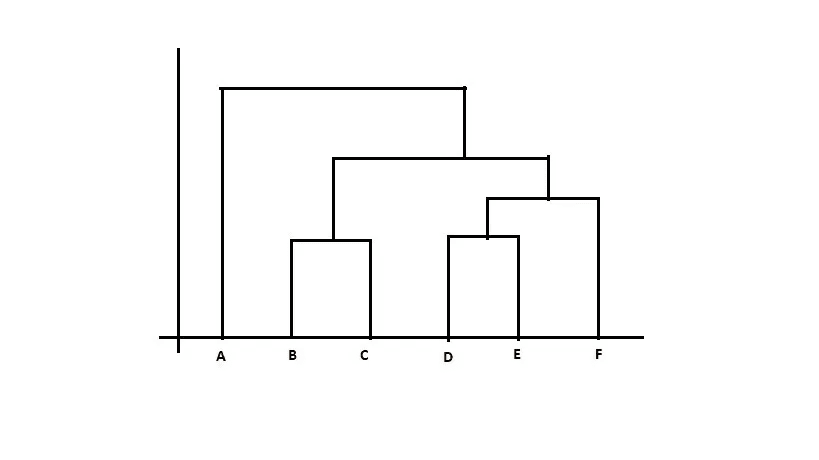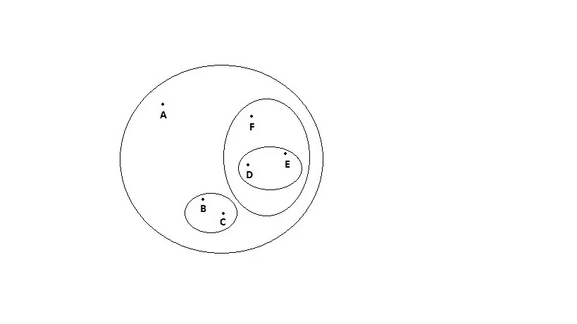