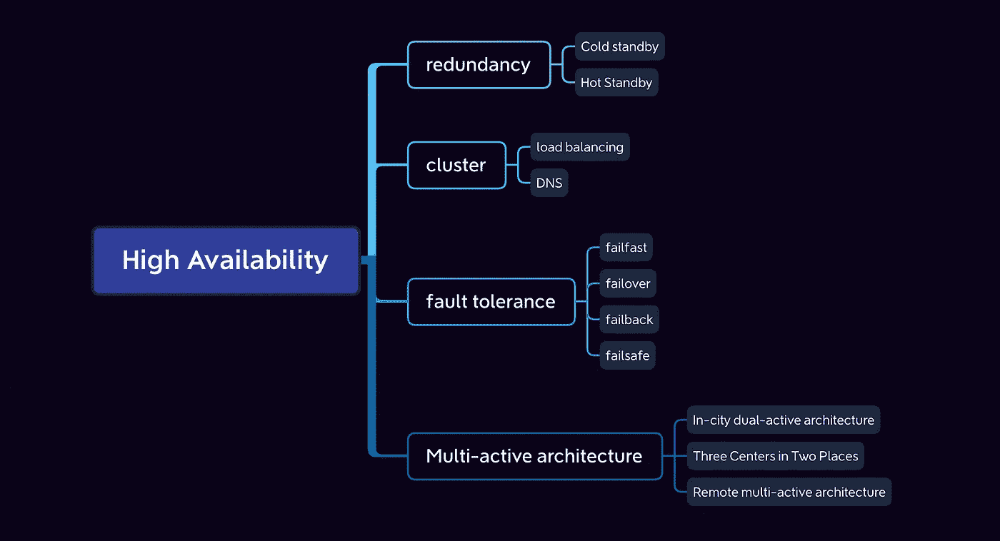

# 高可用性:你知道多少？

> 原文：<https://medium.com/codex/high-availability-how-much-do-you-know-d9d7eb45ce86?source=collection_archive---------13----------------------->

对于我的大多数朋友来说，高可用性是在项目中经常遇到的，因为这是衡量 IT 系统服务质量的一个极其重要的参考。高可用性对于解决方案的设计和实施都非常重要。在这篇文章中，我们一起来讨论一下，平时遇到的解决方法有哪些？

# 选项 1:冗余