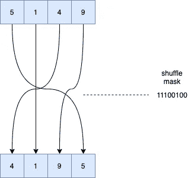
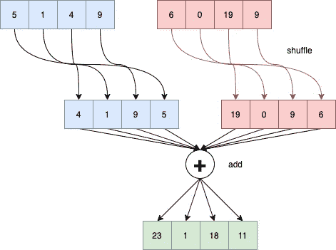

# 高性能随机数:梅森扭结器的替代方案

> 原文：<https://medium.com/codex/high-performance-random-numbers-a-mersenne-twister-alternative-cf827d89897a?source=collection_archive---------1----------------------->


埃菲社在 [Unsplash](https://unsplash.com?utm_source=medium&utm_medium=referral) 上拍摄的照片

随机数及其生成对于几乎所有产品级软件都至关重要。它们大量用于游戏、人工智能、功能测试等等。然而，尽管在如此广泛的应用中普遍存在，但生成它们的算法和方法在过去的 25 年中并没有太大的变化。典型地，伪随机数发生器(PRNG)被分为两类，一类是加密的，另一类是非加密的，并且作为随机性和速度之间的平衡。用于非加密用例的主要一个被称为[梅森扭转器](https://en.wikipedia.org/wiki/Mersenne_Twister)。

Mersenne twister 最初是由松本诚和西村拓治在 1997 年开发的。它主要基于使用[梅森素数](https://en.wikipedia.org/wiki/Mersenne_prime)作为周期的概念。Mersenne twister 在各种流行的编程语言以及许多商业应用程序中被用作 PRNG。它依赖于一个相当大的国家，并提供充足的性能。这个可以改进吗？PRNG 有可能以最小的随机性和内存使用牺牲来击败梅森图吗？

我将尝试通过使用不同的算法生成随机数来回答这个问题。这种替代算法的独特属性称为 FY5Z，它可以使用 SIMD 内在指令进行完全优化。我们将评估与 Mersenne twister 相比的性能和随机性效率。

# FY5Z:前进洗牌机

SIMD 指令，如 x86 机器上广泛使用的 SSE2 集，提供了一次对 128 位数据执行向量运算的能力。在整数的情况下，这意味着每个向量中同时有两个 64 位整数或四个 32 位整数。在大多数处理器上，诸如加法或减法之类的基本操作通常每条指令不到一个时钟周期。然而，使用最简单的操作不足以达到高效或可容忍的随机性水平。为了速度而牺牲任何实质上的随机分布，完全违背了 PRNG 的目的。因此，需要一些更有影响力的操作。

SIMD 指令集，如 SSE2，提供了称为混洗的特殊操作，在常规汇编中没有直接的等价操作。在高级别上，混洗是根据掩码或控制整数改变数据顺序的操作。把这想象成*并行交换*。对于 SSE2 集合，仅在 [16 或 32 位整数](https://software.intel.com/sites/landingpage/IntrinsicsGuide/#techs=SSE2&text=shuffle)上支持混洗。这两种类型的操作，加法和洗牌，可以用来创建一个有效的大国家与一个较小的周期。这是通过将 shuffle 的子状态“携带”到某个更大的状态来实现的，比如一个整数数组。四个 32 位整数的单次混洗可以如下所示:



使用八位控制掩码混洗每组四个整数，使得掩码的每两位代表一个槽，在操作之后，索引槽中的整数应该被放置。例如，如果掩码中的第一个两位整数是 3，这意味着 128 位向量中的第一个 32 位整数移动到结果向量中的最后一个槽。

假设有一个 32 位整数的向量。为了混洗所有的整数，需要每四个整数混洗一次，直到我们混洗了`n`个整数。然而，目标是产生伪随机数，而不仅仅是洗牌。需要一些其他操作来增加随机数发生器中所谓的*周期*，即一个数重复之前的世代数。对于这种情况，将使用将混洗的整数添加到另一个向量，该向量跨代保持其状态。这确保了会有很大可变性和传播。

两个操作可以组合成一个称为前向洗牌的东西，这是一个由跨越一个更大的状态向量的所有洗牌操作的总和形成的向量。这样的操作可以被认为如下:



# 测试:性能

击败 Mersenne twister 的第一个测试是性能问题。可以编写一个 PRNG 来更快地生成伪随机数吗？该测试在四核 i7 英特尔 Haswell 处理器上并排比较了 Mersenne Twister 和 Fy5z 的实施。对于 Fy5z 的实现，前向混洗的顺序被线性测试，其中向量状态的每个部分被顺序混洗和求和，以及分组密码版本，其中混洗的顺序是混沌顺序。为了增加熵和随机性，在添加到混洗整数的值上使用了额外的掩码。使得不是将混洗的整数加回先前的向量，而是将它们加到掩码，然后存储在状态向量中。Fy5z 的实现如下:

这个实现将会和 Mersenne twister 的标准 C 实现进行测试，可以在这里找到。在 50 次产生 1000 万个随机数的试验中，以微秒计的平均结果是:

```
Running: 'Mersenne Twister' took 109224 u/s
Running: 'fy5z' took 62958 u/s
Running: 'fy5z_block' took 67703 u/s
```

幸运的是，Fy5z 的实现确实优于 Mersenne Twister。为什么会这样？首先，MT 是在每个整数的基础上操作的，它是一个标量算法。其中这种新的正向洗牌是以并行的向量方式进行的。鉴于此，这并不试图使用 AVX 和更近期的 SIMD 指令，有很少或没有风险被低于时钟在 CPU 的水平。在这里，“块”变体的执行速度似乎比非块变体要慢一些。这可能有多种原因，但最主要的是，以标量方式(非矢量化)索引一个`static`数组所增加的开销会降低性能。

除了速度，PRNG 的一个非常重要的属性是它的随机程度。不检查随机数生成器的随机程度，就不能盲目地庆祝速度的提高。

# 测试:随机性

我们可以用多种方式测试 PRNG 实现的随机性。最生动和详细的方式，虽然是一个图形和绘图测试。对于这个测试，两个 PRNGs 都将生成一些等效的随机二维坐标。这些坐标将用于在橙色“画布”上绘制黑点。目的是描绘出每个生成器的输出是什么样子，以及每个生成的输出的分布和排列。

为此，可以使用一个 [cmake 项目和一个简单的 C 程序](https://github.com/jweinst1/png-maker/blob/master/CMakeLists.txt)，该程序使用了为处理和编辑可移植网络图形(PNG)图像而开发的原始库`libpng`，可以用来“绘制”生成的随机数。下面你看到的图像是 png 图像，颜色深度为 1 位，调色板为 2 色。这意味着每个像素由一位表示，允许高压缩率。第一个结果是 Fy5z 的:


Fy5z PRNG

然后，梅森图的结果是:


梅森龙卷风 PRNG

正如人们所看到的，这两者之间有显著的区别。虽然 Fy5z 版本仍然实现了伪随机分布，但它具有稀疏可见的线，并且当与 Mersenne Twister 图像相比时，坐标重叠。另一方面，梅森龙卷风几乎没有明显的模式，看起来更加随机。

为什么会这样呢？一种可能性是周期。Fy5z 的周期比 Mersenne Twister 短，导致在相同数量的世代中可能会发生更多的碰撞。总的来说，这些测试表明 PRNGs 的更快实现确实是可能的。然而，这样做可能会导致随机性下降，因此需要更多的尽职调查来创建在最大性能和随机性方面表现出色的 PRNGs。