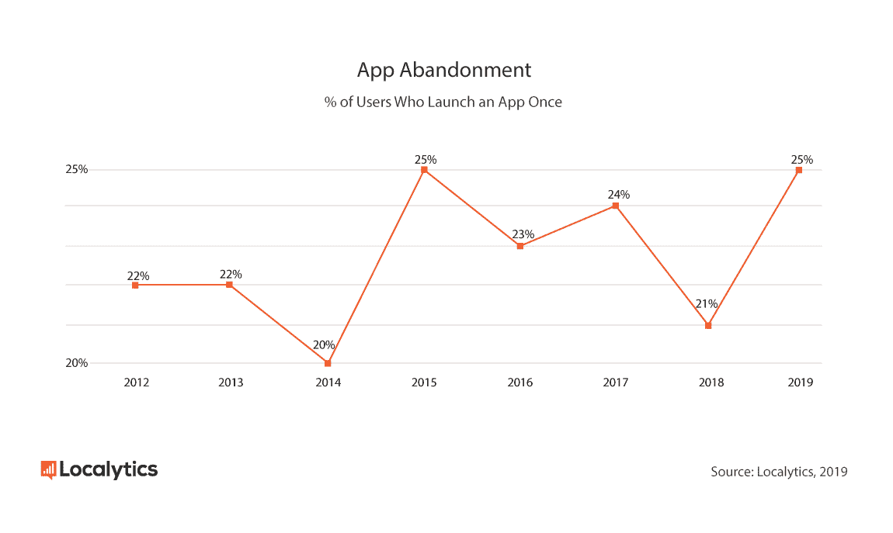
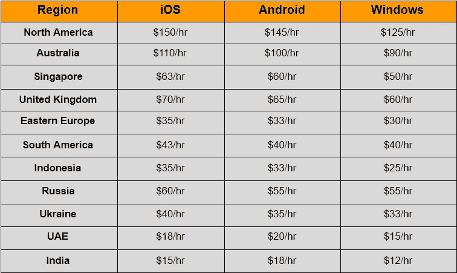
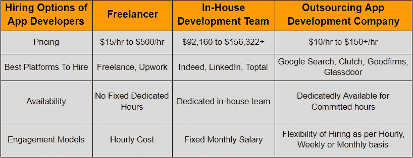
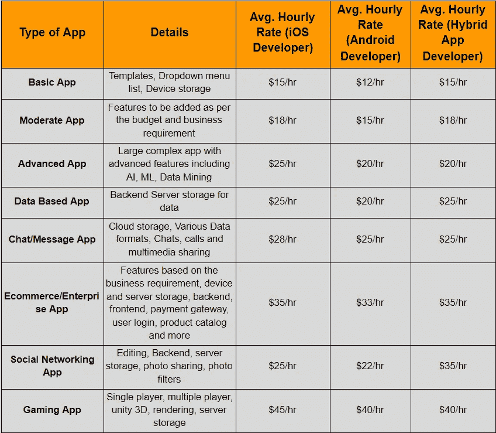

# 雇佣一个移动应用开发者:你要花多少钱？

> 原文：<https://medium.com/codex/hiring-a-mobile-app-developer-how-much-does-it-cost-you-6fdd435f8220?source=collection_archive---------9----------------------->

Clem Onojeghuo 在 [Unsplash](https://unsplash.com?utm_source=medium&utm_medium=referral) 拍摄的照片

随着数字化对智能手机用户的影响越来越大，移动应用已经成为企业成功的同义词。据预测，到 2023 年，T4 的收入将达到 9350 亿美元，毫无疑问，移动应用现在已经成为一件大事。

曾经有一段时间，移动应用只属于大玩家和行业巨头。但是今天，随着如此强大的框架、工具和技术的出现，开发移动应用不仅变得更加容易，而且成为当务之急。

*根据调查报告，美国人每天花* [*5 个小时*](https://techcrunch.com/2017/03/03/u-s-consumers-now-spend-5-hours-per-day-on-mobile-devices/) *使用移动应用程序，92%的移动时间花在应用程序上，超过 8%的时间花在网络浏览器上。*

移动应用程序正以风暴般的方式接管世界，并为通过应用程序访问每一件小事增加了极大的便利，毫无疑问，它们已成为企业推广其产品和服务的最强大而又最具潜力的平台。

*事实上，企业正在意识到这一事实，并采取相应行动。* [*根据 Clutch 调查*](https://clutch.co/app-developers/resources/small-business-apps-survey-2018) *，42%的企业已经建立了一个移动应用程序，30%的小企业主计划在未来建立一个应用程序。*

相信我，如果你真的希望你的企业在未来十年存在，那么投资移动应用程序开发是非常重要的。

如果你也属于这种情况，并计划从头开始开发一个应用程序，或者想为你现有的公司推出一个应用程序，那么第一步就是确定你将如何开发它？你是 [**聘请 app 开发者**](https://www.xicom.ae/solutions/hire-developers/) 还是通过学习编码自己搭建？

事实是，这两种方式都很好，但学习如何编写应用程序或成为一名开发人员并不是每个人的现实选择。虽然有了大量的教程，学习编码变得比以前容易多了，但是，想想你有足够的时间来学习吗？

举个例子，无论你是初创企业还是企业家，你的主要精力都将放在发现业务增长战略上，而不是在简历中添加编码技能。就这一次，你可能学会了编码并构建了一个基本的应用程序，那么如果它有错误、故障或其他问题呢？

[**根据**](https://uplandsoftware.com/localytics/resources/blog/25-of-users-abandon-apps-after-one-use/#:~:text=25%25%20of%20Users%20Abandon%20Apps,brands%20to%20engage%20with%20them.) **的统计，25%的用户在第一次使用后就放弃了应用，最常见的原因是 bug 和较高的加载时间。**

[图像来源](https://uplandsoftware.com/localytics/resources/blog/25-of-users-abandon-apps-after-one-use/#:~:text=25%25%20of%20Users%20Abandon%20Apps,brands%20to%20engage%20with%20them)

所以雇佣一个移动应用开发者是开始使用你的商业应用的最好方法之一。但是当你决定雇佣一个应用开发者的时候，你最终会问这样一个问题:雇佣一个移动应用开发者需要多少钱？

一旦你开始探索市场雇佣开发商，你会发现有各种选择和价格范围，最终取决于你的项目需求。

那么，您是否正在经营一家企业，想要将您的零售店迁移到一个拥有移动应用程序开发解决方案的数字平台，并且正在寻找一个指南，向您解释雇佣一名移动应用程序开发人员 [**需要多少成本**](https://www.xicom.ae/services/mobile-app-developers/) 以及移动应用程序开发的总体成本是多少？如果是的话，那么你就来对地方了，因为这篇博客已经涵盖了与移动应用程序开发解决方案相关的所有主要问题的答案。

> **以下是内容的亮点:**

*   *雇佣一个手机应用开发者需要多少钱？*
*   *雇佣全球移动应用开发者的成本*
*   *雇佣移动应用开发者最便宜的选择是什么？*
*   自由职业者
*   *内部应用程序开发团队*
*   *外包软件开发公司*
*   *雇佣 Android、iOS 或混合应用程序开发人员的成本*
*   哪里能雇佣到最好的应用程序开发人员？
*   *成功雇佣移动应用开发者的技巧*

让我们深入挖掘每一点，以获得更好的见解！

## **1。雇一个手机 App 开发者要多少钱？**

图片来源:作者

对于这个价值百万美元的问题——雇佣一名应用程序开发人员要花多少钱——来说，得到一个直接的答案总是具有挑战性的，即使对于专家来说也是如此。原因是，如果你开始货比三家，你会发现全球有成千上万的开发者为你提供应用开发服务。这可能是诱人的只是去与谷歌搜索和选择最便宜的一个。但是你绝不能在产品质量上冒险。但不代表一定挑贵的。

根据调查报告，最昂贵的开发人员的现代开发成本可高达 100 万美元，而每小时可低至 25 美元。现在你一定陷入了一个两难的境地:雇佣移动应用程序开发人员的工资应该是多少？嗯，这是一个公平的问题，但这个答案没有确切的数字。

因此，在接下来的几节中，我们解释了每个参数都会影响实际雇佣移动应用程序开发人员的成本…

> 让我们快速进入下一部分，了解应用程序开发人员的成本如何因地点和专业知识而异…

## **2。雇佣全球移动应用开发者的成本**

根据地点和专业知识的不同，雇佣一名应用程序开发人员的成本会有很大差异。这就是为什么大多数 [**应用程序开发公司**](https://www.xicom.ae/services/mobile-app-development/) 更喜欢在印度或阿联酋建立他们的离岸开发中心，并增加他们的全球影响力。

***将继续阐述为什么阿联酋和印度将是下一节的首选地点？—*(我)**

如果你想知道这两个参数是如何在定价上带来巨大差异的，那么你应该明白，应用程序开发人员的经验越高，他们在编码方面就越专业，因此你雇佣他们的成本就越高，并节省了长时间的开发时间，因为他们知道如何以最快的方法完成工作，以及如何处理这样的开发障碍。

其次，每个地区都有不同的生活成本，因此他们收取每小时的费用。这里是对你上述陈述的回答，即“印度被认为是雇佣最便宜的应用程序开发人员的最佳地点，因为他们的生活成本最低，而且他们拥有大量的开发人员，最终增加了竞争。

> 这是一张关于在全球范围内雇佣一名软件开发人员的成本的信息图。

> **(注:这些是基于市场调查和不同地区平均成本的粗略估计。但是它可以根据开发人员的技能和专业知识而变化。)**

现在我们来看看在不同国家雇佣一名应用程序开发人员的平均成本，你一定明白为什么公司更喜欢在印度雇佣一名应用程序开发人员。等等，如果你注意到为什么我们在这里也提到了阿联酋？

*让我们看看！*

## **3。为什么阿联酋是雇佣应用程序开发人员的首选地点？**

随着全球对移动应用需求的不断增长，大量软件开发公司在阿联酋崭露头角，并以极具竞争力的价格提供服务。如果你查看上表，你会发现阿联酋是第二个以 18 美元/小时的价格雇佣移动应用开发者的最便宜的地方。除此之外，阿联酋因 [**雇佣来自世界各地的应用程序开发者**](https://www.xicom.ae/services/mobile-app-development/) 而声名鹊起还有很多原因。

*在这里，我们列出了阿联酋在移动应用开发领域迅速占据中心位置的一些最引人注目和最有价值的原因。*

*   **全球对 IT 专家的认可:**阿联酋已经开始被包括 GoodFirms、Clutch 或 Glassdoor 在内的领先 B2B 平台认可为最佳 IT 外包目的地。你可以在全球外包 100 强评级中找到十几家阿联酋公司。
*   **质量和数量:**阿联酋有超过 200，000 名技术专业人员，其中 45%是拥有丰富企业级应用开发经验的高级开发人员。因此，在阿联酋，以可承受的成本找到最好的应用程序开发人员从来都不是一项具有挑战性的工作。
*   **世界知名创业公司之家:**你听说过 Almentor、Yallacompare、GitHelp、Careem、Bridge 等等吗，他们都是在阿联酋开发团队的支持下开始他们的旅程的。

最重要的是，阿联酋以极具竞争力的价格提供应用程序开发服务，因此您甚至可以用最低的预算开始。现在你知道了位置是如何影响开发者的成本的，但是雇佣一个开发者最便宜的选择是什么呢？让我们得到一个答案。

## **4。雇佣一个移动应用开发者最便宜的选择是什么？**

你们中的许多人想知道，当你可以选择建立一个内部开发团队时，为什么要雇佣一个移动应用开发者？拥有一个内部开发团队真的是最便宜的选择还是你应该选择自由职业者？

*   **自由职业者**

当你想解决一个应用程序中的 bug 或者有非常简单或小的项目需要开发时，那么你不需要 [**雇佣一个应用程序开发团队**](https://www.xicom.ae/services/mobile-app-development/) 、设计师、测试人员。找一个自由开发者就足够了。Upwork 或 Freelancer 将是一个可靠的平台，可以雇佣有有效记录的移动应用程序开发人员，支付欺诈的风险也较小。

> 雇佣自由职业者的好处

*   这是获取全球知识库和技能的一种经济有效的方式。
*   你只需要为他们的工作买单，减少包括工作用具、津贴和福利在内的开支。
*   雇主的责任更少，一旦项目交付，你与自由职业者的工作关系将结束或暂停。

> 雇佣自由职业者的弊端

*   跟踪项目进展很困难。
*   工程质量保证不足
*   他们对长期的进步和成功不感兴趣。

> 注意:雇佣自由开发者没有标准成本。它可以从 10 美元/小时到 500 美元以上/小时不等，这取决于开发人员的技能和专业知识。

*   **B .内部应用开发团队**

在用内部开发人员扩大你的团队时，雇佣合适的团队需要很长的时间和技能。

> **选择内部开发团队的好处**

*   你将拥有一个为长期项目做好准备的高效敬业的团队。
*   项目期间获得的专业知识留在公司内部。

> **内部应用开发的缺点**

*   它包括雇佣员工和组建团队的所有痛苦和障碍。
*   无论你是否有足够的开发工作给他们，你都必须承担每月的工资。
*   很难准确评估他们的表现和生产力。

> 注意:每个开发人员的平均薪资包将从[92，610 美元开始，根据经验和技能，可以达到 156，390 美元](https://money.usnews.com/careers/best-jobs/software-developer/salary#:~:text=Software%20Developers%20earned%20an%20average%20salary%20of%20%24111%2C620%20in%202019.)及以上。

*   **C .外包软件开发公司或机构**

多年来，满足您所有应用程序开发需求的外包软件开发公司已经成为潮流引领者，因为他们不仅有技术高超、经验丰富的工程师支持，而且还能确保出色的解决方案质量。

如果你有复杂的项目需求，那么雇佣一家 IT 外包公司或一家 [**应用程序开发公司**](https://www.xicom.ae/services/mobile-app-development/) 将是一个完美的解决方案。这给了您将开发人员工作的独特体验带到您的项目中的特权。此外，他们确保在不影响质量的情况下满足项目期限。

> **外包应用开发者的好处**

*   立即联系处理所需专业知识的现成团队。
*   现成的解决方案，最大限度地缩短项目的价值实现时间。
*   将最新的应用程序开发趋势、方法和策略整合到项目中。

> **外包应用开发者的弊端**

*   工作时区不同。
*   文化差异可能会让这个团队与众不同。

***注:*** *每小时开发人员的费用可以从 15 美元到 150 美元+不等，取决于项目的复杂性和开发人员的技能。但你肯定会得到项目质量，因为外包公司努力在市场上建立自己的声誉，并总是超越客户的期望。*

## **5。雇佣 Android、iOS 或混合应用程序开发人员的成本**

操作系统的选择也是影响应用开发者成本的主要参数之一。因此，在寻找雇佣 Android 开发者、iOS 或 Hybrid 的成本时，了解你想在哪里推出应用程序是很重要的。谁会是你的目标受众？我们来了解一下每个 OS 的开发者成本。

> **A .雇佣一名 iOS 开发人员的成本**

根据 Apple app store 的指导原则，他们已经标准化了 iOS 应用程序开发流程，该流程可归结为学习使用 Swift 和 Objective-C。一名优秀的 iOS 开发人员需要了解以下事项:

*   *iOS SDK 和 UI 套件*
*   *多线程、地理定位、网络、苹果购买、APNS 和核心数据*
*   *OOP 原理，扎实*
*   *使用 Swift 测试工具*
*   *使用 GIT 版本控制系统(VCS)*

平均而言，在阿联酋和印度，iOS 应用开发者的成本分别约为 25 美元/小时和 20 美元/小时，而在阿联酋和印度，一个不太复杂的应用开发项目的初级 iOS 开发者的成本分别为 20 美元/小时和 15 美元/小时。

> **B .雇佣安卓开发者的成本**

Android 是一个更加开放的生态系统，被各种各样的移动设备制造商所使用。Android 开发人员必须了解 Java 或 Kotlin，以编写一致、清晰、可重用的代码，并精通:

*   Android SDK，它是一套基本的工具和原理。
*   使用 API，因为这些应用程序必须通过 API 与大量软件交互。
*   理解后端，因为这个元素在 Android 应用中可能相当复杂。

传统上，Android 应用程序开发人员对市场的要求很高，因为 Android 的市场规模超过了 iOS。所以在原生应用开发的情况下，大多数组织寻找 [**Android 应用开发解决方案**](https://www.xicom.ae/services/android-app-development/) 。通常，在阿联酋和印度，Android 应用程序开发人员的每小时成本从 22 美元/小时和 18 美元/小时开始，而在阿联酋和印度，初级应用程序开发人员的每小时成本为 18 美元和 15 美元。

> **C .雇用混合应用程序开发人员的成本**

在雇佣混合应用程序开发人员时，开发人员的每小时成本会因跨平台框架的不同而有很大差异。Google 将 React Native 和 Flutter 定位为跨平台应用程序开发框架的最受欢迎的选择，用于创建一个在 iOS 和 Android 平台上无缝运行的应用程序，只需一个代码库。

**所以开发人员必须具备以下技能:**

*   Android 或 iOS 开发经验
*   了解 Flutter/React 本地编程语言
*   使用 Git 等版本控制工具的经验

根据调查报告和其他发现，Flutter 开发人员的每小时成本从 25 美元以上/小时开始，而 React 本地开发人员在阿联酋的每小时成本为 20 美元以上。

现在你们知道了为不同的操作系统雇佣软件开发人员的粗略估计，你们中的许多人想知道在哪里雇佣最好的应用程序开发人员，雇佣开发机构的最佳技巧是什么？我们的下一部分将会为这些问题提供一个完美的答案！

## **6。去哪里雇佣最好的应用开发者？**

对于企业来说，雇佣最好的应用程序开发人员总是一项艰巨的任务。虽然在谷歌上搜索一个词更容易得到应用程序开发公司的名单，但你的目标不仅仅是雇佣开发人员。与其花几个小时整理名单，选出最优秀的 [**应用开发公司**](https://www.xicom.ae/services/mobile-app-development/) ，不如从这些平台开始搜索，比如:Goodfirms、Clutch、Glassdoor 等。

有很多平台可以帮助你找到全球各地的应用程序开发公司，但上面列出的平台在列出配置文件之前会进行详细的分析。它们包括公司简介、服务、行业经验、服务、每小时成本、行业最佳技术知识等，以提供一个顶级章程列表。

从这些平台雇佣一个应用程序开发人员最棒的部分是，你可以检查开发人员的每小时成本(从 10 美元到 1000 美元/小时)，客户评论，检查公司简介和技术专业知识，以快速缩小你的名单。

## **7。为你的下一个项目成功雇佣一个移动应用开发者的技巧**

在你在线雇佣一个移动应用开发者之前，有一些提示你需要记住，以确保你在正确的道路上。让我们假设你已经决定 [**从阿联酋、印度等国雇佣应用程序开发人员**](https://www.xicom.ae/solutions/hire-developers/) 。并且想打造一个企业 app。你认为你的下一步是什么，以确保应用程序开发者尽可能适合你的项目并有前途？

> 让我们开始吧！

*   **点击开发人员的作品集**

毫不犹豫地评估开发商的投资组合，询问他们以前的项目和客户。你甚至可以直接询问他们现在和过去的客户名单，以了解他们正在处理的项目的性质。检查项目的 UX/UI 方面，它们看起来有多吸引人和吸引用户。开发一个完美的 UX/用户界面是成功的一半。

*   **检查订婚模型**

无论您为应用程序开发固定了多少预算，成本总是企业严重关注的问题。了解应用程序开发公司是否提供固定雇佣模式，或者是否可以灵活地按小时、周、月或项目雇佣应用程序开发人员。

*   **认证和认可**

聘请全球认可并通过 ISO:9001 认证的移动应用程序开发被认为是应用程序开发项目的首选。

*   **保密协议(NDA)**

为了确保你应用程序开发想法和数据的安全，请确保你雇佣了一家遵循 NDA 和其他应用程序安全措施的公司，以避免欺诈。

*   **沟通流程**

当雇佣离岸开发人员并与不同的文化和时区合作时，检查他们是否遵循标准的沟通过程或他们对客户的可用性是至关重要的。其次，他们会使用什么样的沟通工具——电子邮件、Skype、聊天、电话等。你能说话的具体时间是几点？他们会提供灵活的沟通时间还是局限于朝九晚五的工作文化。所有这些细节都会对你的项目进展产生很大的影响。

*   **评级和评论**

雇佣一个昂贵的应用开发者并不总是意味着你会得到高质量的应用。在这种情况下，他们客户的反馈和评级总是有效的。所以在你雇佣任何一个开发者之前，检查他们以前的客户在网站上的评论是很重要的。

*   **全球业务**

确保你雇佣的应用程序开发公司在不同的地方都有业务。原因是，不同的地区有不同的市场需求，所以他们更好地迎合业务需求。

# **结论:有手机 App 开发思路？**

总结这篇博客，公平地说，对机载应用程序开发人员来说，评估所有这些参数是一项耗时耗力的任务。但是，如果你真的清楚自己在招聘过程中到底在寻找什么，那么找到并聘用一家**移动应用开发公司并不是什么难事。从雇佣移动应用开发者的成本、影响成本的因素到外包移动应用开发者的技巧，这篇博客已经详细地涵盖了一切。**

**尽管如此，应用程序开发人员的可用性只是压倒性的，对于初学者来说，做出正确的决定是一项艰巨的任务。但是有了这些信息，我希望你可以很容易地确定如何评估开发商的成本。**

***不过，如果你有任何疑问，那么你可以在下面提出疑问！***