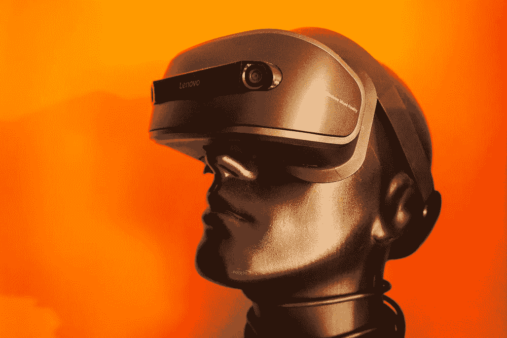
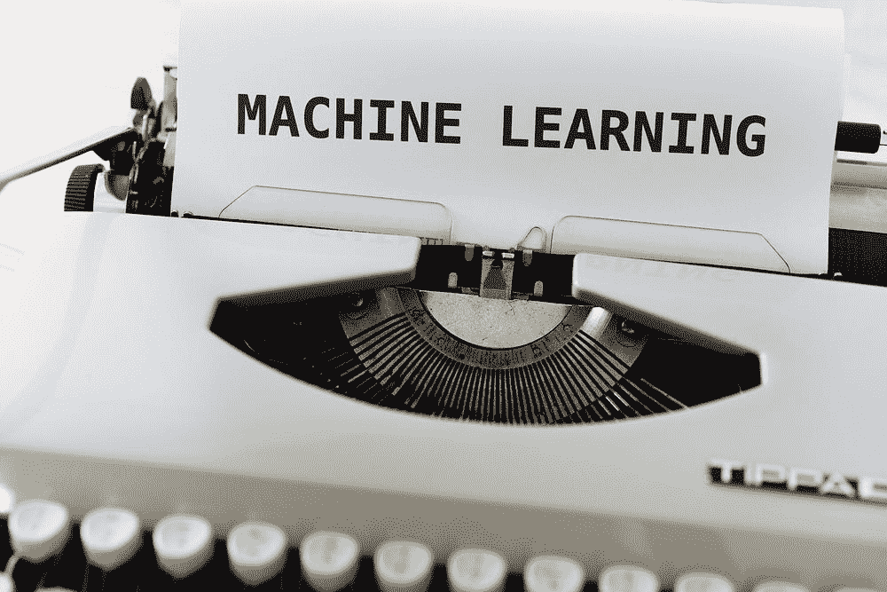

# 通过研究和无监督学习收集的机器学习历史

> 原文：<https://medium.com/codex/history-of-machine-learning-gathered-through-research-and-unsupervised-learning-7f47311cd981?source=collection_archive---------9----------------------->

## 无限的学习

马库斯·温克勒在 Unsplash 上的照片

如果你是一个“永远的学习者”,这个主题是为你准备的。你是否对最新的技术研究和进步感兴趣，并且总是充满好奇？你是否被迫自己做研究，并处于“了解更多”模式？最后的结局>你往往会在这个过程中积累很多。是 …