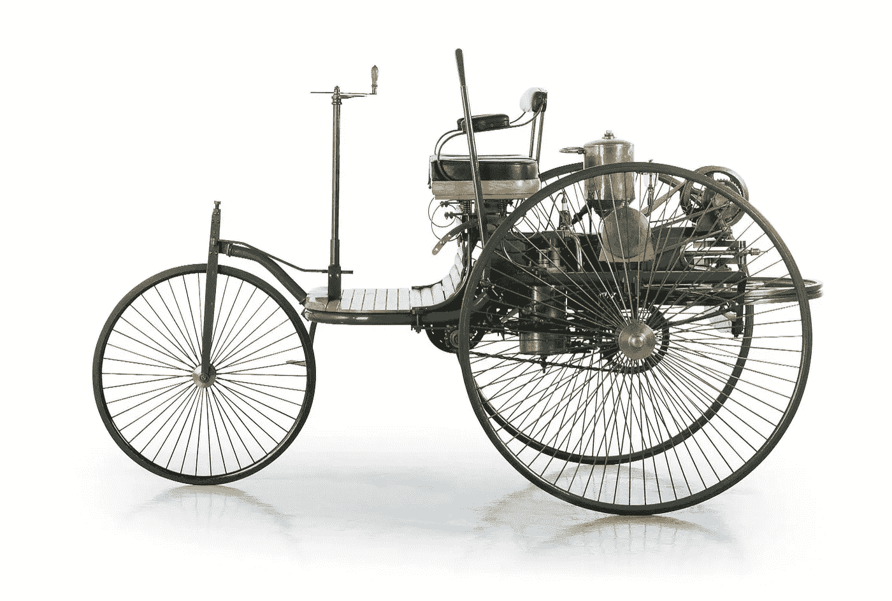

# 自动驾驶汽车的历史

> 原文：<https://medium.com/codex/history-of-self-driving-cars-350bff0aa495?source=collection_archive---------3----------------------->

自动驾驶汽车让我们的交通更安全、更便捷、更高效的承诺显然非常有吸引力。不再需要专注于驾驶任务，我们将有更多的时间从事其他活动。但许多其他原因证明了无人驾驶技术的研发是合理的。一些例子包括提高交通运输的生产率和经济性，确保残疾人使用交通工具，减少高达 66 %的污染和尾气排放，以及许多 more⁶.

自动驾驶的梦想可能与汽车本身一样古老，但完全自主仍然是计算机科学和工程的重大挑战之一。在本文中，我们将探讨无人驾驶汽车发展的历史背景，以及凸显自动驾驶挑战的许多挫折。

# 汽车工业的开端

当我们谈到第一辆汽车时，我们可以追溯到 18 世纪，对于本文的范围来说，第一个合理的里程碑是在 1886 年。那一年，卡尔·奔驰开发了第一辆装有内燃机的汽油动力汽车——奔驰专利——⁸.
1908 年，福特汽车公司推出了福特 t 型车——第一辆在移动装配 line⁴.上批量生产的汽车自然，在接下来的几十年中推出的所有这些汽车和模型都完全由人类司机驾驶。

奔驰专利-Motorwagen Nummer 1。图片由[戴姆勒克莱斯勒股份公司](https://commons.wikimedia.org/wiki/File:Patent-Motorwagen_Nr.1_Benz_2.jpg)提供。

# 最初的自主步骤

1925 年，Houdina Radio Control 驾驶“*美国奇迹*”首次尝试自动驾驶，这是一辆通过无线电控制的汽车，行驶在纽约市繁忙的街道上。这辆车在技术上是无人驾驶的，但它仍然完全由跟随车辆的另一辆车中的操作员控制。因此，尽管它标志着自动驾驶汽车的发明迈出了重要一步，但它仍远未达到我们所认为的完全自动驾驶。

在接下来的几十年里，其他人遵循类似的想法，仅仅通过外部控制器来驾驶汽车。一种流行的方法是在道路中嵌入某种导航电路。这种导航系统的第一个例子是在 1939 年由通用汽车公司赞助的世界博览会上展出的——他们的原型是通过直接嵌入道路中的磁性电缆来导航的。这个想法在整个 20 世纪 50 年代被许多研究人员延续，例如 RCA 实验室，从 1953 年通过铺设在实验室地板上的电线控制微型汽车到 1957 年和 1960 年的全尺寸演示。

在 20 世纪 50 年代和 60 年代，通用汽车展示了一系列名为“火鸟”的实验车，被描述为具有“*电子导航系统[它]可以在驾驶员放松的同时在自动高速公路上疾驰。*

通用设计师厄尔与火鸟 I-III。由[总经理](https://www.gm.com/)提供。

20 世纪 60 年代，英国运输和道路研究实验室对 1970 年推出的雪铁龙 DS19 进行了类似的实验。它能够以每小时 80 英里的速度通过测试轨道，如果开发继续下去，预计可以防止大约 40 %的事故。这是基于道路电缆基础设施的技术的最后一个里程碑之一，因为这些实验的资金在 20 世纪 70 年代中期被撤回，随后在伊利诺伊大学协调科学实验室进行了智能系统的初步研究。

# 走向真正的自治

在 20 世纪 80 年代，第一个基于视觉的导航系统在三个主要项目中实施。第一个使用这项技术的车辆是卡内基梅隆大学的 Navlab 项目，该项目在 1986 年至 1995 年之间开发——最后一次迭代报告了 98 %的自主性，横跨美国 2850 英里。第二个例子是梅赛德斯-奔驰的机器人货车，它在⁰.没有车辆的街道上达到了将近 60 英里的时速随后，尤里卡组织通过从 1987 年到 1995 年向普罗米修斯项目提供 7.49 亿英镑的资金，进行了无人驾驶汽车领域有史以来最大的研发项目。该项目展示了自动驾驶的几个组成部分，如防撞、车道保持支持以及旅行和交通信息系统。
同一十年的另一个例子是 ALV，或 ALVINN(神经 Network)⁵中的自主陆地车辆，由 DARPA 资助，于 1988 年开发。它使用了一个 2 层完全连接的神经网络，将激光雷达和道路图像的输入转换为车辆命令，以高达每四英里 19 英里的速度行驶。

ALVINN:神经网络中的自主陆地车辆。图片来自[原稿](https://proceedings.neurips.cc/paper/1988/file/812b4ba287f5ee0bc9d43bbf5bbe87fb-Paper.pdf)。

# 科技革命

虽然随着系统变得越来越好，自动驾驶汽车的发展逐步取得进展，但有三次“技术革命”对该领域尤为重要。

## 第一波——导航系统和 DARPA 挑战

第一次浪潮侧重于开发新兴的导航技术，即全球定位系统(GPS)和惯性测量单元(IMU)，这些技术是在世纪之交开发的。有了 GPS，自动驾驶系统可以在一米内确定汽车的位置——虽然这是一个不可思议的成就，但对于道路交通中的精确驾驶和导航来说，这还不够。随着 IMU 的引入，这一点得到了改善，IMU 可以测量车内的加速力，并将 GPS 导航的精度提高到 5 厘米。

公开的挑战和大规模的竞争是许多研究领域进一步创新的基本因素，例如，challenge⁹国际影像与遥感中心旨在促进图像识别技术的开发和研究。自动驾驶领域的对等物是 2004 年国防高级研究计划局(DARPA)的大挑战。第一场比赛在美国的莫哈韦沙漠地区举行，任务是通过一条 150 英里的路线。为第一名提供了一百万美元的奖金；然而，没有一个参赛队完成了比赛。CMU 的悍马行驶了最远的距离，仅行驶了 7.32 英里，在一次急转弯后挂在了一块岩石上。因此，第二年安排了第二次 DARPA 大挑战——这一次，五个团队设法自主完成了路线。

DARPA 大挑战 2004 车辆。图片由[亚历克斯·戴维斯](https://www.wired.com/author/alex-davies/)在[连线](https://www.wired.com/story/darpa-grand-challenge-2004-oral-history/)拍摄。

## 第二波浪潮——科技巨头加入战斗

多年来，车辆中使用的传感器质量大幅提高，基于视觉的系统变得越来越受欢迎。大约在 2006 年，更好的激光雷达系统被开发出来，相机系统得到了显著的改进，并首次引入了精确的 3D 重建方法，这有助于识别和定位障碍物。这些技术极大地推动了自动驾驶的研究，很快，大型科技公司进入了这一领域。例如，2009 年，谷歌开始秘密开发他们的原型，名为“Waymo”。到 2015 年，他们报告了 10 亿美元的研发投资。最近，他们还发表了一项基于神经辐射场(NeRF)的技术，从 280 万张照片中大规模重建旧金山。相比之前在大规模重建中的方法，Waymo 取得了超棒的效果。

[Waymo](https://waymo.com/) 汽车。

许多主要的汽车制造商，如通用、福特、奥迪、宝马等，自 2005 年以来一直在研究无人驾驶汽车系统。2010 年，作为 VisLab 洲际自动驾驶挑战赛(VIAC)的一部分，一辆自动驾驶汽车从意大利行驶了近 10，000 英里到上海，自动跟随前面行驶的引导车。在有真实交通的地理围栏的小区域进行了更多的实验，例如由 2010⁷.布伦瑞克技术大学开发的 Stadtpilot 项目同年，首次提出了与法律和道德相关的问题——特别是，加州机动车辆部的一名律师说“*这项技术在许多领域都领先于法律*”，引用了该州法律要求车辆在任何时候都有一名人类操作员。

## 第三次浪潮——技术革命

可被视为第三次技术革命浪潮的下一个重大发展里程碑发生在 2012 年。随着机器学习、表征学习和深度学习方法的进步，自动驾驶系统变得越来越精确。新的竞赛和基准使得以统一的方式比较不同的技术和方法成为可能，这也激励了许多研究团队不断开发新技术。

2014 年，梅赛德斯-奔驰推出了 S 级车型，配备了自动车道保持、自主转向、加速和制动以及高速防撞等功能。同年，汽车工程师协会(SAE)发布了一个分类法，比较了不同级别的自动驾驶技术，创建了五个类别的自动驾驶。根据这个系统，S 级实现了 2 级自主。

由 [SAE](https://www.sae.org/) 定义的自主级别。图片由作者提供。

# 当今的自动驾驶行业

大公司越来越多地参与开发自动驾驶汽车的某些组件或完整系统，很快形成了一个完整的行业。许多大公司，如优步和特斯拉，在 2015 年和 2016 年成立了整个研究部门，雇佣了众多科学家和工程师。不幸的是，这一发展再次受到挫折，特别是在 2016 年和 2018 年，因为两起致命的特斯拉汽车事故，引发了法律问题，降低了对自动驾驶技术的信任。

2017 年，奥迪宣布他们的新 A8 车型将完全自动驾驶。与其他汽车相反，不需要进行安全检查，例如每 15 秒钟触摸一次方向盘。参考自治级别表，这意味着 3 级自治。然而，该系统从未完全实施，2020 年，奥迪宣布该系统将不被激活。

在 21 世纪 20 年代，特斯拉向美国的一小群测试人员发布了他们的 FSD 系统的测试版。梅赛德斯-奔驰已经获得了德国对专注于车道保持的 3 级自主系统的批准。后来，他们在德国推出了 S 级和 EQS 车型的驾驶引导系统，在 3 级运行。

特斯拉 FSD 架构概述。图片来自[特斯拉 AI Day 2022](https://youtu.be/ODSJsviD_SU) 。

# 摘要

本文总结了自动驾驶汽车发展的主要里程碑。正如我们所见，自驾有着悠久的历史。人们比想象中更早地开始思考让车辆自动驾驶的方法。在过去的几十年里，这项技术一直在不断改进，变得越来越可靠，直到 2019 年，第一辆实现高速公路 3 级自动驾驶的车辆问世。在越来越多的自动驾驶汽车的竞争中，现在有许多参与者，包括知名的参与者，特斯拉和 Waymo 似乎在这个领域领先。但是第四级和第五级自治仍然没有实现，而且极难实现。此外，一些挫折降低了人们对自驾的信心，并使道德和法律问题成为焦点。自动驾驶是一项复杂但有前景的技术，预计在未来几十年内，它将变得越来越重要。

# 参考

**【1】**SAE 国际。*自动驾驶自适应系统分类和术语表*。
2017 年 10 月 7 日从原存档。

斯蒂芬·埃德尔斯坦。*奥迪放弃 A8 的 3 级自动驾驶辅助
系统。* 2020 年。

**【3】**尤里卡。*尤里卡项目 E！45 普罗米修斯*。
2018 年 8 月 14 日存档自原。

**【4】**History.com。T 型车:大多数人买得起的第一辆车。 2020 年。

金德武夫、查克·索普和威廉·惠特克。*CMU 的自主陆地车辆项目*。在 1986 年 ACM 第十四届计算机科学年会的会议录中。

尼古拉·朗、迈克尔·r·̈ußmann、杰弗里·蔡和赞西·杜巴拉。让自动驾驶汽车成为现实:来自波士顿和其他地方的教训。 2017 年。

托拜厄斯·诺斯德夫特、彼得·黑克尔、塞巴斯蒂安·奥尔、法尔科·索斯特、马库斯·毛雷尔、安德烈亚斯·雷什卡和̈urgen·̈udiger·̈ohmer. *Stadtpilot:首次在城市交通中进行全自动试驾*。2012.

德国专利和商标局。*现代汽车。*
存档自 2017 年 1 月 2 日原件。

**【9】**奥尔加·鲁萨科夫斯基、贾登、苏浩、乔纳森·克劳斯、桑吉夫·萨特西、
肖恩·马、黄志恒、安德烈·卡帕西、阿迪蒂亚·科斯拉、迈克尔·伯恩-
斯坦因、亚历山大·c·伯格、李菲菲。 *ImageNet 大规模视觉
识别挑战。国际计算机视觉杂志(IJCV)。* 2015 年。

**【10】**于尔根·施密德胡伯。Schmidhuber 教授的机器人汽车历史集锦。2009 年。

Matthew Tancik，Vincent Casser，Yan，Sabeek Pradhan，Ben milden hall，Pratul Srinivasan，Jonathan T. Barron 和 Henrik Kretzschmar。 *Block-NeRF:可扩展的大场景神经视图合成*。2022.

《纽约时报》。*谷歌汽车在车流中自动驾驶。* 2010。

**【13】**卡耐基梅隆大学。*卡内基梅隆大学自主陆地车辆项目(NAVLAB)。2014 年。*