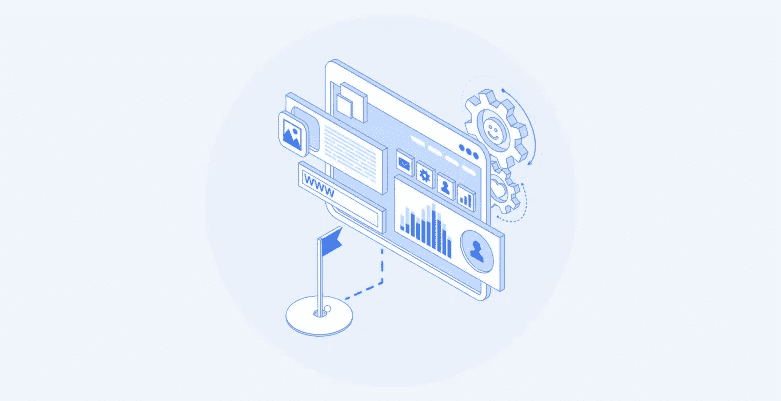

# 浏览器自动化一击即中

> 原文：<https://medium.com/codex/hitting-a-hole-in-one-with-browser-automation-fbc6e82564b1?source=collection_archive---------7----------------------->

## 了解您和您的公司如何使用“浏览器自动化”来简化其性能测试、链接验证和 web 数据收集操作

图片来自 Bright Data

与[**无头浏览器**](https://en.wikipedia.org/wiki/Headless_browser) 一样，浏览器自动化追求的是精简基于手动网络浏览器的任务。采用这种方法的主要目标包括:

*   减少人为错误
*   利用能够轻松复制单调/重复任务的“机器”
*   扩展处理无限数量的并发请求的能力
*   提高可操作的网络浏览器分配的速度

从帮助执行站点流程或代码检查到帮助进行动态测试，浏览器自动化通常也被用于执行**质量保证** (QA)以及数据收集。这使公司在时间和劳动力方面变得更加高效，并简化了硬件/软件资源分配。

# 流行的浏览器自动化用例

以下是各公司在日常运营中利用浏览器自动化的主要方式:

# #1:性能/自动化/并行测试

许多公司使用浏览器自动化来执行“压力测试”，即模拟给定域的大量网络流量，并观察该域如何应对。这些专业人员通常会使用 [**数据中心代理**](https://brightdata.com/proxy-types/datacenter-proxies) 以及其他代理网络，以便生成服务器认为是“真实”的流量，尤其是从地理位置的角度来看。

同样的任务在以下方面执行:

*   “负载测试”——即确保加载时间符合标准，以降低跳出率。
*   “回归测试”——即运行功能性/非功能性测试，以确保实时软件正常运行，尤其是在更新被实时推送后(当发现错误时，这被称为“回归”)。
*   并行/网格测试——即关联和交叉引用每一个可能的浏览器和操作系统，以查看您的程序在该环境中如何运行。自动化在这里很方便，因为有许多可能的组合。在这种背景下， **Selenium** 是一个非常流行的工具。

# #2:链接测试/验证

链接通常是广告、博客、视频或任何其他形式的数字内容中最重要的部分。如果链接断开、错误或不包含贵公司多点触控归因模型所需的 UTM(顽童跟踪模块参数),则行动号召(CTA)按钮毫无价值。

对于拥有大量数字资产和分支机构的公司，尤其是如果他们有动态生成的链接，手动检查可能会很繁琐，并且在许多情况下是不可能的。在这种情况下，web 浏览器自动化可以是一种有效的链接测试/验证工具。

承蒙亮眼的数据

# #3:网络数据收集

最后但同样重要的是， [**网页抓取**](https://levelup.gitconnected.com/web-scraping-and-the-art-of-war-5-tools-that-will-help-your-bot-win-c2a3840d8b71) 是一个主要的“浏览器自动化”用例。互联网上每天都有大量的内容、消费者互动和商业活动。这留下了以下形式的数字足迹:

*   T4、谷歌、雅虎和必应等引擎上的关键词搜索趋势
*   社交情绪和参与度数据，表现为脸书、Instagram 和抖音等网络上的赞、分享和帖子
*   数字商务活动，如竞争对手定价/广告活动、产品库存/动态定价策略以及用户在**易贝、亚马逊和 Wish** 等网站上生成的商品评论

浏览器自动化使公司能够打开目标网站，提取感兴趣的目标数据点，然后将这些信息交付给算法和团队进行进一步分析。

数据收集器浏览器自动化

# 流行的浏览器自动化工具

[**Selenium**](https://github.com/SeleniumHQ/selenium)**是一款流行的开源工具，面向 Python 程序员和精通技术的个人。但是，需要在其日常工作流程中执行“网络浏览器任务”的专业人员可能更喜欢全自动解决方案。**

**在 Javascript 方面，谷歌的 [**木偶师**](https://github.com/puppeteer/puppeteer) 相当于 Selenium，允许与网页交互，以便提取动态加载的数据。**

**另一个可行的选择是微软 [**剧作家**](https://github.com/microsoft/playwright) ，这是一个面向 Typescript、Javascript、Python 和 Java 用户的跨语言浏览器。**

**数据收集器是一个工具，使公司能够完成“浏览器自动化”任务，包括链接验证、 [**性能网站测试**](https://brightdata.com/use-cases/website-testing) 和数据收集。唯一的区别是不需要测试脚本语言(比如 Selenium)。这是一个零代码的替代方案，它解析、清理和构建目标数据，然后以您公司的客户选择的格式(JSON、CSV、HTML 或 Microsoft Excel)将其交付给他们。**

**性能测试和链路验证是使用一流的数据中心、住宅和移动代理网络的国际网络进行的。这些由真正的本地化用户设备组成，例如，这意味着在东京运行的广告活动，具有 CTA 链接，将使用本地用户的设备进行验证。**

# **我们学到了什么？**

**Web 浏览器自动化是一种工具，使公司能够访问与竞争对手和目标受众相关的重要数据。它是链路验证和性能测试背后的驱动引擎。公司在寻求利用“网络浏览器自动化”时有两个主要选择，要么使用手动、资源密集型、基于代码的语言，如 Selenium，要么使用全自动工具，如[**Bright Data Collector**](https://brightdata.com/products/data-collector)。这种选择完全取决于一家企业认为什么是其资源和人力的最佳配置。**