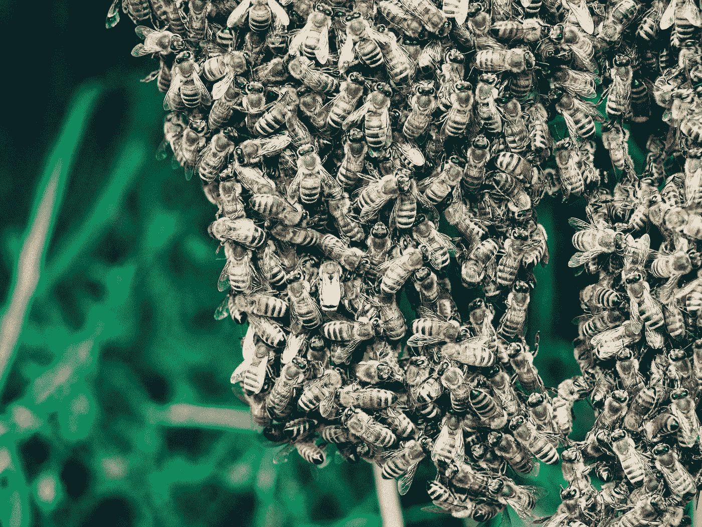
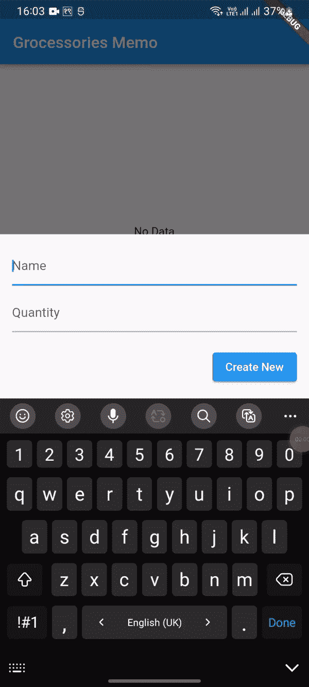

# 蜂房在颤动

> 原文：<https://medium.com/codex/hive-in-flutter-7a2b320eb1dc?source=collection_archive---------0----------------------->



照片由[安特·哈默斯特](https://unsplash.com/@ante_kante?utm_source=medium&utm_medium=referral)在 [Unsplash](https://unsplash.com?utm_source=medium&utm_medium=referral) 上拍摄

Hive 是轻量级、NoSql、键值数据库，用于在本地存储 **flutter** 和 **dart** 应用程序中的数据。有许多方法可以在本地存储数据。Hive 可用于存储移动和 web 应用程序的数据。

我们的应用程序工作如下:



Hive 非常有用，使用起来也非常简单。它由没有众多关系的键值数据库组成。Hive 是脱机数据库。

存储在 Hive 中的所有数据都组织在盒子中。

## 什么是盒子？

Hive 将其数据存储在包含键值集的盒子中。

对于一个小应用来说，一个盒子可能就足够了。对于更高级的问题，盒子是组织数据的好方法。盒子也可以加密以存储敏感数据。

在使用箱子之前，需要先打开蜂箱。

## 开箱

```
var box = await Hive.openBox<DataModel>('hive_box');Or
var box = await Hive.openBox('hive_box');
```

不管怎样，你都可以打开盒子。

如果盒子已经打开，则返回它，并忽略所有提供的参数。如果不打开 hive box，您将无法读取、写入和删除数据。

## 打开盒子

hive 为所有打开的盒子存储一个引用。要从打开的盒子中获取数据，可以按如下方式获取:

```
var box = Hive.box('myBox');
```

这个过程或方法对于 Flutter 应用程序非常有用，因为您不必在小部件之间传递盒子。

## 关闭框

如果你不再需要这个盒子，你应该把它关上。所有缓存的键和值都将从内存中删除，并且在所有读写操作完成后关闭 box 文件。

> **如果您将来需要盒子，可以将盒子打开。在应用程序运行之前，让一个框保持打开状态是可以的。**

```
await box.close();
```

## 写

写一个盒子是非常容易的，就像写一张地图一样。

```
var box = Hive.box('box_name');box.put('name', 'John Doe');box.put('friends', ['Hari', 'Ram', 'Sita']);box.put(123, 'testdata');box.putAll({'key1': 'value1', 23: 'process'});
```

## 阅读

从盒子中读取数据非常简单。

```
var box = Hive.box('myBox');
String name = box.get('name');
DateTime birthday = box.get('birthday');
```

如果键不存在，则返回`**null**`。你也可以选择一个`**defaultValue**` ,在键不存在的情况下返回。

```
double length=box.get('yourkey',defaultValue:12.5);
```

返回的列表`get()`总是类型`List<dynamic>`(类型`Map<dynamic, dynamic>`的地图)。使用`list.cast<SomeType>()`将它们转换成特定的类型。

## 类型适配器

Hive 为我们提供了几乎所有原始数据类型的权限，例如`String`、`int`、`Map`、`List`、`DateTime` 和`Uint8List.`类型适配器将对象从二进制形式转换为二进制形式。

你需要生成`TypeAdapter`或者你可以自己写。在使用适配器之前，您需要注册它。

## 注册适配器

注册适配器需要两件东西，即`instance of adapter`和`typeId`。`typeId`是唯一的，必须在 0 到 223 之间。您可以将适配器注册为

```
Hive.registerAdapter(MyAdapter());
```

## 为什么是蜂巢数据库？

*   与其他数据库如 **SQLite** 和 **SharedPreferences** 相比，它在速度和性能方面是最高效的数据库。
*   它给出了执行 **CRUD** 操作的简单方法。
*   内置强加密
*   没有本机依赖项

## 何时使用 Hive

Hive 的性能非常好，因为与关系数据库相比，它的开销很小。

Hive 可以用来存储几乎所有类型的数据。

*   购物车内容
*   博客/文章
*   信息
*   产品类别
*   会议
*   等等

## 何时不使用 Hive

当以正确的方式建模时，每种类型的数据都可以存储在 Hive 中。有时使用 SQLite 这样的关系数据库会更方便，因为它更方便，但也不是更快。

如果您的数据包含复杂的关系，并且您必须主要依赖于索引和复杂的查询，那么您应该考虑使用 SQLite。

由于 Hive 是如此的轻量级，你可以同时使用 Hive 和其他数据库。

## 好了，我们潜水吧


Jeremy Bishop 在 [Unsplash](https://unsplash.com?utm_source=medium&utm_medium=referral) 上的照片

## 步骤 1:创建 flutter 应用程序

## 步骤 2:添加依赖项

```
dependencies:
  flutter:
    sdk: flutter
  hive: ^2.2.3
  path_provider: ^2.0.11
  hive_flutter: ^1.1.0
  hive_generator: ^1.1.3
```

和开发依赖性

```
dev_dependencies:
  flutter_test:
    sdk: flutter

  build_runner: ^2.2.0
```

## 步骤 3:创建模型

我们需要创建模型类来与存储数据的配置单元一起工作。我们将制作一个 **Grocesories Memo** 应用程序，在去市场之前存储所需的杂货。

`@HiveType`将告诉数据模型表上面的信息，其中包含一个参数`*typeId.*`

`@HiveField`告诉数据为每个属性传递。

> 我们已经执行了 HiveObject 以获得我们的数据模型数据项的键。

## 步骤 4:生成适配器

要生成`DataModelApdater`，请在终端中运行以下命令。

```
flutter packages pub run build_runner build
```

它将生成 data_modal.g.dart

## 步骤 5:初始化配置单元

您需要在 main 方法上初始化 hive，因为它需要在其他功能之前执行。

```
void main() async {
  WidgetsFlutterBinding.ensureInitialized();
  Directory directory = await         pathProvider.getApplicationDocumentsDirectory();
  Hive.init(directory.path);
   Hive.registerAdapter(DataModelAdapter());
   await Hive.openBox('hive_box');
  runApp(const MyApp());
}
```

## 第六步:添加**库存数据**

正如我们之前了解到的，您需要打开我们的`box`来添加数据。

```
box = await Hive.openBox('hive_box');
DataModel dataModel = DataModel(
      item: _itemController.text,
       quantity: int.parse(_qtyController.text));
box.add(dataModel);
```

## 第七步:获取数据

```
box = await Hive.openBox('hive_box');
var items = box.values.toList().reversed.toList();
```

这里我们使用了`reversed`来反转我们的数据，这样新的数据就会出现在最上面。

## 步骤 8:编辑/更新数据

```
var box = await Hive.openBox('hive_box');
DataModel dataModel = DataModel(
                            item: _itemController.text,
                            quantity: int.parse(_qtyController.text));
box.put(itemKey, dataModel);
```

`itemKey`是数据的标识符。上面我们扩展了 HiveObject 以获得这个键。

## 第 9 步:删除数据

```
var box = await Hive.openBox('hive_box');
box.delete(items[index].key);
```

# 让我们连接起来

我们可以成为朋友。在[脸书](https://www.facebook.com/nabin.dhakal.714/)、 [Linkedin](https://www.linkedin.com/in/nabindhakal/) 、 [Github](https://github.com/nbnD) 、 [Youtube](https://www.youtube.com/channel/UCW6oYt_3QSl7J2HSHNqwXWw) 、 [BuyMeACoffee](https://www.buymeacoffee.com/nabindhakal) 和 [Instagram](https://www.instagram.com/nbn_d_/) 上查找。

访问:[颤振连接](https://flutterjunction.com/)

**投稿:**BuyMeACoffee

# 结论

希望这篇文章对你有所帮助，让你学到新的东西。我在这篇文章中使用了一些对你们中的一些人来说可能是新的东西。

如果你学到了新的东西或者想提出一些建议，请在评论中告诉我。

如果你喜欢这篇文章，请点击👏图标，它为您提供了传递所有新事物的动力。

此外，关注令人兴奋的文章和项目的更新。

通过分享学习对学习过程产生了巨大的影响，并使社区越来越大。

分享是吸引其他爱好者的磁石。

因此，让我们朝着扩大我们的学习社区迈出一小步。

与你的朋友分享这篇文章，或者如果你喜欢这篇文章，就在推特上发表评论。

# 在以下时间吃饱:

[](https://github.com/nbnD/flutter_hive) [## GitHub-nbnD/flutter _ hive:hive _ flutter 示例

### 一个新的颤振项目。这个项目是颤振应用的起点。一些帮助您入门的资源…

github.com](https://github.com/nbnD/flutter_hive)