# HomePod 成为一个收藏家的项目&一些好的闪电电缆新闻！

> 原文：<https://medium.com/codex/homepod-becomes-a-collectors-item-some-good-lightning-cable-news-76b0399bbb14?source=collection_archive---------6----------------------->

## 苹果视图综述

2022 年 4 月 18 日至 4 月 22 日

HomePod 的价值在上升

城市的春天，生活很容易…本周孙灌苹果观点

## HomePod 的故事

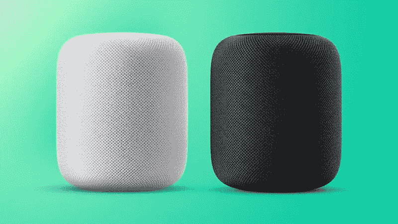

经典而美妙的 HomePod

最初的 HomePod 有一个奇怪的故事，整个冒险看起来也非常不像苹果。它于 2017 年首次公布，但实际发布延迟到 2018 年。这已经是板上钉钉了。苹果公司坚持认为延期纯粹是为了确保这个大日子的*一切都完美。在其短暂的生命周期中，我们看到苹果做了不可思议的事情，将价格从最初的 349 美元降至 299 美元。不仅如此，还有大量的员工折扣，员工可以花 149 美元买一台 HomePod！最终，这款扬声器于 2021 年初停产，当时的焦点是 HomePod mini。原版的爱好者觉得声音比不上迷你，并哀叹它的逝去。虽然今天的声音一如既往地好，但它受到了旧 A8 处理器的影响，这表明了它与 Siri 和 AirPlay 功能的年龄。如果你有一个 *OG 的*并且喜欢它…保重！有报告说，爆裂声似乎意味着，扬声器是在它最后的腿。但是，最奇怪的是，他们在升值！在易趣上购买一个新的或未使用的扬声器将花费你大约 500 美元！也许当它和我们在一起的时候，我们应该对它表示一些爱！*

 [## wi-fi 去哪了？

### 苹果有许多依赖 wi-fi 的产品，但他们不再有路由器。为什么？

medium.com](/codex/where-did-the-wi-fi-go-15ecea31a89e) 

## iOS 16——其实也有可报道的！

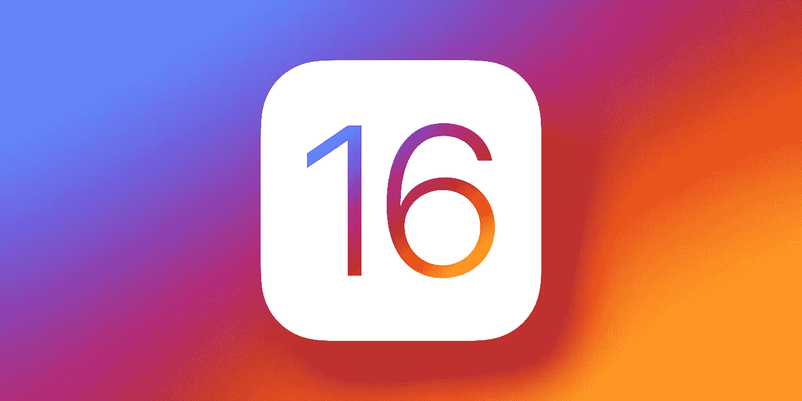

iOS 16

看起来下一个操作系统最大的更新是通知，尤其是焦点模式。当然，焦点模式可以让用户管理他们一天中想要看到的应用和通知。本周从马克·古尔曼**传出的另一个消息是，苹果新闻应用程序也将进行一些工作，在 watchOS 上增加一些健康跟踪功能，并在 iPadOS 16 上改进多任务界面。好吧……我撒谎了——没什么可报道的！**

## iPhone 14——最新款

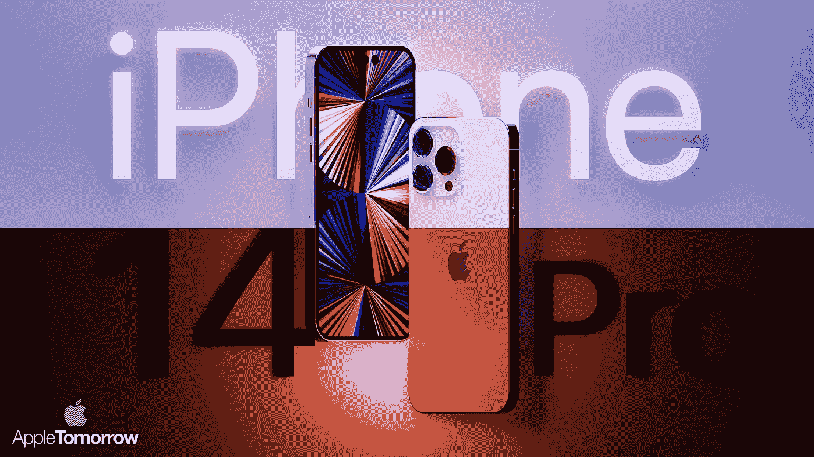

iPhone 14 新闻

每周，我们都会得到关于今年秋季 iPhone 的新鲜消息。本周证实，Pro 机型将运行不同的芯片，手机也将更高。比我们最初认为的更有可能的是，卫星功能现在也可能出现在 iPhone 14 上。**郭明志**本周在推特上表示，新系列中所有四款车型的前置摄像头都将升级为自动对焦传感器@ f/1.9 光圈。他本周还在推特上说，2024 年这款手机(iPhone 16)的设计可能会发生重大变化，它将首次全面屏，他预测它也将拥有人们期待已久的欠显示 Face ID。最后，在本周的电话传言中， [ShrimpApplePro](https://twitter.com/VNchocoTaco) 首次向我们展示了屏幕保护设计。他们提到 Pro Max 上的听筒太薄，顶部没有开口！对于那些想知道的人来说，新的前置镜头意味着前置摄像头会给你一个模糊的背景！

 [## 强大的 Mac mini 的下一步是什么？

### 为这款惊艳的台式机做了大量规划

medium.com](/codex/what-next-for-the-mighty-mac-mini-8815484e070d) 

## 哦，那些 CADS

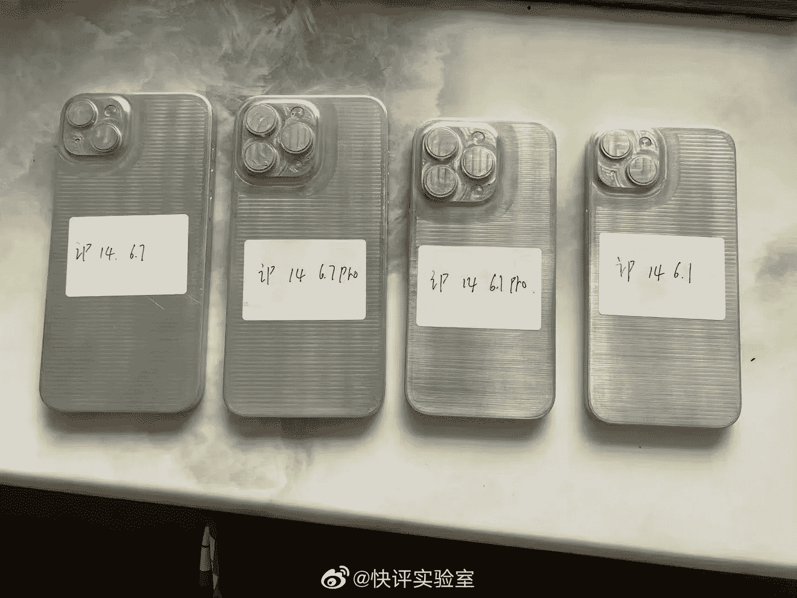

最新款 iPhone 14 CADS 的外壳模具

过去一周左右，你可能已经在网上看到了一些 CAD 图像，原来它们不是直接来自苹果，而是来自外壳制造商。尽管如此，它证实了今年将不会有 iPhone Mini 选项，相机凸起的大小以及 Pro 和 Pro Max 的整体尺寸。 ***他们要大，大，男生这 14 个职业！***

## 即将出现的麻烦

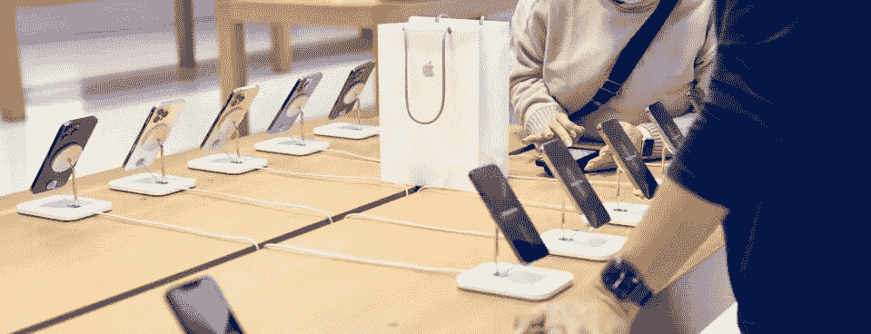

苹果商店的工会问题？

亚特兰大苹果商店的工人是第一批申请加入工会的人。这看起来肯定会引发一场与硅谷巨头的战争。亚特兰大西北部坎伯兰购物中心的 107 名员工中有 70%支持这一举措。5 月 5 日或 7 日可能是工会选举的日期。组织者说，商店低于亚特兰大的生活工资。麻省理工学院(Massachusetts Institute of Technology)的数据显示，起薪约为每小时 20 美元，低于有一个孩子的单亲父母每小时 31 美元的生活工资。 ***所有的宣传真的是好的宣传吗？***

## 反垄断成本！

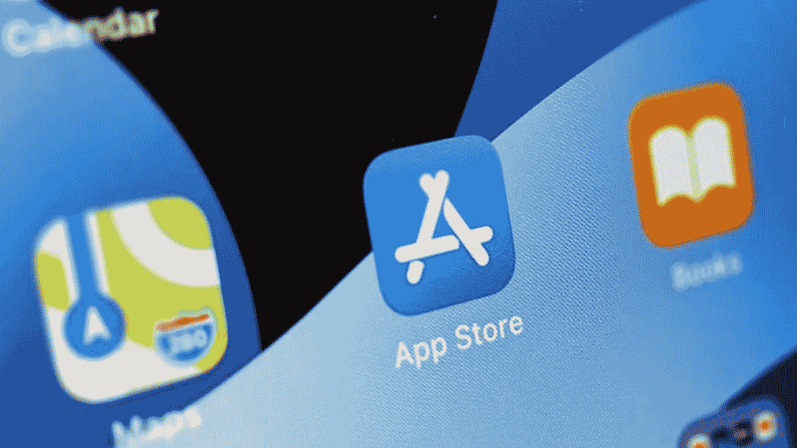

苹果花大价钱游说

本周，Appleinsider 报道称，苹果在 2022 年第一季度已经花费了 250 万美元用于政治游说。前一个高点是由亚马逊和 Meta 保持的，但随着苹果面临国会对其应用商店越来越大的压力，支出已经上升。从 2022 年 1 月到 3 月，250 万美元的支出比去年同期增长了 34%。苹果公司已加大努力，试图对抗拟议中的立法，这可能意味着改变其应用商店。 ***Ooof！即使对苹果来说，那也是一大笔钱！***

 [## 九台新的 M2 苹果电脑

### 和四种不同版本的 M2 芯片。是时候让我们看看了！

medium.com](/codex/nine-new-m2-macs-1415cfa37ac5) 

## 无损音频

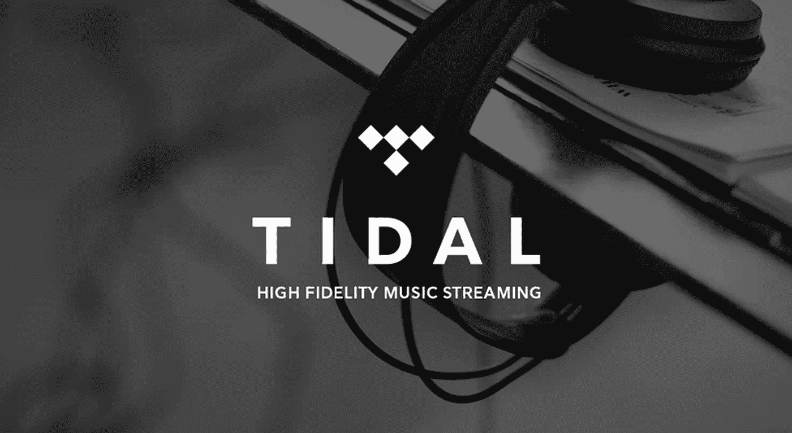

iOS 中的 Tidal 有待改进

你是发烧友吗？好吧，如果你是一个潮流用户，事情刚刚有了转机。在其最新的 iOS 更新中，音乐流媒体服务的用户现在可以要求苹果的语音助手 Siri 播放内容。不过暂时仅限于 iPhone 和 iPad 用户。这项服务还没有延伸到 HomePod 或 HomePod 迷你。这意味着 Tidal 的听众仍然不能利用‌HomePod‌'s ‌Siri‌语音控制来浏览他们的歌曲和播放列表。我确实订阅了一段时间——但是一旦苹果音乐无损，那对我来说就足够了。

## 一些好消息！

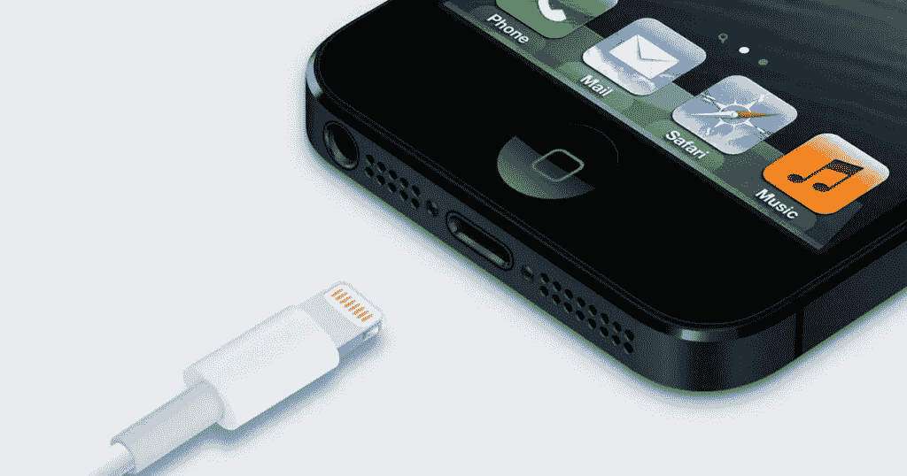

闪电速度的改进即将到来？

*老实说，还是有的！*虽然苹果产品线中的几乎所有其他产品现在都使用 USB-C 适配器，但 iPhone 仍然坚定不移地使用 lightning 连接器。如果我们需要任何进一步的信息来表明这将比一些人所希望的时间更长，那么本周它就来了。似乎今年 14 系列中的两款 Pro 手机将被赋予 USB 3.0 lightning 端口。目前，端口是 2.0，但从技术上讲，它们并不局限于此。苹果公司的工程师一直在努力提高电缆的传输速度。随着 Pro 系列手机能够拍摄 4K pro res 视频，从手机上获取这些文件被证明是痛苦的。2.0 USB 速度只能以 480 Mbps 的速度传输，而使用 USB 3.0，这一速度将提高到 5 Gbps！作为一个用 iPhone 看 YouTube 视频的人，这正是我想要的新闻。

最新的负十六播客也在苹果播客上

## 你穿莱卡吗？

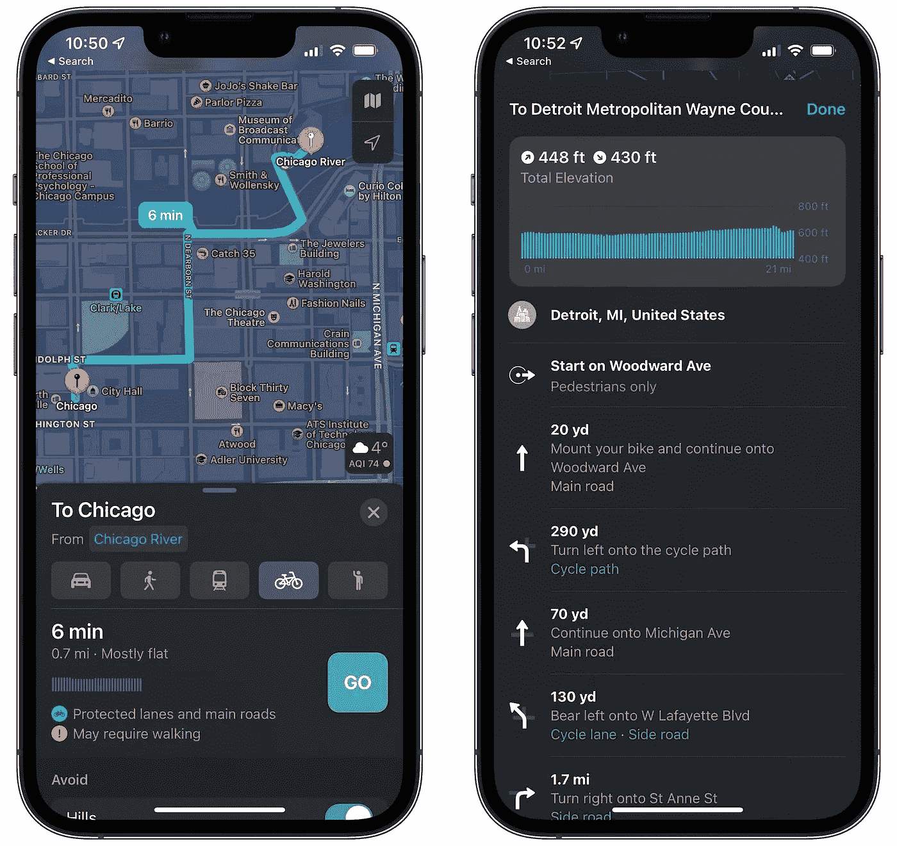

为骑自行车的人增加地图细节

好吧，如果你这样做，那是因为你是一个骑自行车的人，那么我有消息给你。去年首次在 iOS 中引入的骑行方向，自 4 月初以来已悄然加入。骑行方向考虑海拔，街道有多繁忙，沿线是否有楼梯。在巴塞罗纳、伦敦、加拿大和 mainland China 得到官方支持，在美国的部分地区有一些局部改进。据报道，详细和更新的覆盖范围包括俄亥俄州和西弗吉尼亚州的全部，以及伊利诺伊州、印第安纳州、密歇根州和弗吉尼亚州的部分地区，贾斯汀·奥贝恩报道。不要让我开始骑自行车俱乐部！

## 那你用 WhatsApp？

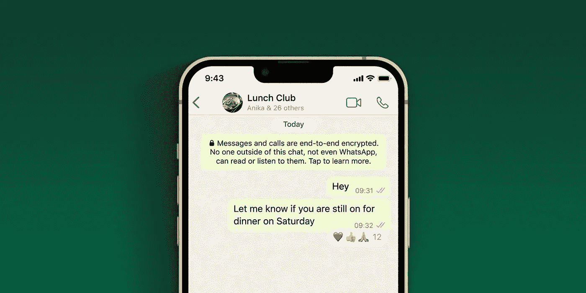

对 WhatsApp 的反应

上周，[的加密信息服务 WhatsApp](https://www.whatsapp.com/) 宣布，该应用终于迎来了反响*。他们将提供所有表情符号，以便用户可以对信息做出反应，就像 Instagram 已经对其直接信息所做的那样。要使用反应表情符号，用户只需更新应用程序，然后点击并按住聊天气泡，对消息做出反应。目前，它只提供给测试版用户，但将推出他们的下一个完整的更新，我听说很快就会到来。 ***反应——我和女儿沟通的唯一方式！****

## 跟上需求

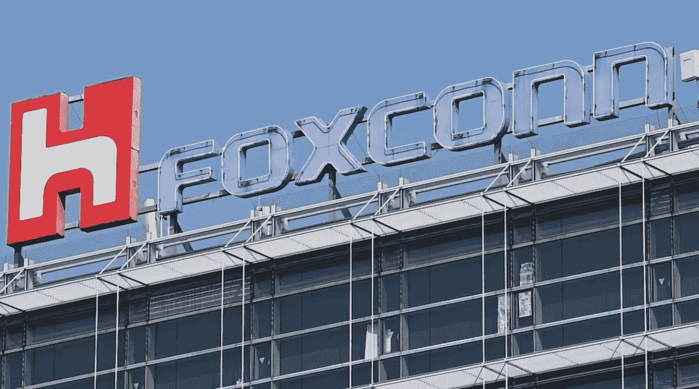

富士康的扩张

随着中国在深圳封锁后重启 iPhone 生产，富士康在钦奈工厂的员工数量几乎翻了一番，并扩大了产量。印度对 iPhone 机型的需求大幅增加。据印度《经济时报》报道，苹果获得了当地政府的许可，可以进行所谓的“去技术化”富士康在钦奈的工厂在经济特区内运营，这意味着伴随着特定条件的利益。全球统治继续以那时的速度发展。

## 蒂姆的一句话

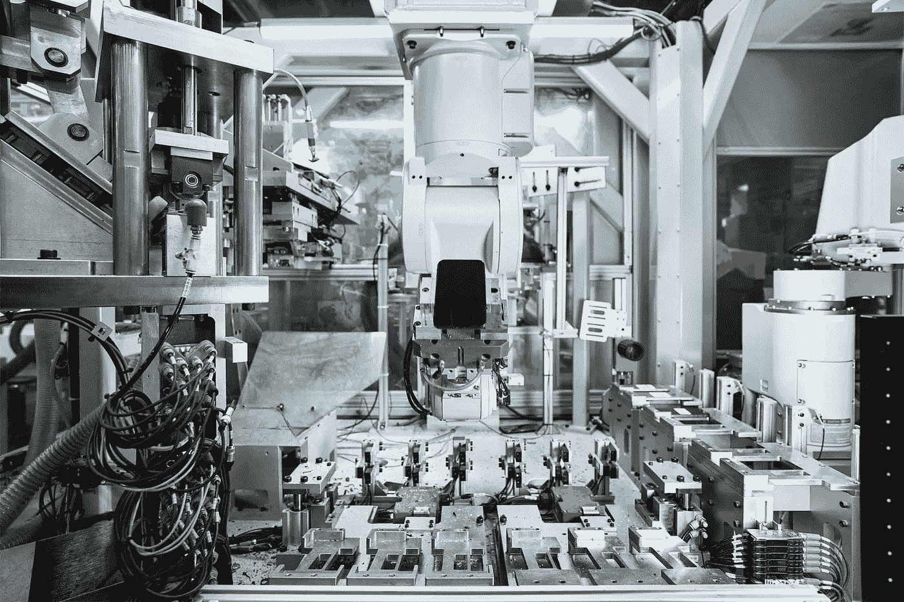

为地球日做准备

上周，我报道了苹果的环保意图。本周，苹果公司发布的新闻稿证实了这一点，他们在新闻稿中表示，他们将在其产品中扩大回收材料的使用。该公司首次推出经认证的再生黄金，并将再生钨、稀土元素和钴的使用量提高了一倍以上。2021 年，苹果产品中使用的所有材料中有近 20%是回收的，这是有史以来回收含量最高的一次。该公司还分享了顾客庆祝[地球日、](https://www.earthday.org/)的新方式，包括使用 Apple Pay 支持世界野生动物基金会。在 4 月 22 日的地球日，苹果客户可以在 Snapchat 上通过一种新的沉浸式增强现实体验了解 iPhone 13 背后令人兴奋的环境创新——包括雏菊回收机器人。 ***我认为他们确实关心这个问题，这不仅仅是良好的公关…尽管这不会有什么坏处！***

## 甚至苹果也需要一些帮助

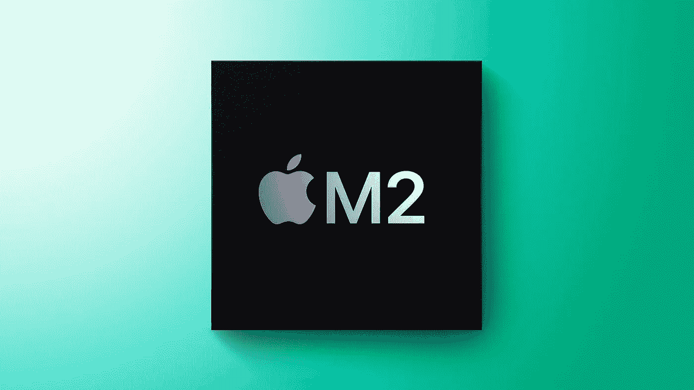

苹果硅制造的细节

尽管苹果自有芯片的所有生产都是由台湾的 TSMC 独家制造的，但芯片实际上包含了来自几家供应商的组件。例如，芯片的电路板由 Ibiden 和 Unimicron 提供。随着苹果继续与三星合作，今年的 M2 芯片也将如此。三星电子机械供应倒装芯片球栅阵列(FC-BGA)，一种用作半导体的印刷电路板。人们对苹果 M1 芯片的外包知之甚少，直到苹果发布近一年后才被 elect 发现。 ***魔鬼总是在细节中。***

## 给我充电

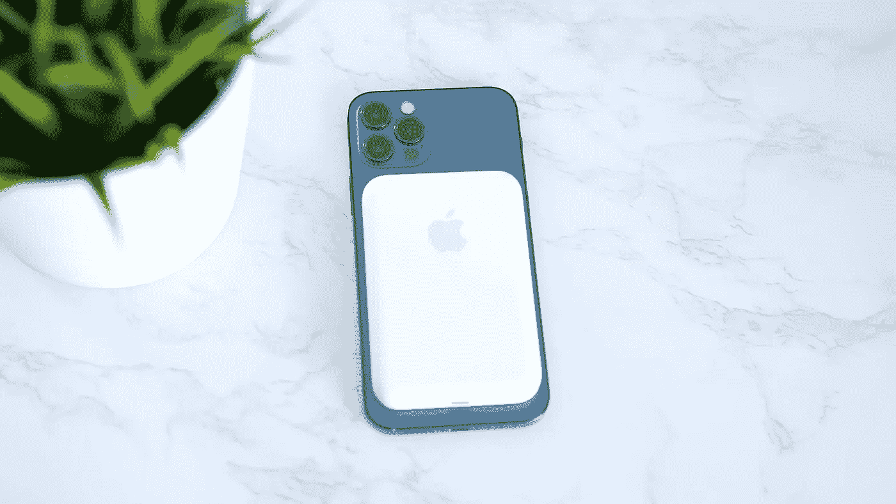

更快的 MagSafe 充电

本周，苹果为他们的 MagSafe 电池组发布了新的固件更新。它允许用户启用 7.5W 充电，而旧标准仅为 5W。苹果建议用户将 Lightning 线缆连接到‌MagSafe 电池 Pack‌，然后将 USB 端插入‌iPad‌或 Mac，以启动更新过程。您需要 iPhone 12 或更高版本才能受益于此更新。无论你有多忙，你再也不需要免费服务了。

## 最后

网飞的苦难

你是网飞的订户吗？如果是这样，那么你是少数几个没有取消流媒体服务的人之一。随着其他服务以更低的价格提供更好的内容，观众正在离开他们的收藏。本周，[网飞](https://www.netflix.com/gb/)公布了一个巨大的第一季度收益损失，因为他们看到 20 万用户在同一时期取消。现在观众的选择比以往任何时候都多。每月 5 美元的苹果和 9 美元的亚马逊只是两个例子。 ***你知道我是苹果电视+的超级粉丝，我现在在上面看的内容肯定比网飞多。***

如果我错过了什么新闻，请告诉我，我会在下周报道——当然，这要归功于你自己！

## 在你走之前

你订阅媒体了吗？

我只是高端博客网站 Medium 的众多作者之一。它是如此物有所值，你可以在这里加入[https://medium.com/membership](https://medium.com/membership)

加入我的幕后邮件[列表](https://www.talkingtechandaudio.com/)

最初发表于 2022 年 4 月 22 日 https://www.talkingtechandaudio.com/blog。