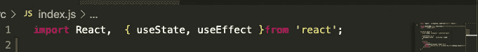
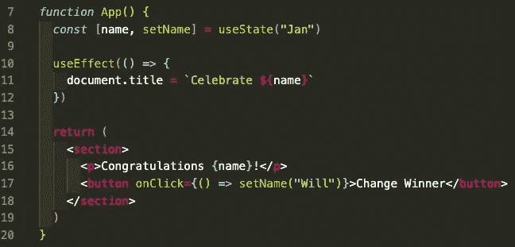

# 钩子和梯子第 2 部分

> 原文：<https://medium.com/codex/hooks-and-ladders-part-2-eea1dedcf52b?source=collection_archive---------32----------------------->

## *使用 useEffect 钩子的基础知识，以及它如何成为你提高编程技能的阶梯*

在 React 编程中使用钩子对应用程序的可读性和设计非常有益。它们有助于使代码更加清晰和简洁。它们还可以增加代码的可测试性。总而言之，这只是一种更现代、更高效的编程方式。

在我上一篇关于钩子的博客中，我主要讨论了**使用状态**钩子，这是一种在功能组件内部的组件生命周期中管理应用程序状态的方法。这一轮我将特别关注**使用效果**挂钩。前者关注的是如何保持对*状态*的跟踪，我敢打赌你能猜到这一步的走向……它与功能组件中的副作用*有关。*

# 何时调用

渲染后调用 **useEffect** 中定义的效果。实际上，它们是在第一次渲染之后和每次更新之后被调用的。使用钩子代替古老的基于类的组件的区别很小，但是很强大。有些事情不是在组件安装后完成的，而是在组件首次出现后完成的。基于类的组件有点过时，在最近的 React 编程中几乎没有使用过。每个新开发人员都应该从一开始就把时间投入到学习钩子上。

# 使用效果

使用 **useEffect** 钩子的主要思想是替换成 componentDidMount 生命周期函数。但是，它也可以处理一些其他的副作用。从本地存储读取是一个方面，注册和注销事件侦听器是另一个方面。如果定义了效果，则根据状态、属性或上下文的变化，组件将被重新渲染。可能还有作为第二个参数提供的依赖数组。如果没有提供任何内容，它将只在初次渲染时运行。

# 让我们看看它的实际效果

首先，你必须从 react 导入钩子和它的老伙伴 **useState** 。

现在，让我们来看看这个*功能*应用程序，它可以通过点击一个按钮来更改竞赛获胜者的姓名。

对于要执行的效果， ***useEffect*** 只定义了一个(强制)参数。我们使用状态变量来表示名称，并将值赋给 *document.title* 。我们给按钮分配了 onClick 函数，这样当它被点击时, **useEffect** 将会运行并重新渲染，名字将会改为 will。

我希望你喜欢这篇关于 **useEffect** 钩子的文章，并且在你理解 React 中的钩子的过程中找到有用的信息。请稍后回来查看其他一些。请随意查看我的其他博客，并在我的 LinkedIn 上与我联系！编码快乐！

 [## Jamon Dixon -全栈开发者-熨斗学校| LinkedIn

### 全栈式 web 开发人员，对事物的工作原理充满好奇，并具有解决问题的能力。拥有强大的…

www.linkedin.com](https://www.linkedin.com/in/jamondixon/)