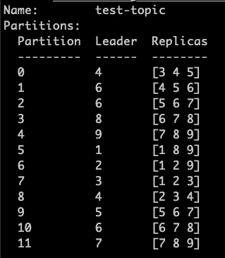
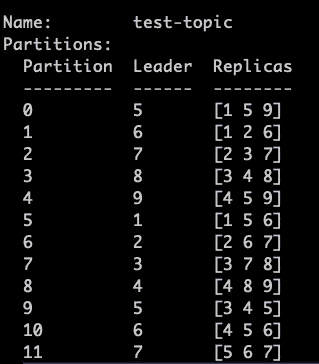

# 横向扩展 Kafka 集群

> 原文：<https://medium.com/codex/horizontally-scaling-up-a-kafka-cluster-9492d3943560?source=collection_archive---------7----------------------->

我在 Gojek 的数据工程团队工作，我的工作包括管理大量的 Kafka 集群，以及其他种类的东西。这篇博客的灵感来自于我们的一个 Kafka 集群最近的一次中断，导致了消费应用程序的降级。作为一个度假村，我们必须横向扩展 Kafka 集群。这篇博客将让您了解 Kafka 集群的水平扩展，重点关注分区重新分配。

由于集群上的高负载，我们在少数代理上面临高 CPU。我们可以选择简单地通过用强大的机器替换它们来增加每个代理的计算能力，即垂直扩展。垂直扩展 Kafka 集群意味着用更高容量的节点替换现有的代理节点，同时保留相同的代理。

但是当你这样做的时候会有一些挑战。例如，它涉及对代理配置的仔细重新考虑，以便最佳地使用新的计算能力。向群集过度调配计算和存储资源可能会给企业带来巨大的成本。我们不想花太多精力根据新的机器规格重新调整我们的代理配置，以便在一个关键的生产支持问题上节省一些时间。所以我们决定横向扩展 Kafka 集群。

我们的 Kafka 代理通常是标准的 Google 计算引擎实例。代理配置是在可重用的 IaC 模块中定义的，因此许多团队可以从这些经过深思熟虑的配置中受益。您所需要做的就是使用 IaC 工具提供您的代理。在数据工程团队中，我们大量使用 Terraform 进行 IaC 供应。

# 过程

水平扩展 Kafka 集群包括以下粗略步骤:

1.  创建调配存储、网络和计算资源的新机器
2.  使用您选择的配置和供应的资源启动代理
3.  在集群中重新分配分区，以便新的代理分担负载，从而提高集群的整体性能

当您没有创建新机器并为其配置必要软件和配置的标准方法时，第 1 步和第 2 步可能具有挑战性、耗时、易出错且棘手。数据工程团队付出了大量努力，在任何部署环境中实现这些标准，无论是容器还是虚拟机。它给我们带来了指数级的好处，节省了大量时间，避免了配置偏差和人为错误。所以在这里，唯一需要解决的事情是分区的重新分配。

在向上扩展之前，集群有 6 个代理和大约 1600 个主题。正如你可能知道的，Kafka 主题被进一步分割成分区以实现负载平衡。代理存储这些分区。代理按照复制配置复制分区。如果你对复习感兴趣，我在这里写了这些概念[。当您添加新的代理时，您还需要手动重新安排集群中的分区，以便新的代理可以在所有代理之间平衡负载。](https://abhisheksah.xyz/what-makes-kafka-awesome/)

对于一个主题的每个分区，一个代理被选为该分区的领导者，一些代理参与复制该分区。因此，例如:对于复制因子为 3 的主题 T，分区 Pi 分布在作为领导者的代理 1 和作为跟随者的代理 2 和 3 之间。当您对此主题运行重新分配时，领导者和追随者将被修改。

我们来看一个详细的例子。下图显示了一个主题`test-topic`，有 12 个分区和一个跨 9 个代理的存储计划。



*运行分区重新分配后:*



如您所见，Kafka 控制器节点针对不同的代理重新调整了分区存储。最初，Kafka 控制器节点将分区 0 存储在代理 3、4 和 5 上，其中第 4 个作为领导者。重新分配后，它存储在 1、5 和 9 上，第 5 个代理作为领导者。

当添加新的代理时，分区重新分配将确保主题分区在代理之间平衡，包括我们作为扩展的一部分添加的代理。我们需要在所有主题上这样做，以便在新添加的代理之间实现最佳负载平衡。

# 执行

现在，让我们快速看一下如何着手进行重新分配。

标准 Kafka 安装具有运行重新分配所需的脚本。可以查到是`bin/kafka-reassign-partitions.sh`。

重新分配是一个 3 步流程:

1.  首先，我们将希望负载平衡的主题列表放在一个 JSON 文件中。

```
{ "topics" : [ { "topic" : "test-topic" } ] , "version" : 1 }
```

2.我们告诉卡夫卡集群为我们生成一个计划。它会将当前分区副本分配和建议的分区重新分配配置记录到控制台

```
bin/kafka-reassign-partitions.sh --bootstrap-server "my-kafka.example.com" --broker-list "1,2,3,4,5,6,7,8,9" --topics-to-move-json-file "/root/topics.json" --zookeeper "my-zookeper.example.com" --generate
```

将建议的分区重新分配配置放在一个 JSON 文件中。

3.我们根据提议的计划执行任务。

```
bin/kafka-reassign-partitions.sh --bootstrap-server "my-kafka.example.com" --reassignment-json-file "/root/plan.json" --zookeeper "my-zookeper.example.com" --execute
```

执行时间取决于主题的大小，并且是异步发生的。您可以通过验证来查询该执行的状态。

```
bin/kafka-reassign-partitions.sh --bootstrap-server "my-kafka.example.com" --reassignment-json-file "/root/plan.json" --zookeeper "my-zookeper.example.com" --verify
```

# 后续步骤

对于拥有数千个主题的大型集群来说，手动重新分配分区*非常耗时。下一步，我们希望开发自动化功能，在最少干预的情况下进行分区重新分配。*

*原载于*[*https://abhisheksah . XYZ*](https://abhisheksah.xyz/kafka-scaling/)*。*