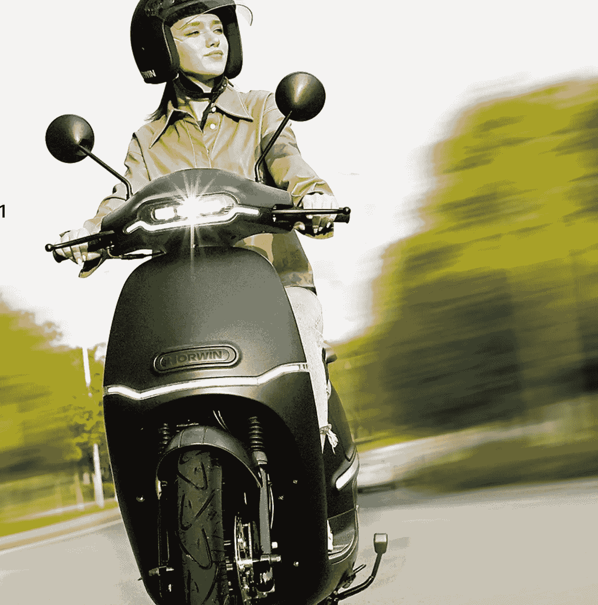

# horwin EK3——满载创新的电动助力车

> 原文：<https://medium.com/codex/horwin-ek3-an-electric-moped-that-is-loaded-with-innovation-47fddddc3c69?source=collection_archive---------4----------------------->

## 以一定的速度启动！

[EK3(霍文媒体)](https://www.horwin.eu/)

在不断扩张的电动汽车领域，一个即将被重新定义的新类别“助力车”出现了。奥地利设计、中国制造的电动摩托车品牌 [Horwin](https://www.horwin.eu/) 推出了其最新的充满创新和技术的电动汽车。体重不到 250 磅…