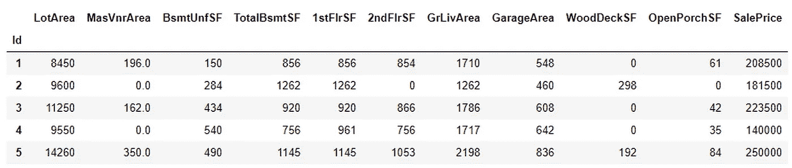
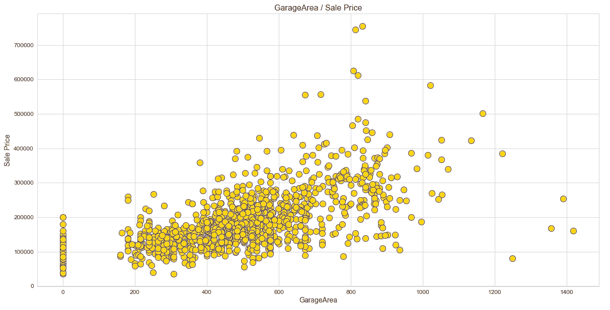
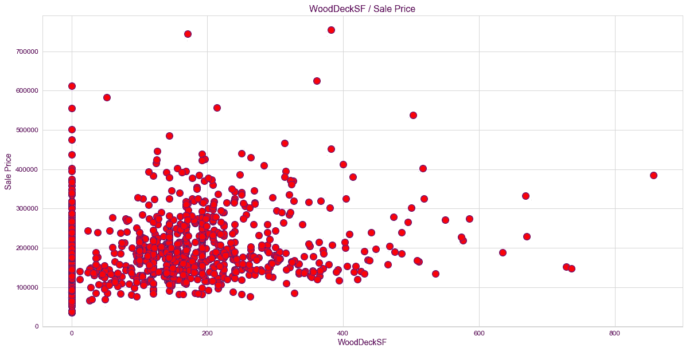

# Python 中基于机器学习的房价预测

> 原文：<https://medium.com/codex/house-price-prediction-with-machine-learning-in-python-cf9df744f7ff?source=collection_archive---------0----------------------->

## 使用岭、贝叶斯、套索、弹性网和 OLS 回归模型进行预测

# 介绍

估计房屋的销售价格是你的数据科学简历中的基本项目之一。通过完成这篇文章，你将能够使用各种类型的线性回归算法预测连续变量。

**为什么要线性回归？线性回归是一种用于预测本质上连续的值的算法。它变得越来越流行，因为如果你是 ML 的新手，这是最好的开始算法。**

为了预测销售价格，我们将使用以下线性回归算法:有序最小二乘(OLS)算法、岭回归算法、Lasso 回归算法、贝叶斯回归算法，最后是弹性网回归算法。这些算法可以通过使用 scikit-learn 包在 python 中实现。

最后，我们通过使用 scikit-learn 包提供的评估指标来评估每个模型，从而得出哪个模型最适合给定的情况。

# 为什么是 Python？

Python 是一种通用的高级编程语言，以其高效和强大的功能而闻名。Python 因其易用性而受到数据科学家的喜爱，这使得它更易于访问。Python 为数据科学家提供了大量的工具和软件包来构建机器学习模型。它的一个特别之处是，我们可以用更少的代码构建各种机器学习。

# 涉及的步骤

1.  将所需的包导入我们的 python 环境
2.  导入房价数据并对其进行 EDA
3.  房价数据的数据可视化
4.  特征选择和数据分割
5.  使用算法对数据建模
6.  使用评估度量来评估所构建的模型

现在让我们进入编码部分吧！

# 导入所需的包

我们这个项目的主要软件包是用于数据处理的 pandas，用于数组的 NumPy，用于数据可视化的 matplotlib & seaborn，以及用于构建评估我们的 ML 模型的 scikit-learn。让我们将所有需要的包导入到 python 环境中。

**Python 实现:**

# 导入数据和 EDA

正如我之前所说的，我们将使用房价数据集，该数据集包含关于房屋及其销售价格的各种功能和信息。使用 Pandas 包提供的*‘read _ CSV’*函数，我们可以将数据导入到 python 环境中。导入数据后，我们可以使用“head”函数来浏览我们的数据集。

**Python 实现:**

输出:

作者图片

现在让我们继续 EDA 部分。我们从删除数据集中包含的所有空值开始 EDA 过程。我们可以在 python 中使用*‘dropna’*函数来做到这一点。

**Python 实现:**

输出:

作者图片

现在，使用“描述”功能，我们可以获得数据的统计视图，如平均值、中值、标准偏差等。

**Python 实现:**

输出:

作者图片

EDA 过程中的最后一步是检查变量中存在的变量的数据类型。如果有任何浮点或对象类型的变量，我们必须将它们转换成整数类型。现在，让我们使用 python 中的*‘dtypes’*函数来看看数据集中变量的数据类型。

**Python 实现:**

输出:

作者图片

我们可以注意到，变量 *'MasVnrArea'* 是浮点数据类型的形式。请记住，将 float 类型更改为 integer 类型是非常重要的，因为只有 integer 类型的变量才支持线性回归。可以使用 python 中的*‘as type’*函数进行转换。

**Python 实现:**

输出:

作者图片

至此，我们的 EDA 流程结束。我们的下一个过程是使用 matplotlib 和 seaborn 包来可视化数据。

# 数据可视化

在此过程中，我们将制作三种不同类型的图表，包括热图、散点图和分布图。

## ㈠热图:

热图对于发现数据集中两个变量之间的关系非常有用。使用 python 中 seaborn 包提供的*‘heat map’*函数可以很容易地生成热图。

**Python 实现:**

输出:

作者图片

## ㈡散点图

像热图一样，散点图也用于观察数据集中两个变量之间的线性关系。在散点图中，因变量标在 x 轴上，自变量标在 y 轴上。在我们的例子中,“销售价格”属性是因变量，其他属性是自变量。很难为每个变量生成一个图，因此我们可以定义一个函数，该函数只接受因变量，并返回数据集中每个自变量的散点图。

**Python 实现:**

输出:

作者提供的图片

## (三)分布图

分布图对于检查变量在数据集中的分布情况非常有用。现在让我们使用*‘distplot’*函数来生成一个分布图，以检查数据集中*‘sale price’*变量的分布。

**Python 实现:**

输出:

作者图片

至此，我们完成了数据可视化过程。我们的下一步是选择和定义因变量和自变量，并将它们分成训练集和测试集。

# 特征选择和数据分割

我之前说过，在这个过程中我们要定义‘X’变量(自变量)和‘Y’变量(因变量)。在定义变量之后，我们将使用它们将数据分成训练集和测试集。可以使用 python 中 scikit-learn 提供的“train_test_split”函数来拆分数据。

**Python 实现:**

输出:

作者图片

现在我们已经拥有了构建线性回归模型所需的所有元素。因此，让我们进入下一步，使用 python 中的 scikit-learn 构建模型。

# 建模

在这个过程中，我们将建立和训练五种不同类型的线性回归模型，它们是 OLS 模型、岭回归模型、拉索回归模型、贝叶斯回归模型、弹性网回归模型。对于所有模型，我们将使用 python 中的 scikit-learn 包提供的预构建算法。所有模型的过程都是一样的，首先，我们定义一个变量来存储模型算法，然后，我们将训练集变量拟合到模型中，最后在测试集中进行一些预测。

**Python 实现:**

使用 scikit-learn 提供的算法，我们已经成功构建了五个不同的线性回归模型。现在，为了知道哪个模型更适合我们的数据，我们可以使用评估指标来评估每个模型，并得出结论。

# 模型评估

为了评估我们的模型，我们将使用 python 中的 scikit-learn 包提供的*‘解释变量得分’*度量和*‘R2 得分’*度量函数。

对于*‘解释变量得分’*指标，得分不应低于 0.60 或 60%。如果是这种情况，那么我们建立的模型不足以让我们的数据解决给定的情况。所以，*‘解释变量得分’*的理想得分应该在 0.60 到 1.0 之间。

我们的下一个评估指标是*‘R2 _ score’*(R 平方)指标。什么是 R 平方？r 平方是因变量解释自变量方差的程度的度量。它是回归模型最流行的评估指标。一个构建的理想‘R2 _ score’应该大于 0.70(至少> 0.60)。

我们现在将比较每个模型的指标得分，并选择哪个模型更适合给定的数据集。先说 python 中的*‘解释 _ 方差 _ 得分’*评估指标。

**Python 实现:**

输出:

作者图片

我们可以看到，每个模型在舍入输出值时都会得到 0.77 (77%)或 0.78 (78%)的分数，这意味着我们的模型在我们的数据集上表现良好，可用于解决现实世界的问题。在选择最佳模型的情况下，弹性网络回归模型在与其他模型进行比较时(根据解释的方差得分)更准确。其次是套索回归模型。模型中表现最差的是贝叶斯回归模型。

现在，让我们继续讨论最终的评估指标，即 python 中的“r2_score”指标。

**Python 实现:**

输出:

作者图片

在分析报告时，注意到 Lasso 回归模型的 R 平方似乎是最高的，这意味着它取代了最适合我们数据集的模型(基于 R 平方)。其次是弹性净回归模型。模型中表现最差的还是贝叶斯回归模型，因此，对于我们的数据集，忽略贝叶斯回归模型更理想。

我们可以得出结论，套索和弹性网回归模型都可以用于我们的房价数据集。

就是这样！

# 最后的想法！

在经历了一系列过程之后，我们还成功地用 python 构建并评估了五种不同类型的线性回归模型，为我们给定的数据集选择了最佳模型。但是，这不会就此停止。我们建立的每个模型都有自己的统计和数学概念。我们之所以选择这五款，是因为它的受欢迎程度。还有许多其他不同的线性回归模型，如泊松回归模型、增强决策树模型、决策树模型等。

**尽管线性回归是机器学习中最基本的概念，但它在建立模型方面仍然非常强大。**

说到这里，我们就到了本文的结尾。如果您忘记了任何编码部分，不要担心，我已经在本文末尾提供了我们所经历的所有过程的完整代码。

**快乐的机器学习！**

完整代码: