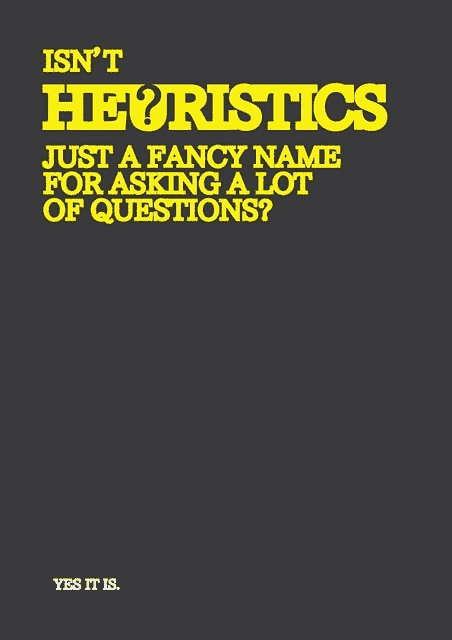

# 数据科学家如何在不使用评估工具的情况下解决 Kaggle 大赛问题

> 原文：<https://medium.com/codex/how-a-data-scientist-solved-the-kaggle-titanic-competition-question-without-using-an-estimator-e65d4eed3dda?source=collection_archive---------9----------------------->

Kaggle 的泰坦尼克号数据集可能是数据科学家开始研究时看到的第一批数据集之一。我个人已经在 Kaggle 的数据集上工作过很多次，并就这个主题写过几篇文章。除了这篇文章之外，我写过的所有文章都涉及到使用估计器来训练、拟合和预测…