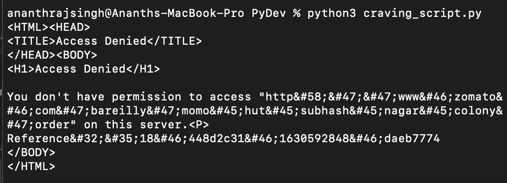
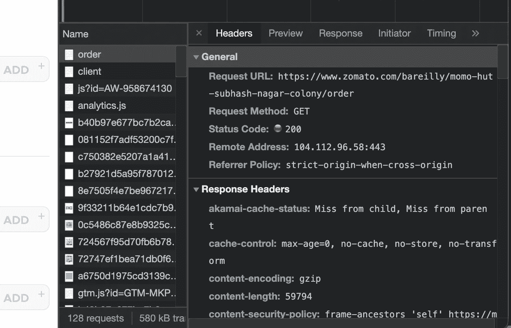
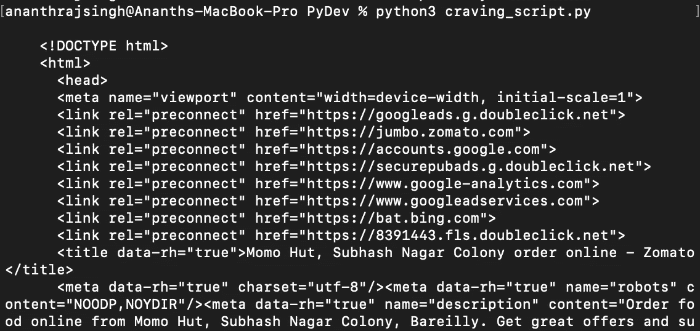
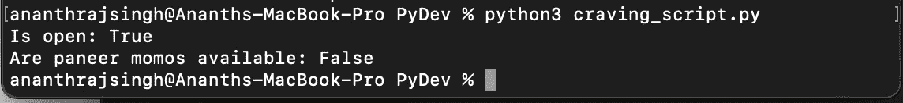

# 一个 Python 脚本如何在 Zomato 的帮助下满足我的渴望

> 原文：<https://medium.com/codex/how-a-python-script-satisfied-my-craving-with-the-help-of-zomato-a028a3781b19?source=collection_archive---------9----------------------->

## 一个可爱的 python 脚本，当你最喜欢的餐馆和/或菜肴在 Zomato 上上线时，它会向你发送电子邮件


安娜·塔拉泽维奇摄于[佩克斯](https://www.pexels.com/photo/dumplings-with-chopped-onion-leaks-7251858/?utm_content=attributionCopyText&utm_medium=referral&utm_source=pexels)

在我的家乡巴雷利，有一家名为 Momo Hut 的餐厅，提供我吃过的最好吃、最美味的 Momo。相信我，我在很多地方都有过很多 momos 但是不要告诉我的健身教练！你可能会想，在家工作期间，我有机会随时随心所欲地订购它们，对吗？不对！

这家餐厅很受欢迎，因此由于负载，经常离线，大多数时候所需的食物都不可用，即使在线。比起在 zoma to app/网站上不停刷新，我还有更重要的事情要做。我必须想出一个最佳的解决方案来满足我的渴望。我心想，这可能是一个尝试编写一个美味的 Python 脚本的好机会。

让我们把任务分解成更小的问题:

1.  获取所需网址的 HTML
2.  检查是否有在线餐厅和想要的项目
3.  达到条件时通知我
4.  定期不间断地运行该脚本

# 获取 HTML 代码

要获得静态网站的 HTML，我们需要两样东西:

*   HTML 页面的网址
*   [请求](https://docs.python-requests.org/en/master/)库进行网络连接并发出请求

假设 Python (python3)将被安装在我们正在工作的系统中，我们可以继续获取 HTML。我有这家餐馆的网址:[https://www . zomato . com/bare illy/momo-hut-subhash-nagar-colony/order](https://www.zomato.com/bareilly/momo-hut-subhash-nagar-colony/order)

要安装请求库，请转到终端窗口，使用以下命令安装库:

```
$ python3 -m pip install requests
```

现在，我们应该能够使用我的简单代码获得页面 HTML:

```
import requestsURL = "[https://www.zomato.com/bareilly/momo-hut-subhash-nagar-colony/order](https://www.zomato.com/bareilly/momo-hut-subhash-nagar-colony/order)"
page = requests.get(URL)print(page.text)
```

但是等等，我们得到了一个拒绝访问的结果:



当使用浏览器访问这个网址时，我们不会面对这个问题，所以这有什么区别呢？让我们检查一下。

在浏览器的匿名窗口中打开 URL，然后检查页面。我们可以看到，很多额外的信息是从浏览器发送的，而不是从我们的脚本发送的。



正在发送的邮件头

让我们假设我们不理解这些，为什么和什么额外的东西被发送，我们只是想从我们的脚本中模仿这种行为。这个便利的[网站](https://curl.trillworks.com/#Search)可以给我们来自 cURL 的 Python 请求参数。

这个网站(【https://curl.trillworks.com】T2)也会指导你如何提取卷发，以防你需要帮助。现在我们有了我们需要的所有头文件，可以添加到我们的脚本中了。(旁注:我们可以去掉标题中的 cookies):

```
import requestsURL = "[https://www.zomato.com/bareilly/momo-hut-subhash-nagar-colony/order](https://www.zomato.com/bareilly/momo-hut-subhash-nagar-colony/order)"
headers = {
    'authority': '[www.zomato.com'](http://www.zomato.com'),
    'sec-ch-ua': '"Chromium";v="92", " Not A;Brand";v="99", "Google Chrome";v="92"',
    'sec-ch-ua-mobile': '?0',
    'upgrade-insecure-requests': '1',
    'user-agent': 'Mozilla/5.0 (Macintosh; Intel Mac OS X 10_15_7) AppleWebKit/537.36 (KHTML, like Gecko) Chrome/92.0.4515.159 Safari/537.36',
    'accept': 'text/html,application/xhtml+xml,application/xml;q=0.9,image/avif,image/webp,image/apng,*/*;q=0.8,application/signed-exchange;v=b3;q=0.9',
    'sec-fetch-site': 'same-origin',
    'sec-fetch-mode': 'navigate',
    'sec-fetch-user': '?1',
    'sec-fetch-dest': 'document',
    'accept-language': 'en-GB,en;q=0.9',
}page = requests.get(URL, headers=headers)print(page.text)
```

太棒了。我们能够接收 HTML:



从脚本中检索的 HTML

# 检查餐厅是否在线，是否有食物

从这些大量的 HTML 数据中，我们需要挑选出我们需要的信息。对我来说，需要满足两个条件才能称之为成功事件:

*   餐厅在线
*   莫莫可供订购

HTML 响应中的这个片段将告诉我们餐馆是否离线:

```
<div class=”subtitle”>Currently closed for online ordering</div>
```

要检查所需的项目是否可用，我们只需在 HTML 响应中搜索它的名称。现在，为了从 HTML 中提取数据，我们将使用这个方便的库[美丽的汤](https://www.crummy.com/software/BeautifulSoup/bs4/doc/)。

```
from bs4 import BeautifulSoup
...
soup = BeautifulSoup(page.content, "html.parser")
subtitles = soup.find_all("div", class_="subtitle")# Check if the restaurant is open or not
is_open = False
if len(subtitles) > 0:
 is_open = "Currently closed" not in subtitles[0].decode_contents()
else:
 is_open = True 
print("Is open: " + str(is_open))# Find paneer momo
paneer_momos = soup.find_all(text='Paneer Steamed Momos [6 Pieces]')
are_paneer_momos_available = len(paneer_momos) > 0print("Are paneer momos available: " + str(are_paneer_momos_available))
```

运行这个程序将会得到如下结果:



这对一个美食家来说看起来很棒！现在，只要运行这个脚本就可以告诉我们是否可以订购了。

# 通过电子邮件通知

当我们的成功条件得到满足时，如果我们通过邮件获得在线回电，那该有多好？美味的甜！让我们使用 Python 的内置模块 [smtplib](https://docs.python.org/3/library/smtplib.html) 将邮件从脚本发送到指定的目的地。

**注意**:我们将从我们的脚本中发送敏感信息(如电子邮件的密码)，所以我们应该对加密保持警惕。为此，您也可以创建一个一次性电子邮件帐户。

以下代码通过 TLS 加密连接创建了与 Gmail SMTP 服务器的安全连接。SMTP 本身并不安全，因此 [ssl 库](https://docs.python.org/3/library/ssl.html)将帮助我们保护我们的通信。

```
import smtplib, ssl

port = 465 # Port for SMTP via SSL

# Create a secure SSL context
context = ssl.create_default_context()

with smtplib.SMTP_SSL("smtp.gmail.com", port, context=context) as server:
    server.login("your.address@gmail.com", "your*password")
    server.sendmail("your.address@gmail.com", "receiver.email@something.com", "Paneer momos are available on Momo Hut")
```


尝试运行此脚本，并检查您是否正在接收邮件。如果您的 g mail 帐户无法接收邮件，请尝试[允许连接不太安全的应用](https://myaccount.google.com/lesssecureapps)。

让我们把这个功能整合到我们的渴望脚本中，并在上菜前给它最后的润色。

对于我们来说，完整功能的脚本应该是这样的:

# 计划脚本执行

如果我们不得不一次又一次地显式运行这个脚本，那么从这个脚本中仍然没有取得多少成果。让我们试着安排它定期运行。

更好的方法是把它放在一些托管平台上，比如 pythonanywhere.com。我试过，但失败了，因为免费账户通常允许打电话到一些预先定义和指定的网址，而 zomato.com 不在其中。

相反，我使用 **cron** 来安排我们的脚本在自己的机器上定期运行，比如你的笔记本电脑或台式机。如果您有一台基于 UNIX 的机器，这对您来说将是非常简单的。您需要告诉 crontab 文件您想要运行的脚本。您可以使用以下命令编辑 crontab 文件:

```
$ crontab -e
```

终端中将打开一个 Vi 窗口，使用 Vi 编辑器将路径添加到您的脚本中，并指定时间间隔(此处为 5 分钟):

```
*/5 * * * * python3 /Users/Path/To/Directory/cravings_script.py
```

然后按 **Esc** 键进入 Vi 正常模式，输入 **:wq** 然后**回车**写入文件并退出。好了，剧本已经排好了！

在那里，高需求的 momos 问题得到解决。这个剧本已经获得了回报，自剧本推出以来，消费增长了许多倍。原谅我的困扰。

[](https://github.com/ananthrajsingh) [## GITHUB: ananthrajsingh

### 在 Github 上查看 Ananth 的知识库和 gists

github.com](https://github.com/ananthrajsingh) 

你也可以在这里找到代码要点。如果有任何问题、反馈、建议或关于一些很棒的餐馆的通知，请联系我。

邮箱:[ananthrajsingh@gmail.com](mailto:ananthrajsingh@gmail.com)

[](https://www.linkedin.com/in/ananthrajsingh/) [## Ananth Raj Singh -软件开发人员- Furlenco | LinkedIn

### 为公司、开源和个人项目设计、构建、改进和调试软件。正在写作…

www.linkedin.com](https://www.linkedin.com/in/ananthrajsingh/)