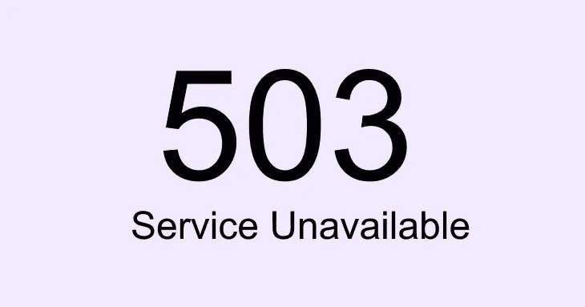

# REST 客户端如何处理 503 服务不可用错误

> 原文：<https://medium.com/codex/how-a-rest-client-handles-503-service-unavailable-error-35c8a42a75a8?source=collection_archive---------9----------------------->

HTTP 503 服务不可用服务器错误响应代码表示服务器暂时未准备好处理请求。

503 HTTP 状态代码的常见原因:

*   服务器因定期维护而停机
*   由于流量太大，服务器超载了