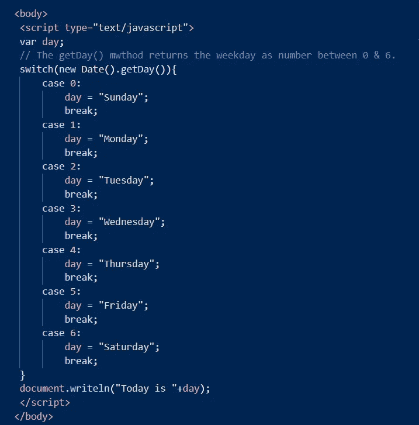
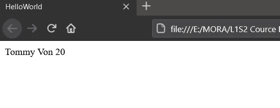

# JavaScript 怎么样？

> 原文：<https://medium.com/codex/how-about-javascript-54b47f5449de?source=collection_archive---------4----------------------->


马库斯·斯皮斯克在 [Unsplash](https://unsplash.com/) 上的照片

## ***让我们从条件句和循环句开始。***


功劳归于[埃斯克拉德弗洛克](https://media.giphy.com/media/ln7z2eWriiQAllfVcn/giphy.gif)

# **大家好！**

这是我在媒体上的第一篇文章。今天我要谈谈 JavaScript 的基本概念。

在编写代码时，我们还希望根据不同的情况执行不同的操作。这就是我们讨论条件语句的地方。

## if 语句

JavaScript 中有许多不同的条件，作为起点，我想谈谈最有用的条件之一:" **if** "

我们使用 **if** 条件来定义一个代码块，如果它对指定的条件有效，我们就要执行这个代码块。

```
if (condition) { statement}
```

只有当条件为**真**时，才会执行程序块内的语句。

*这里有一个小例子:*


*代码的输出:*


但是想想看，如果上述条件为假，那么 alert 语句将被跳过，程序将继续执行结束 **if** 语句{}之后的行。

## else & else-if 语句

我们可以使用 **else** 语句来指定一段代码，使相同的条件为 **false** 。

```
if (expression) {// executed if condition is true}else  {// executed if condition is false}
```

并且我们使用 **else-if** 条件来指定一个新的条件来测试第一个条件是否为 **false** 。

```
if (expression) {// executed if condition is true}else if (expression) {// executed if condition is false}else {// executed if the all above conditions are false}
```

*这里有一个小例子:*


*代码的输出:*


## switch 语句

试想，如果需要选择多个条件呢？这就是 switch 语句的来源。**开关**表达式被评估一次。表达式的值与每个**案例**的值进行比较。如果匹配，则执行相关的代码块。如果不匹配，则执行默认代码块。

```
switch (expression) { case n1: statements break; case n2: statements break; default: statements}
```

注意，应该在每个 case 语句中放置一个 **break** ，否则程序会无中断地移动到下一个带标签的语句，执行这些语句，直到到达一个 break 或语句的结尾。在某些情况下，这种一致性可能是可取的。

*这里有一个小例子:*



*代码的输出:*


## for 循环

如果想用不同的值反复执行相同的代码，可以使用**进行循环**。

for 循环有三个部分:初始化部分、测试条件和迭代语句。循环的初始化，其中我们的计数器被初始化为一个初始值。在循环开始之前，执行初始化语句。测试语句将测试给定的条件是否为真。如果条件为真，它将执行循环内给定的代码，否则，控制将退出循环。可以增加或减少计数器的迭代语句。

```
for (initialization; test condition; iteration statement) { Statement(s) to be executed if test condition is true }
```

*这里有一个小例子:*


*代码的输出:*


🤔这里到底发生了什么？

在上面的例子中，`statement 1 (var i = 1;)`在循环开始前设置一个变量，然后`statement 2 (i≤5;)`定义循环运行的条件(这里的****(I)****应该小于等于 5* )。在`statement 3`增加时， **(i)** 值每执行一次**加 1** 循环中的代码块。*

## *for/in 循环*

*我们在循环中使用 for/来迭代一个**对象**的属性。如果我们想读取一个对象的属性，我们可以在循环中使用它。*

*[***物体***](https://www.w3schools.com/js/js_objects.asp) ***？*🤔***

**非符号可枚举属性被迭代的对象。**

```
*for (variable in object) {  
      Statement 
}*
```

*每次根据`object`属性更改`variable`名称。*

*[***变量***](https://www.w3schools.com/js/js_variables.asp) ***？*🤔***

**在每次迭代中，不同的属性名被分配给变量。**

**这里有一个小例子:**

**

**代码的输出:**

**

*🤔这里发生了什么？*

*在 for/in 循环中，每次都取名字。然后一个人的值被替换为`lname`，然后被替换为`age`。像这样，在每次迭代中,`person`的值都会改变。然后它将`people`中的读取属性、`people`对象中`person`的值附加到这个`txt`变量中。*

## *While 循环*

*我们为什么要使用 while 循环？*

*只要条件为真，while 循环就会持续执行代码块。循环终止，直到表达式变为 false。*

```
*while (expression) {  
      Statement(s) to be executed if expression is true. 
}*
```

***有一点特别说明**:你在写代码的时候要想好表达式。如果你的条件始终为真，循环将无限运行。无限循环是非常糟糕的。如果我们不能增加条件中使用的变量，发生这种情况的一种方式是。所以你要小心！！*

**这里有一个小例子:**

**

**代码的输出:**

**

*只要 count 变量小于，5，上面代码中的 while 循环就会继续运行。而且循环每运行一次，就加 1。*

## *Do…While 循环*

*几乎完成了循环！这是最后一个了！！！*

*do-while 循环类似于 while 循环，只是在循环结束时会进行条件检查。这确保了至少有一次，即使条件不正确，循环仍然会被执行。*

```
*do {  
      Statement(s) to be executed.} while (expression);*
```

**这里有一个小例子:**

**

**代码的输出:**

**

*这就是所有关于条件和循环的内容。我想你们已经对什么是循环，以及这些循环是如何工作的有了一些基本的了解。*

*所以，如果你认为这很重要，请为我鼓掌，留下评论并与他人分享。*