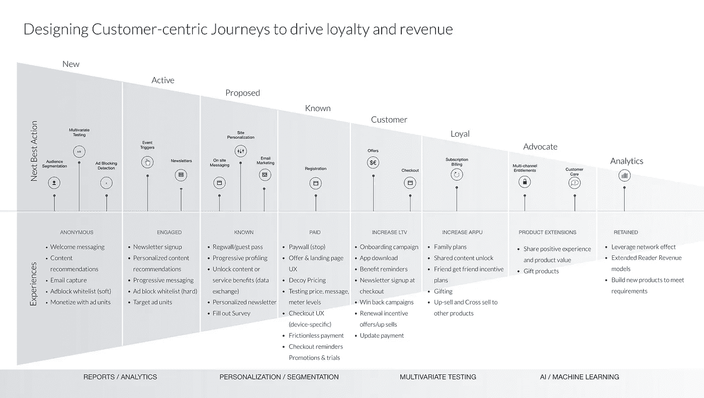

# 人工智能如何帮助公司推动更多销售。

> 原文：<https://medium.com/codex/how-ai-is-helping-companies-drive-more-sales-f511e90cfef4?source=collection_archive---------17----------------------->

巴里·李柏特，首席执行官。

由人工智能倾向建模驱动的数据驱动的客户旅程如何帮助品牌和企业销售更多。

客户旅程映射(可视化跟踪客户互动)并不是什么新鲜事，正如来自*Invesp*的[丽莎·罗斯](https://www.linkedin.com/in/lisa-ross-270389b1/)所强调的，它可以为创造一个更好的 CX 带来许多关键好处。然而，沟通渠道的兴起已经把线性旅程变成了，正如福布斯杂志撰稿人和数字化转型顾问丹尼尔·纽曼描述的那样。事实上，这种新发现的复杂性似乎令人困惑，但由于人工智能的兴起，创建有效的客户旅程地图将变得更加容易。

人工智能帮助企业优化客户旅程地图并推动更多销售的一种方式是帮助他们提供更好的客户服务。信息是了解客户偏好的关键，然而获取这些信息会给一线员工带来挑战。为了克服这一挑战，许多公司正在转向人工智能驱动的聊天机器人，这些机器人可以回答客户的问题，并确定他们对产品或服务的具体需求。

人工智能还帮助企业跟踪与客户的接触点(互动)，使他们尽可能无缝。根据基于云的呼叫中心解决方案提供商 [Five9](https://www.five9.com/) 的营销高级副总裁 Scott Kolam 的说法，人工智能已经被用于创建更多的互动渠道，使客户能够更频繁地与品牌互动。这是有益的，原因有二——首先，它允许在客户偏好的渠道之间无缝切换，其次，允许品牌以更具预测性的方式提供服务。

为新闻出版商订阅模式设计的客户之旅

## 人工智能倾向建模。

人工智能倾向建模被营销人员用作“预测工具”，可以简化为描述使用人工智能来预测用户完成某个操作的概率的过程。对于营销人员来说，这是一个强大的工具，因为它允许他们根据客户的历史数据来训练未来的预测模型。

人工智能倾向建模的使用已经被许多 CX 专家所接受，包括 CXM 平台市场领导者 Alida 的总裁 Riaz Raihan。在最近为*福布斯*撰写的[文章](https://www.forbes.com/sites/forbestechcouncil/2021/06/16/ai-driven-predictive-models-three-steps-to-transform-customer-experience/?sh=32046cee3f5e)中，Raihan 展示了企业如何使用人工智能预测模型来识别客户旅程中导致客户流失的步骤，从而增加客户保留率。事实上，我们这些从事销售工作的人都知道，留住现有客户和获得新客户一样重要。

企业也在使用人工智能倾向建模来帮助预测潜在客户转化的概率。也许其中最引人注目的是微软，他们使用一种名为 BEAM(机器人增强营销)的人工智能助手，通过自然语言处理(NLP)向客户发送电子邮件并评估他们的兴趣水平。这项技术的使用增加了 20-25%的销售时间，更重要的是，提高了成交率。

尽管人工智能倾向建模还不是一个可以单独使用的灵丹妙药，但它已经在帮助公司保持客户和增加新的销售，并且在不太遥远的将来无疑对任何企业的销售模式都至关重要。

## **永远改变商业模式的面貌。**

许多人仍然对人工智能的好处持怀疑态度，而许多高管在其商业模式中忽视了这一点。然而，塑造行业的变革力量发展迅速，对于那些选择落后的人来说往往是不可原谅的。

董事会顾问兼科技公司首席执行官巴里·d·李柏特(Barry D. Libert)最近在一篇文章中概述了这一点；[如何在平台游戏中获胜](https://sloanreview.mit.edu/article/how-to-win-at-the-platform-game/)，在麻省理工学院斯隆管理评论中，他对 SaaS 公司如何利用人工智能和数据推动指数增长的愿景。他的公式很简单——结合；

1.  可预测的订阅收入模式，
2.  市场产品和服务，
3.  人工智能驱动的机器学习模型产生网络效应。

Libert 在许多方面都是正确的，不仅仅是因为它对未来的预期有着深刻的见解，还因为许多公司已经在使用人工智能和数据来成功推动他们今天的商业模式。正如他在文章中所写的:

*“由于机器学习和数据驱动的推荐，当今世界上最大、最有价值的公司已经掌握了这种新的多边增长模式，其目标是让客户与大量供应商建立有价值的联系，并向他们提供更多他们想要的东西。”*

许多人接受李柏特模型来推动销售的一个关键方法是通过使用数据驱动的客户旅程和人工智能的倾向建模。通过在这些领域利用人工智能，公司正在改善客户体验(CX)，有效地跟踪消费者接触点，并提高客户忠诚度，以增加其品牌的收入。

为了跟上变化，我们需要保持敏捷，并且对任何变化可能带来的好处嗤之以鼻。通过让人工智能帮助我们提高 CX，增加保留率并推动我们的销售，我们都将能够在今天的新商业环境中茁壮成长。