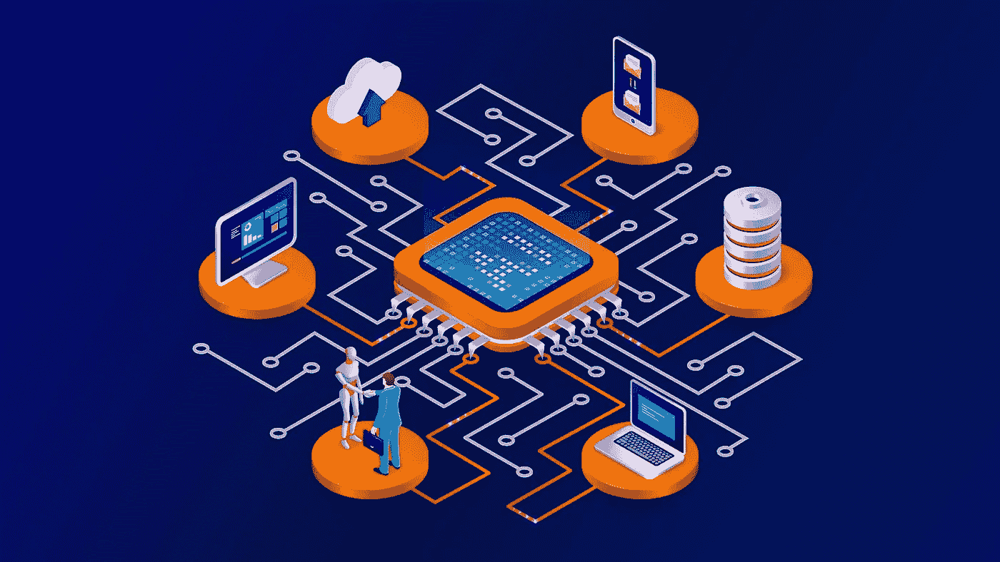

# 人工智能、人工智能和大数据分析如何融入非科技公司

> 原文：<https://medium.com/codex/how-ai-ml-and-big-data-analytics-fit-into-a-non-tech-company-430a33937e4e?source=collection_archive---------0----------------------->

作者图片

2019 年，人工智能和大分析是最重要和发展最快的两项技术。然而，这种上升趋势并不局限于 2019 年，而且已经持续了五年。这种进步和随之而来的扩散也意味着人工智能、人工智能和大分析已经在每个行业的消费者应用中找到了自己的路。但是这些技术如何适应您的公司呢？

尽管这三个主题彼此紧密相关(并且经常一起使用)，但是确定它们不是同义词是很重要的。它们有不同的用途，可以相互独立使用。在本文中，我们将明确区分人工智能、人工智能和大分析，并简要了解这三种技术如何适应非技术企业的现有工作流程。

# 什么是人工智能？

与无数好莱坞的描述相反，人工智能不是一个有意识的机器人(至少现在不是)。目前，人工智能是一种从广泛的业务流程和服务中去除人为因素的方法。现在，因为这项技术已经上市一段时间了，所以它有时间发展并被更多的行业所采用。因此，人工智能的一些实现几乎随处可见。

例如，人工智能正被用于疾病绘图、制造机器人、对话机器人(我们经常看到这种机器人)以及帮助提醒我们不适当内容的社交媒体监控工具。事实上，如今我们受益的大多数服务都是由人工智能驱动的。一个简单的谷歌搜索是由后端的人工智能驱动的。上周你在杂货店用过信用卡吗？然后有一些人工智能来验证你的卡，并监控你的账户是否有欺诈行为。今天，我们认为人工智能是我们利用计算机智能替代人类智能的一种方式。

# 机器学习和 AI 有什么不同？

机器学习是人工智能的一个子集，一个扩展。简而言之，机器学习是对计算机进行编程以分析新数据集并根据分析结果修改其行为的过程——没有任何人类干预。

这里有一个例子来帮助你理解:通常，程序员会编写代码来告诉计算机做什么，通常这是一个代码，在最低层次上，评估真或假，1 或 0。当您开发一个 ML 模型时，您正在编写的代码将会动态地响应它所输入的数据。通过模型的训练和准确性测试，您可以提出一些非常有趣的应用程序！请记住，您从模型中获得的洞察力的质量取决于您为模型提供的培训。

机器学习的美妙之处在于，它能够使用许多不同的数据类型，以及结构化和非结构化数据。通过使用谷歌云的人工智能平台，任何人都可以开始创建一个新的 ML 模型。谷歌已经有一些内置的算法，你可以用它来测试你的输入数据。谷歌人工智能平台帮助你创建你的模型，部署它，并根据你的模型进行预测。

机器学习也在快速发展！95%的北美已经采用了机器学习的用途(全球已经投资了 280 亿美元)。因此，投资机器学习可能会带来强大而持久的竞争优势。

# 大数据分析如何融入大局？

通常，人工智能和人工智能会同时使用，尤其是在大数据分析领域。这两项技术正在改变我们分析数据的方式。AI 帮助我们回答大量数据解析分析后可能提出的问题。它可以帮助我们看到帮助公司做出业务决策的关键数据点，最终推动流程走向更加简化的工作流程。事实上，超过 60%计划在其分析过程中采用机器学习的企业已经注意到，它有助于他们的决策。

通过使用谷歌的 BigQuery 这样的工具，它有一个机器学习组件，你可以利用大规模的计算来处理大量的数据输入(随着[谷歌云最近发布的](https://www.d3vtech.com/cloud-news/google-cloud-next-20-announcements-bigquery-omni-and-confidential-virtual-machines)big query Omni，这个工具现在是多云友好的)。像 BigQuery 这样的工具可以帮助数据分析师从数据中获得洞察力。通过开发机器学习模型，这些模型可以根据提供给它们的数据动态地对自己进行编程，数据分析的过程变得不那么繁琐，而且更加强大。

# 正在总结…

人工智能、机器学习和大分析是现代数据驱动型公司的关键组成部分，虽然你可能觉得这些技术对非技术组织来说不是理想的，但重要的是要记住这些技术也代表着不远的未来。当自动化、人工智能客户服务、大分析驱动的营销成为常态时，早期采用者将处于新数字时代的前沿。

如果您有兴趣了解更多关于您的组织可以利用这些新兴技术的信息，请联系下面的网站，与我们的认证云专家进行免费的战略咨询。

最初发表于[https://www.d3vtech.com](https://www.d3vtech.com/insights/how-ai-ml-and-big-data-analytics-fit-into-a-non-tech-company)