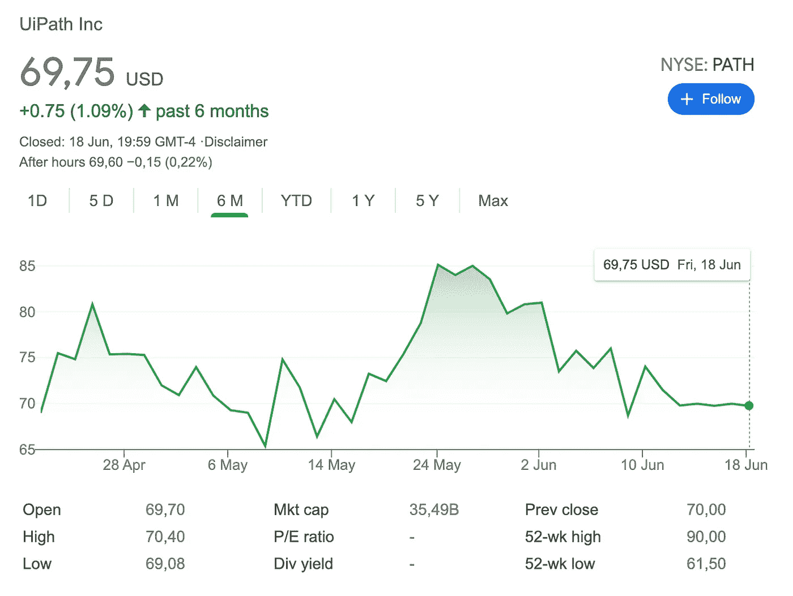
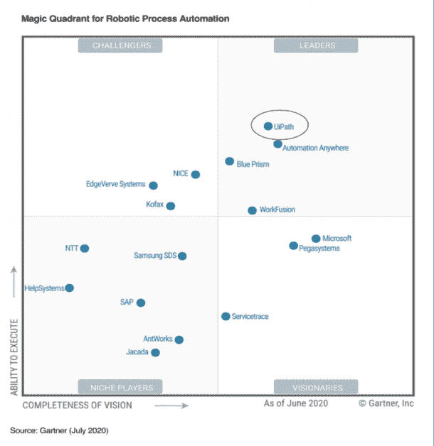
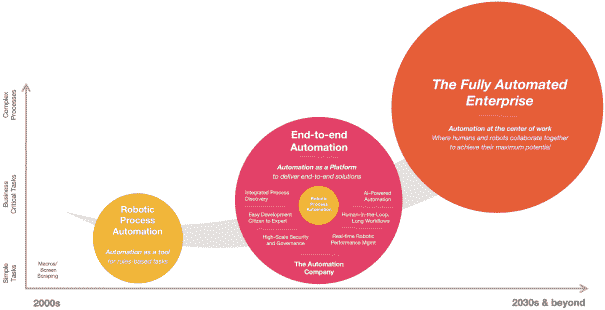

# AI 的 IPO 宠儿 UiPath，是如何让 RPA 板块火热起来的。

> 原文：<https://medium.com/codex/how-ais-ipo-darling-uipath-made-the-rpa-sector-hot-296bbc416970?source=collection_archive---------11----------------------->

# (RPA)机器人过程自动化领导者 UiPath，只能增加市场份额，从而为客户和股东带来经济价值。

尽管 UiPath 的股价回到了 69 美元的发行价，但在接下来的几个季度里，它很有可能会上涨。

从 2021 年 5 月 24 日 85.12 美元的峰值下降，这一下降是由于现有股票持有人担心高管团队的额外股份会卸载其持有的股份。

对于不熟悉锁定的人来说，这意味着在 IPO 之后，它会阻止主要股东(早期投资者)和公司内部人士(执行股票期权的高管和员工)在 IPO 之后的特定天数内出售公司股票。

这是为了防止内幕交易和股票操纵，以保护股票的消费者市场，即只参与股票上市后交易的父母和专业交易者。

由于公司可售股票数量的增加，锁定到期与公司股票下跌 1-3%有关，对于一家市值为 362.1 亿美元的公司，这相当于 3.6 亿美元的股权价值可能消失。

自 2021 年 5 月 7 日和 2021 年 6 月 18 日首次公开募股以来，UiPath 的股票表现。

在 4 月份 300 亿美元的重磅 IPO 之后，UiPath 已经牢牢确立了自己在快速增长的 RPA(机器人过程自动化)行业中的关键角色。

尽管目前科技股的市场状况起伏不定，但许多人都预测罗马尼亚的第一只独角兽前景光明，《经济学人》将其称为“自 Spotify 以来欧洲最成功的科技出口”

现在的问题是，UiPath 的早期成功将如何影响其在 RPA 行业的未来地位？一群 RPA 伪装者会蜂拥上市以利用 UiPath 的成功吗，或者这个领域已经缩小到几个关键参与者——如[蓝棱镜](https://www.blueprism.com/)、[自动化无处不在](https://www.automationanywhere.com/)和微软——在这个大肆宣传和潜在有利可图的行业中一决雌雄。

对于任何潜在投资者来说，UiPath 突出的 IPO 原因似乎是一些非常有吸引力的因素的结合。它不仅是目前增长速度第五快的 SaaS 公司，年增长率为 65%，具有巨大的规模潜力，而且在一个充斥着热门词汇(机器人、自动化、人工智能)和完全可行的行业中，它似乎是一个领跑者:根据摩根士丹利的研究，RPA 类别目前被评为具有 250 亿美元的市场机会，年复合增长率为 14%。

UiPath 的 6，000 个客户中已经有 61%是财富全球 500 强企业，包括 Adobe、雪佛龙和优步技术公司，同时该公司 30%的 ARR(年运行率)增长归功于新客户，70%归功于现有客户的扩大销售。

根据 Gartner RPA 魔力象限，UiPath 目前是同类最佳产品，其最接近的竞争对手是 Automation Anywhere 和 Blue Prism。总部位于英国曼彻斯特的 Blue Prism 于 2016 年在伦敦证券交易所 AIM 市场上市，最近其股价与 UiPath 的 IPO 同步攀升，但在该公司预测销售数据弱于预期后，股价有所下跌。

另一方面，Blue Prism 也报告称，2021 财年上半年的预订量增长了 35%，即 9800 万英镑。正如《Capital.com》杂志所引用的“Blue Prism Cloud，其完全托管的软件即服务智能自动化平台，占新预订量的 22%，较前一时期增长了 65%。”这正好表明了人们对 RPA 行业和自动化的兴趣普遍增加，尤其是在疫情的背面。然而，他们的市值停留在 952.00 美元，比 2019 年的峰值 2560 美元下降了近 63%。

许多分析师将自动化和 RPA 视为无论未来如何都有望实现强劲增长的行业领域。我们认为会的。向数字化的强行进军，无论多么令人不快，都是一个有效的警钟，让数字化变得“正确”。我们认为，即使是经济低迷，也会给自动化厂商带来优势。[维基邦研究](https://wikibon.com/)的大卫·韦兰特评论道。

最近，UiPath 的另一个密切竞争对手，位于印度班加罗尔的 Automation Anywhere 发布了一份新闻稿，宣布任命两位“经验丰富的行业老手”为首席财务官和首席运营官。他们的首席执行官兼联合创始人[米希尔·舒克拉](https://www.linkedin.com/in/mihirshukla/)宣布，他“很高兴在我们建立市场势头并迈向下一阶段增长的时候，欢迎这两位世界级的高管……”，这暗示着 UiPath 的行业竞争对手也在关注一个潜在有利可图的 IPO。

Automation Anywhere 在最后一轮融资后的估值为 68 亿美元，尽管如果该公司在上市方面采取更多措施，这一数字肯定会增加。与 UiPath 一样，Automation Anywhere 也承诺未来将实现巨大增长，并进一步宣布，“该公司目前已部署了近 300 万个由一些全球最大企业提供的软件机器人，并计划在未来几年内将这一数字成倍增长。”

然而，每家公司预计增长多少，以及它们各自能够实现多少增长尚不确定。有一点是明确的，竞争正在升温，正如摩根士丹利研究公司最近在评估 UiPath 的投资潜力时所评论的那样，“竞争的加剧平衡了风险/回报。”

摩根士丹利(Morgan Stanley)的研究发现，UiPath 目前的交易价格是其 2022 财年预期的 36 倍，从而表明“可持续增长已经反映在这些水平的股价中。”他们给了该公司 70 美元的目标股价和同等权重的评级。

虽然投资者最有可能在不久的将来看到自动化领域的 IPO，但评论人士也警告说，在这个快速增长的市场上，来自微软等行业巨头的竞争将越来越激烈，微软在 2020 年收购了 RPA 公司 Softomotive，并推出了自己的“Power Automate”包，作为其 Office 365 产品的一部分。像微软这样的公司可以通过压低价格和将 RPA 作为捆绑产品的一部分提供给已经庞大的客户群来排挤像 UiPath 和 Blue Prism 这样的竞争对手。

作为预计增长最快的软件行业之一，RPA 将成为投资者和消费者日益关注的领域。竞争只会继续升温，像 UiPath 这样的公司将不得不继续为市场提供创新和价格敏感的解决方案，这个市场越来越了解自动化在所有行业的好处。他们现在已经领先于潜在的机会主义者，但像微软这样的巨头也将继续在这个市场上获利。战斗才刚刚开始。

来源:

*https://www.marketbeat.com/ipos/lockup-expirations/*

*https://www . prnewswire . com/news-releases/automation-anywhere-appoints-former-sales force-executive-and-tech-finance-expert-strength-the-executive-team-for-the-next-phase-of-growth-301284152 . html*

*https://www . economist . com/business/2021/04/22/ui path-is-europes-most-successful-tech-export-sin-Spotify*

*https://www . benzinga . com/analyst-ratings/analyst-color/21/05/21155892/ui path-provides-big-opportunity-but-big-multiple-to-match-says-analyst-initiating-c*

*https://wiki bon . com/breaking-analysis-ui paths-非常规-path-ipo/*

*https://research.aimultiple.com/uipath-ipo/*

*https://www . CMS wire . com/digital-workplace/what-ui paths-IPO-tells-us-about-growth-of-automation/*