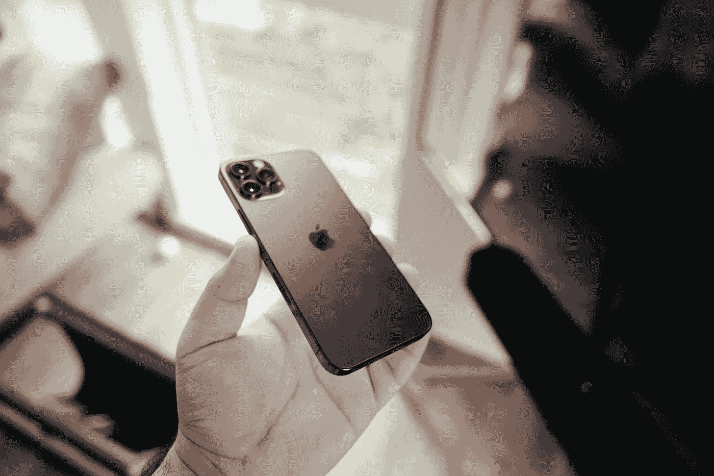

# iPhone 12 如何融入新的 5G 世界

> 原文：<https://medium.com/codex/how-apple-both-over-hyped-and-undersold-5g-1acd0d449563?source=collection_archive---------11----------------------->

## [法典](https://medium.com/codex)

## 苹果活动上的 5G 令人惊叹，但值得额外消耗电池吗？是啊！一个新世界正在打开

由[阿迪亚·艾拉瓦迪](https://unsplash.com/@tekgeekhd?utm_source=medium&utm_medium=referral)在 [Unsplash](https://unsplash.com?utm_source=medium&utm_medium=referral) 上拍摄的照片

根据卫翰思在 iPhone 12 发布会上的说法，2020 年 10 月是“5G 真正实现的时候”。那是什么意思？

*   最高下载速度为 4Gbps…