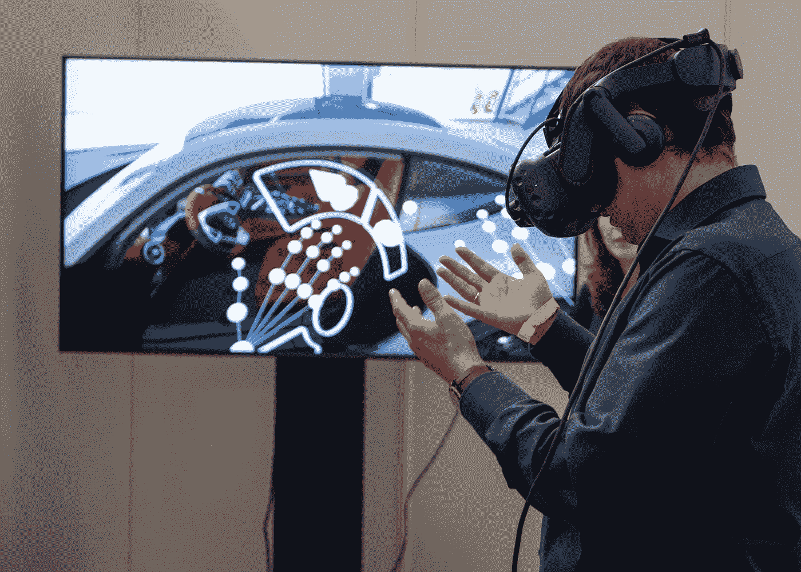

# AR/VR 将如何改变汽车行业

> 原文：<https://medium.com/codex/how-ar-vr-will-change-the-auto-industry-a4a181d33fcf?source=collection_archive---------16----------------------->

[XR Expo](https://unsplash.com/@xrexpo?utm_source=medium&utm_medium=referral) 在 [UnsplaThish](https://unsplash.com?utm_source=medium&utm_medium=referral) 拍摄的照片

新冠肺炎将永远改变许多行业，但我认为受影响最大的将继续是汽车行业。虽然经销商显然依然存在，但在网上订购汽车并在交付后取车变得越来越普遍。有时这包括建造一辆你特别定制的汽车，或者有时这仅仅意味着运送一辆已经闲置一段时间的汽车到某个地方等待…