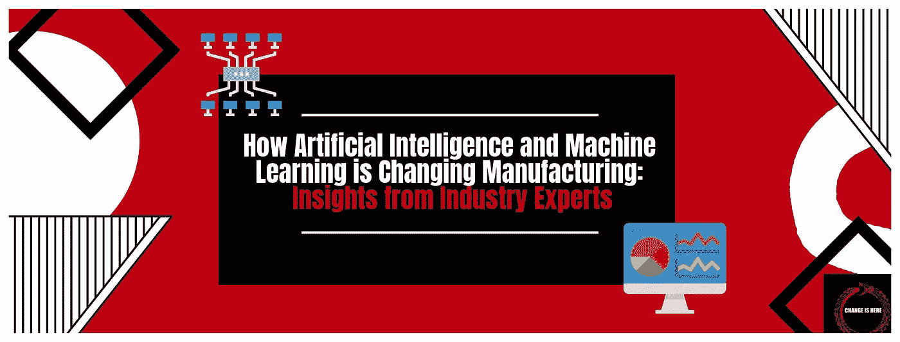

# 人工智能和机器学习如何改变制造业:来自行业专家的见解

> 原文：<https://medium.com/codex/how-artificial-intelligence-and-machine-learning-is-changing-manufacturing-insights-from-industry-385b0b8d5d2b?source=collection_archive---------15----------------------->

制造业正在发展。随着人工智能(AI)和机器学习(ML)的出现，制造商现在可以利用数据的力量来提高效率和解决曾经不可能解决的业务问题。行业专家看好人工智能和人工智能在制造业中的作用…