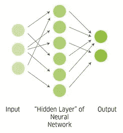
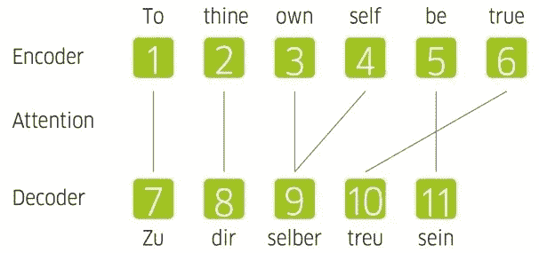
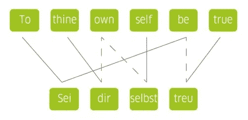

# 人工智能如何在文学翻译中“工作”

> 原文：<https://medium.com/codex/how-artificial-intelligence-works-in-literary-translation-c0e4ffdd8bd?source=collection_archive---------19----------------------->

## 理解神经机器翻译

文学翻译中的人工智能是如何“起作用”的？照片:Philippos Vassiliades

当谷歌翻译在 2006 年首次推出时，它只能翻译两种语言。到 2016 年，它支持超过 103 种语言，每天翻译超过 1000 亿个单词。现在，它不仅可以翻译，还可以实时转录八种最广泛使用的语言。机器在学习，而且学得很快。

*作者阿拉娜·卡伦*

仍然有一些机器尚未破解的语言代码。人工智能继续与人类语言的巨大复杂性作斗争——没有任何地方的语言比文学中的语言更复杂和更有意义。小说、诗歌、戏剧中的文字之美，往往在于细微之处，微妙之处。但是，由于机器按照语言学家设定的规则逐字翻译，传统的机器翻译系统无法捕捉文学文本背后的含义。他们努力理解单词所在的句子、段落和页面中上下文的重要性。

然而，有一种新技术正在学习理解这种上下文混乱——神经机器翻译(NMT)。尽管仍处于起步阶段，但 NMT 已经证明，它的系统迟早会学会如何处理文学翻译的复杂性。NMT 标志着人工智能新时代的开始。机器不再按照语言学家写的规则来玩——相反，它们在制定自己的规则，甚至创造了自己的语言。

# 神经机器翻译(NMT)

NMT 于 2016 年推出，是迄今为止最成功的机器翻译软件。与它的前身统计机器翻译(SMT)相比，它不仅拥有令人印象深刻的 60%的翻译错误减少，而且它的翻译速度也快得多。

这些进步归功于该系统的人工神经网络。据说是基于人脑中神经元的模型，该网络允许系统在单词和短语之间建立重要的上下文联系。它可以建立这些联系，因为它被训练学习语言规则，通过扫描数据库中数百万个句子的例子来识别共同特征。然后，机器使用这些规则来建立统计模型，这有助于它学习应该如何构建一个句子。

人工神经网络。一个源句子进入网络，然后被发送到不同的隐藏网络“层”，最后以目标语言发送回来。照片:阿拉娜·卡伦

# 人工语言

NMT 的一个突破性特征是它使用了一种由数字组成的新“通用语言”。

引用莎士比亚的《哈姆雷特》中的一句话“对你自己要真实”。首先，短语中的每个单词将被编码成数字(称为向量):1、2、3、4、5、6。这串数字然后进入神经网络，如左图所示。神奇的事情就发生在隐藏的层中。基于其学习的语言规则，系统在德语中找到最合适的单词。产生数字 7、8、9、10、11，它们对应于德语目标句子中的单词。这些数字然后被解码成目标语言:“Zu dir selber treu sein”。

本质上，该系统将单词翻译成自己的语言，然后根据它已经知道的东西“思考”如何最好地将它们变成可理解的句子——就像人脑一样。

# 理解上下文

> ***“从一个人交的朋友就可以知道一个人说的话。”***
> 
> 语境语言学之父约翰·r·弗斯，1957 年

NMT 能够成功翻译文学作品是因为他开始分析语境。它不仅关注希望翻译的单词，还会查看出现在前面和后面的单词。

就像大脑破译信息片段一样，人工神经网络查看它已经获得的信息，并根据其相邻的单词生成下一个单词。随着时间的推移，它会“学习”关注哪些单词，以及根据以前的例子在哪里建立最佳的上下文联系。这个过程是“深度学习”的一种形式，允许翻译系统随着时间的推移不断学习和改进。在 NMT，解读上下文被称为“对齐”，发生在注意力机制中，位于机器系统的编码器和解码器之间。

对齐的过程。对齐发生在人工神经网络的注意机制中，并用于推断单词的上下文。照片:阿拉娜·卡伦

当然，机器并不完美。当翻译回英语时，这句话变成了“对自己真实”，不太符合英国都铎王朝时期莎士比亚作品的基调或历史语域。字面上的逐字翻译应该是“Sei deinem eigenen Selbst treu”，但在德语中，莎士比亚的话通常被人类翻译为“Sei dir selbst treu”。

人工翻译。当由人类翻译时，链接比由机器翻译时复杂得多。这是由于更高层次的语境理解。照片:阿拉娜·卡伦

这里令人兴奋的是谷歌翻译在这种情况下如何抓住了“treu”这个词的重要性。使用这个德语单词意味着 Google Translate 区分了“treu”和另一个德语单词“true ”,前者的意思是“真实”,后者的意思是“忠实于”一个人的真实本性，而后者的意思是“wahr ”,意思是某事事实上是正确的。深度学习意味着一个误译的短语很可能在几周后至少部分得到纠正。(也许这篇文章发表的时候，Google Translate 已经改正了错误！)

这种与机器自身语言一起的持续改进意味着 NMT 可以被训练进行“零镜头翻译”。这是一种将一种语言直接映射到另一种语言的能力，不需要使用英语作为中介。对于机器来说，就像人类一样，熟能生巧。

# 迷失在翻译中

尽管近年来机器翻译取得了长足的进步，但它仍未能达到可接受的文学标准。亨利·詹姆斯强调了用原文理解文本的重要性，他说理想的文学翻译者必须是一个“不会丢失任何东西”的人。至少在文学方面，机器离这个理想还有很长的路要走。

NMT 继续在文学翻译中努力使用生僻字、专有名词和高度技术性的语言，只有 25-30%的作品被认为具有可接受的文学质量。一项关于将小说从德语翻译成英语的研究(见最后的参考:使用神经机器翻译文学的挑战)发现，虽然语法错误很少，但歧义词的意义在翻译中继续丢失。然而，尽管有这些错误，研究人员发现机器翻译后的文本质量足够高，足以让故事被理解，甚至读起来令人愉快。另一项关于将小说从英语翻译成加泰罗尼亚语的研究得出了类似的令人印象深刻的结果，以至于平均 25%的以英语为母语的人认为质量与人工翻译的质量相似(参见参考 a the end: NMT 翻译文学作品的正确率为 25%)。).

然而，机器系统对所有语言对的表现并不一样。它尤其与形态丰富的语言斗争，这些语言有很多屈折变化，比如斯拉夫语。当从一种不太复杂的语言翻译成一种更复杂的语言时，这一点尤其明显——这意味着 NMT 还不能作为一种全球翻译工具。

# 找到合适的声音

最大的挑战仍然是找到正确的语气和翻译文本登记。康涅狄格大学文学翻译项目主任彼得·康斯坦丁表示，如果机器要在文学翻译中取得成功，它们必须找到“合适的声音”。

> ***“机器会模仿什么？是要做一些漂亮而高明的异化，还是要做一个惊人的归化，还是要让契诃夫听起来像是 10 分钟前在伦敦写作？”***
> 
> *彼得·康斯坦丁，2019*

机器会选择哪种声音？拿诺贝尔奖得主作家托马斯·曼恩的作品来说。随着时间的推移，他的写作风格发生了变化，他早期的故事比他后期的严肃小说有趣得多。如果机器的翻译要传达预期的意思，它们需要理解并捕捉这些变化。

# 重要的合作

显然，尽管机器尽了最大努力，文学文本中发现的人类语言的内在模糊性和灵活性仍然需要人类管理。NMT 不能取代人类译者，而是作为翻译文学的有用工具。

人类和机器翻译系统之间的合作是关键。这个问题的一个答案可能是后期编辑的机器翻译。在这里，了解机器翻译所涉及的问题的专业翻译人员将编辑和修改机器的初稿——类似于一名经验丰富的翻译人员帮助编辑一名没有经验的翻译人员的工作。轻度的后期编辑机器翻译包括一些小的编辑，如拼写和语法，而完全的后期编辑将有助于澄清更深层次的问题，包括句子结构和写作风格。当然，当翻译文学作品时，可能需要充分的后期编辑，以产生正确的语域和写作风格。研究人员将一部科幻小说从苏格兰盖尔语翻译成爱尔兰语，发现这种方法比从头翻译快 31%(见最后的参考文献:一部小说的后期编辑工作与统计和神经机器翻译)。此外，在进行后期编辑时，与从头开始翻译相比，翻译人员的工作效率提高了 36%，每小时多翻译 182 个单词。

随着人工智能在我们的生活中扮演越来越重要的角色，将它作为一种翻译工具对于推动行业发展至关重要。机器翻译已经从它最初出现的地方走了这么长的路，它被设定为通过后期编辑技术来帮助文学翻译——做令人厌倦的跑腿工作，以便人类译者可以进行最后的润色。它不仅减轻了翻译人员的负担，而且 NMT 还为语言打开了多种机会之窗，从翻译以前从未翻译过的文本，到提供语言学习的帮助。通过与 NMT 的合作，我们可以将它作为一种学习工具，为所有人都能接触到文学和语言铺平道路。

## 参考

布朗利，J. 2017。*神经机器翻译的温和介绍。*【2020 年 7 月 9 日访问】。

[康斯坦丁，第 2019 页。*谷歌翻译得到伏尔泰:文学翻译和人工智能时代。当代法语和法语研究。*第 23 卷第 4 期，第 479—471 页。](https://doi.org/10.1080/17409292.2019.1694798)

[金锤，A. 2016。机器翻译的危险。铁丝。[2020 年 7 月 14 日访问]。](https://thewire.in/tech/machine-translation)

[谷歌大脑团队。2016.*用于机器翻译的神经网络，生产规模。*【2020 年 7 月 9 日进入】。](https://ai.googleblog.com/2016/09/a-neural-network-for-machine.html)

[顾，王，朱，王，李。V. O. K. 2019。*通过忽略虚假相关性改进零触发神经机器翻译。arxiv。*【2020 年 7 月 10 日访问】。](https://arxiv.org/abs/1906.01181)

伊克拉姆，S. 2020。*现在你可以用谷歌翻译转录语音。*【2020 年 7 月 9 日进入】。

琼斯，b .，安德烈亚斯，j .，鲍尔，d .，赫尔曼，K. M .，奈特，K. 2012。基于超边替换文法的语义机器翻译。*选集。*(1083 年)第 12 卷，第 1376—1359 页。

克拉瓦里蒂，2018 年。机器翻译:NMT 翻译文学作品的准确率为 25%。翻译加号。[2020 年 7 月 14 日访问]。

[马图索夫，E. 2019。*使用神经机器翻译文学的挑战。欧洲机器翻译协会:爱尔兰都柏林。*](https://www.aclweb.org/anthology/W19-7302.pdf)

[mauc，M. S .和 Donaj，G. 2019。*机器翻译及其质量评估计算智能的近期趋势。*英达公开赛。](https://www.intechopen.com/books/recent-trends-in-computational-intelligence/machine-translation-and-the-evaluation-of-its-quality)

[英国肖夫纳，2017 年。*统计 vs .神经机器翻译。* ULG 的语言解决方案博客。[2020 年 7 月 10 日访问]。](https://www.unitedlanguagegroup.com/blog/statistical-vs-neural-machine-translation)

[Systran。2020.*什么是机器翻译？基于规则的翻译与统计机器翻译。*【2002 年 7 月 9 日访问】。](https://www.systransoft.com/systran/translation-technology/what-is-machine-translation/)

[Toral，a .，Wieling，m .，和 Way，a .，2018。统计和神经机器翻译小说的后期编辑工作。*数字人文前沿。*第五卷第九期。](https://doi.org/10.3389/fdigh.2018.00009)

图罗夫斯基，2016 年生。*谷歌翻译十年。*【2020 年 7 月 9 日进入】。

[黄，S. 2016。谷歌翻译人工智能发明了自己的翻译语言。新科学家。[7 月 11 日访问]。](https://institutions-newscientist-com.iclibezp1.cc.ic.ac.uk/article/2114748-google-translate-ai-invents-its-own-language-to-translate-with/)

[山田，M. 2019。谷歌神经机器翻译对学生翻译后期编辑的影响。*专业翻译杂志。*第 31 卷，第 87—95 页。](https://www.researchgate.net/publication/330831614_The_impact_of_Google_Neural_Machine_Translation_on_Post-editing_by_student_translators)

[扎梅奥，S. 2019。神经机器翻译:数字翻译的技巧和优势。正文大师走向全球。[2020 年 7 月 14 日访问]。](https://www.textmaster.com/blog/neural-machine-translation-guide/)

版权:正文:[歌德学院，阿拉娜·卡伦](https://www.goethe.de/en/index.html)。本作品根据[知识共享署名 4.0 国际版(CC BY-SA 4.0)](http://creativecommons.org/licenses/by-nd/4.0/) 许可证进行许可。

2020 年 9 月

*原载于*[*https://www . Goethe . de*](https://www.goethe.de/prj/one/en/aco/art/21967556.html)*。*