# 人工智能如何工作:打开黑盒！

> 原文：<https://medium.com/codex/how-artificial-intelligence-works-open-the-black-box-12eb97704abe?source=collection_archive---------10----------------------->

## [法典](http://medium.com/codex)

人们常说，大约 99%的数据科学(DS)、机器学习(ML)和深度学习(DL)从业者仍然将人工神经网络(ANN)模型视为黑盒模型。

如果你属于这 99%,而任何人对此都无能为力，你可能会在下面的图片中找到娱乐价值。如果你是那 99%中的一员，并且对这种情况感到不舒服，这篇文章打算打开那个黑匣子。但是如果你是那 1%的人并且仍然好奇，这篇文章展示了你可能熟悉的深度人工神经网络反投影方程可以从这里展示的 3 个方程中恢复出来(面板 3、5 和 6)。

考虑下面图 1 所示的浅层人工神经网络，我们可以很容易地归纳出面板 1 所示的正向传播计算公式，这也适用于深层人工神经网络。对于每个单元(神经元)，线性函数将自变量(输入参数)映射到预激活值，然后由激活函数将其映射到后激活值。网络中每层的总激活值由该层中所有单元的激活值之和给出。

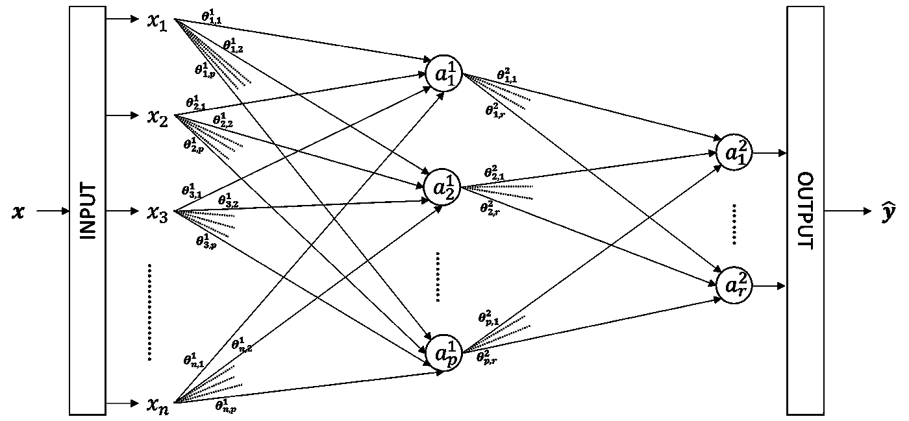

图 1:浅层神经网络(图片由作者提供)。

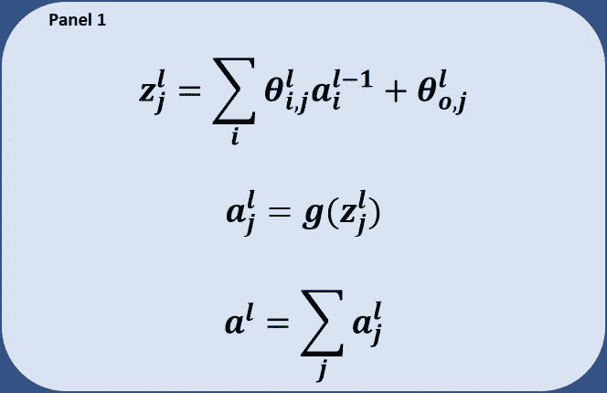

让我们假设交叉熵损失用于计算学习目标的成本函数(J)。面板 2 显示了成本函数的表达式。

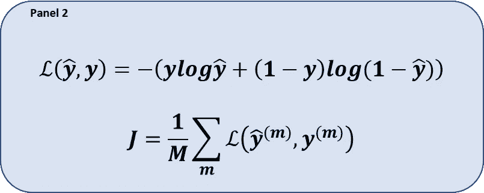

量化成本相对于图 2 中红色边缘参数的梯度涉及链式法则的应用，如面板 3 所示。

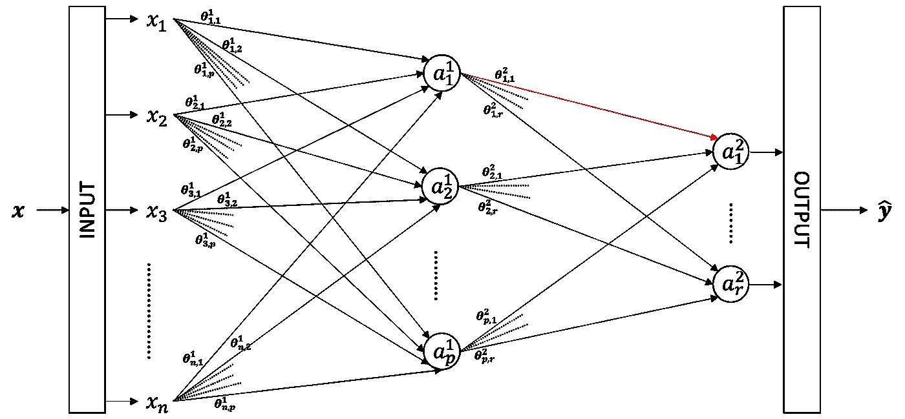

图 2:第二层网络中红色边的参数(权重)(图片由作者提供)。

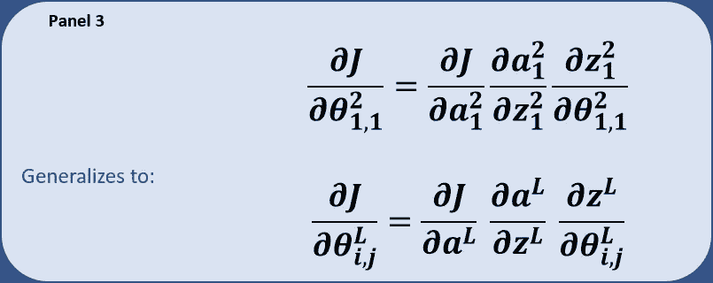

然而，如果我们根据激活函数来表达成本函数，则可以通过避免后激活项来截断链式规则，如面板 4 所示。但是为了保持一致，让我们保留链式法则的长形式。

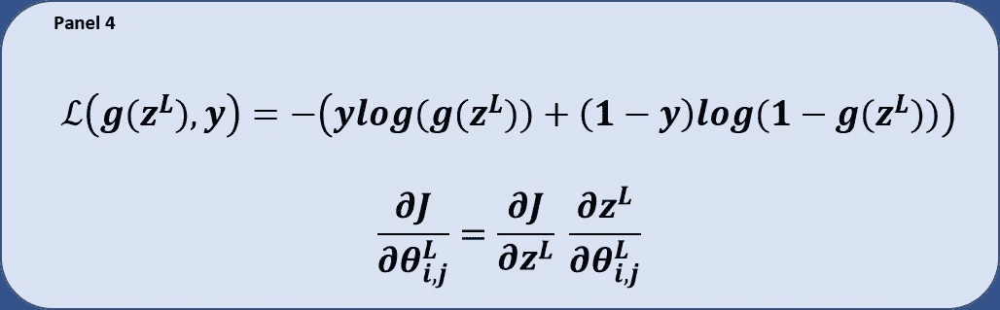

此外，在浅网络的下一层上，面板 5 示出了图 3 中彩色边缘上的梯度的计算。

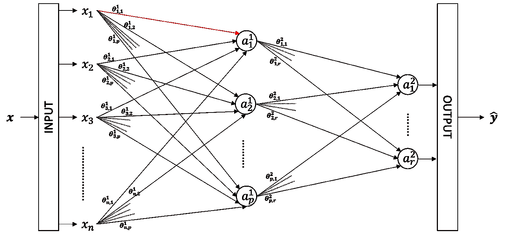

图 3:网络第一层红色边的参数(权重)。

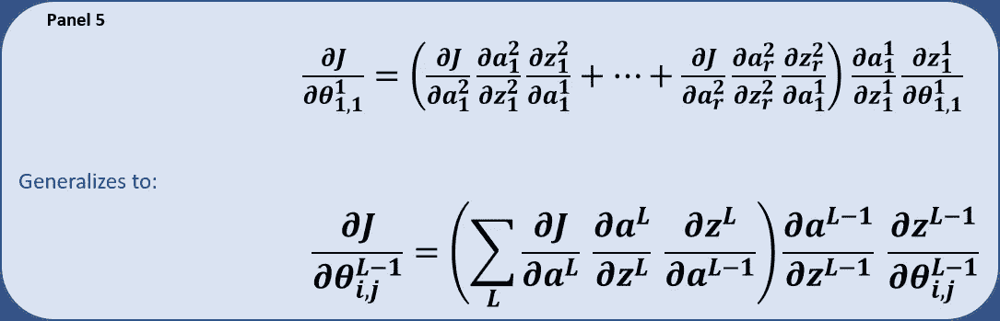

到目前为止，我们只看了一个 2 层网络(不包括输入层，这在实践中很常见)。有趣的是，我们可以将直觉从浅层网络扩展到图 4 所示的 L 层深层网络。

图 4:深度神经网络(图片由作者提供)。

类似地，对于深层网络，我们可以确定相对于隐藏层中任何参数的成本梯度。图 6 显示了相对于图 5 中边缘参数的梯度。

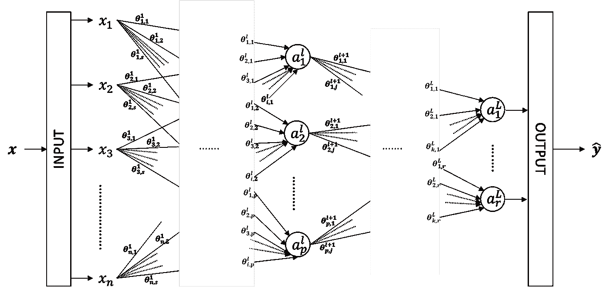

图片 5:网络隐藏层中红色边的参数(权重)。

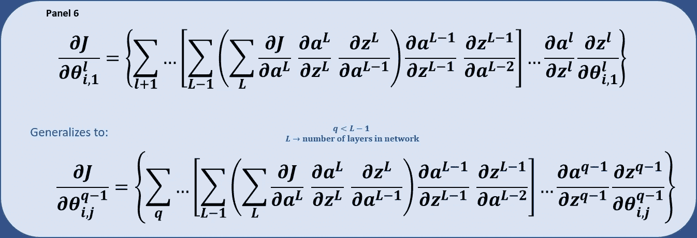

如果你熟悉吴恩达课程中的方程，你可能会注意到，当按顺序考虑时，面板 7 中的表达式等同于前面给出的表达式(面板 3、5 和 6)；对于每个渐变，迭代一层又一层。

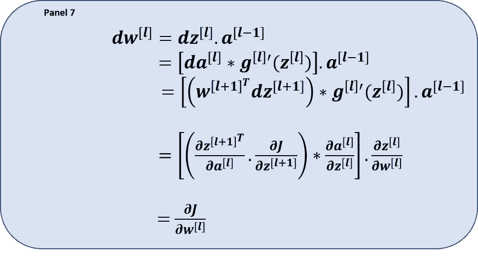

请注意，在吴恩达公式中，成本函数是以激活函数的形式表示的(如面板 4 所示)。