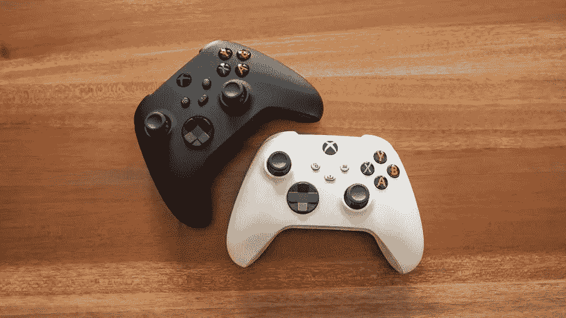

# 视频游戏有多大？

> 原文：<https://medium.com/codex/how-big-is-video-gaming-bbb7a6a6c600?source=collection_archive---------6----------------------->

今年是 2022 年，所有的新闻报道都集中在以 687 亿美元的高价收购某家公司，是的，你没看错。687 亿美元。我甚至认为在我的脑海中想象不出这么多美元钞票是多么的不可思议。

你可能会想:什么样的公司有可能被估值如此之高？或许像抖音或 Snapchat 这样的社交媒体平台？我是说，还能是什么？

在 2022 年 1 月之前，微软最大的一次收购是在 2016 年以 260 亿美元收购 LinkedIn，六年后，他们将这一数字增加了近两倍，收购了动视暴雪，这是对视频游戏和“元宇宙”未来的一次不可思议的押注对于 Xbox 及其视频游戏订阅服务 Xbox Game Pass 背后的巨头来说，此次收购将使他们成为世界上收入第三大的视频游戏公司，这是他们成为视频游戏行业绝对巨头的雄心的真实宣言(第二次宣言，考虑到他们在此之前已经收购了 Bethesda)，并在每天都在增长的元宇宙获得立足点。

微软只以 75 亿美元收购了贝塞斯达，并以超过 9 倍的价格收购了大型视频游戏特许经营权背后的公司，如:*使命召唤、魔兽争霸、守望先锋、星际争霸*和*糖果粉碎！*此次收购涉及许多较小的 IP，如*原型*视频游戏系列，在收购后可能会重新启动。

但在这样一笔肯定会对视频游戏行业产生巨大影响的交易之后，有一个问题不得不问。视频游戏到底有多大？700 亿美元花在视频游戏上是一大笔钱，但如果微软对它长期支付的股息没有完全的信心，这不是一笔支出，这是他们对这个巨大行业的信心。

视频游戏大约在 20 世纪末就已经出现了，那是很久以前的事了。现存的第一个视频游戏可以追溯到 1958 年，但是这个行业真正流行是在 80 年代和 90 年代。我们看到了像*雅达利*、更早的*任天堂*、*世嘉大师*、*世嘉土星*、 *Dreamcast* 、五代 PlayStation 中的第一代等等平台，以及像*超级马里奥、吃豆人、模拟城市、大金刚、塞尔达传说和俄罗斯方块*这样的视频游戏上升到了惊人的受欢迎程度。

一晃四十多年过去了，视频游戏行业并没有放慢脚步，更糟糕的是，它比以前更上一层楼，走得更艰难。随着现代经典如*《索尼克》、《真人快打》、《光环》、《使命召唤》、《《我的世界》》、《最终幻想》、《上古卷轴》、*以及最近流行的游戏如*、《顶点传说》、《守望先锋》、《PUBG》、*等等的出现，可以肯定地说，这个行业在短期内绝对没有放缓的迹象。我的意思是，我们已经从像素化视频游戏发展到现在拥有强大的野兽控制台，具有 4K 功能**和**光线追踪。元宇宙的增长甚至有可能将视频游戏产业带到一个全新的水平。

视频游戏行业非常庞大，远远大于电影和音乐行业。合起来。全世界有超过 20 亿游戏玩家，占世界人口的 25%以上，他们在不同的平台上玩游戏，从 Xbox 到 Playstation 到任天堂到 PC 再到智能手机。游戏无处不在。

2020 年，该行业创造了超过 1500 亿美元的收入。一百五十块。有了这样的数字，或许收购动视就不再那么疯狂了，越来越多的巨头寻求在游戏行业站稳脚跟也就不足为奇了。请记住,*使命召唤*游戏是过去几年最畅销的游戏，尽管质量有所下降，并经历了工作场所的争议。

游戏总是关于创新，关于想象，关于休闲和放松。随着技术变得更加复杂，随着更多平台的发布，游戏只会继续发展壮大，达到新的沉浸水平，特别是随着元宇宙的崛起。如果你需要一个合适的指标来说明这个行业有多大，而令人垂涎的巨额资金还不够，那么看看越来越多受流行视频游戏特许经营权启发或基于这些特许经营权的影院或流媒体发行就知道了。我们在谈论*真人快打、古墓丽影、超级马里奥、刺猬索尼克、生化危机、马克思·佩恩、刺客信条以及即将上映的电影《神秘海域》。*

视频游戏是巨大的。比你能想象的要大得多，比这篇文章所涵盖的还要大得多。事实是，随着微软收购动视暴雪和元宇宙的崛起，它的增长肯定会很快出现大幅增长。我们唯一能做的就是按计划行事。

现在可能是你买一个 Xbox 和一个 VR 耳机的好时机。跟上时代，我的伙计。