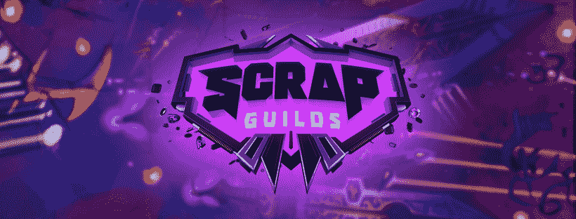

# 区块链项目如何解决 GameFi 行业的挑战

> 原文：<https://medium.com/codex/how-blockchain-projects-are-solving-the-challenges-in-the-gamefi-industry-2d2a767ae6d3?source=collection_archive---------6----------------------->

吉列尔莫·贝拉尔德在 [Unsplash](https://unsplash.com?utm_source=medium&utm_medium=referral) 上拍摄的照片

在过去的 18 个月里，随着不可替换代币(NFT)、玩 2 赚(P2E)游戏和“元宇宙”成为主流，区块链游戏生态系统的价值经历了爆炸式增长。然而，该生态系统在入职球员和项目方面正面临巨大挑战，进入成本、可扩展性和技术实力等问题限制了该生态系统的增长潜力。我们强调了这些挑战，并展示了一些开发解决方案以增强 GameFi 行业的项目。

# GameFi 生态系统的爆炸式增长

根据 [DFC Intelligence](https://www.dfcint.com/product/video-game-consumer-segmentation-2/) 的新闻报道，传统游戏有望在今年年底突破 3000 亿美元大关。到 2020 年中期，全球有超过 31 亿视频和在线游戏玩家，占世界人口的近 40%。根据 Statista 的数据，2021 年游戏玩家数量增长至 32.4 亿，其中亚洲和欧洲分别以 14.8 亿和 7.15 亿玩家领先。

这种逐渐增长将在未来几年继续下去，区块链游戏将与 VR、XR 和 AR 游戏一起受益匪浅。随着每天都有新的升级和项目推出，生态系统正在快速发展。区块链游戏不同于传统的前辈，它的运营模式是“玩到赚”，而不是“玩到赢”。这一概念包括给予玩家通过游戏进行游戏和进步的经济激励，让玩家从参与生态系统中获得被动或全职收入。

然而，GameFi 产品的需求增长如此之快，以至于大多数项目或生态系统本身都跟不上。这限制了区块链游戏的大规模采用，因为这些挑战对该领域的新用户构成了准入壁垒。

# 了解 GameFi 行业的陷阱

如上所述，区块链游戏生态系统面临着各种挑战，其中最突出的一个挑战是大多数游戏开始玩起来非常昂贵。例如，顶级 GameFi 项目 Axie Infinity 需要大约 3 个 Axie(这是游戏内的 NFT)，或者最便宜的 Axie 大约 90 美元才能开始玩游戏。这限制了愿意玩游戏的玩家数量，因为这些游戏可能比传统游戏更昂贵。

其次，GameFi 行业过于专注于“赚”，以至于他们忘记了游戏的娱乐价值。如果你访问过几个区块链游戏平台，你可能会注意到它们只是简单的点击游戏，没有什么娱乐价值。这是由于在区块链上创作使命召唤类游戏的困难，缺乏创造性的写作，以及开发游戏的技术缺陷。

最后，从玩到赚的游戏通常是作为独立项目开发的，没有游戏工作室的支持。这就提出了不连续性的问题。这意味着一旦一个游戏过时或者玩过头了，它就会死去，而不是给玩家更多的效用来让他们留在平台上。进入这类市场的新玩家发现自己没有流动性可玩，这使得在游戏中赚钱变得非常困难。

为了解决这些挑战，几个开发团队正在为此创建解决方案。为 GameFi 行业提供解决方案的项目之一是 [Attack Wagon](https://attackwagon.com/) ，这是一个免费玩和玩赚游戏的开发工作室。development studio 即将推出其第一款游戏，名为 Scrap Guilds。

# GameFi 行业的未来展望

《攻击马车的废铁公会》是一款科幻角色扮演游戏，方便玩家使用攻击马车代币(ATK)，并为玩家提供了各种不同的赚钱途径，包括通过游戏和被动方式。随着 GameFi 行业最近面临的挑战，Attack Wagon 旨在提供持久的解决方案，以促进区块链游戏在全球的大规模采用。

首先，分散式游戏项目拆除了任何昂贵的付费墙，允许每个玩家参与游戏。开发团队已经使游戏的初始设置可以免费玩，玩家可以通过玩来增加他们帐户的价值，解决了新玩家的成本障碍。另一个免费提供 P2E 游戏的项目是[自由游戏公会](https://libertygaming.io/)。他们称自己为游戏玩家获得昂贵和难以获得的 NFTs 区块链游戏的“门户”,并为游戏玩家提供一个在游戏社区中学习和发展的生态系统。他们通过降低参与者的准入门槛和提供奖学金来做到这一点。

在无聊和非娱乐性游戏的问题上，许多区块链游戏，如 [Gala Games](https://gala.games/) 、Mobox 和 Attack Wagon，正在创造出不仅仅提供赚钱功能的游戏。这些平台上的游戏提供了丰富的知识和背景故事，娱乐了玩家，吸引了他们的更多注意力，这使他们在增加收入的同时获得了乐趣。想象一下，玩《使命召唤》、《未收费》或《国际足联》可以获得奖励。这是区块链游戏的未来，最有趣的游戏吸引了最多的玩家。

区块链游戏还需要一个社区来团结他们，并需要一个开发工作室来保持游戏的新鲜和可玩性。有了诸如上述建筑开发工作室这样的项目，这些社区将会在他们的初始版本中加入更新的游戏。Attack Wagon 还为其每个游戏创建了一个长期视图，允许玩家在多个游戏中赚钱，所产生的价值在几个游戏中转移和持续，并且是长期的。此外，Liberty 已经有了广泛的游戏收藏，并将继续扩大。这样他们可以为他们的社区提供更广泛的选择，同时增加越来越多的奖学金。他们可以被视为加密游戏赚取的首选公会。