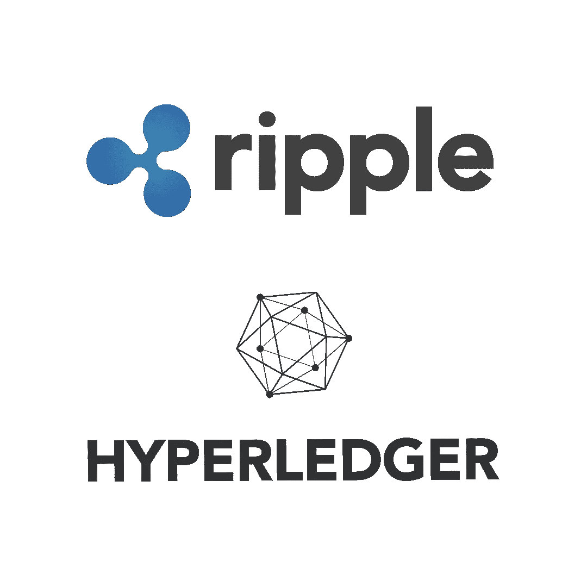
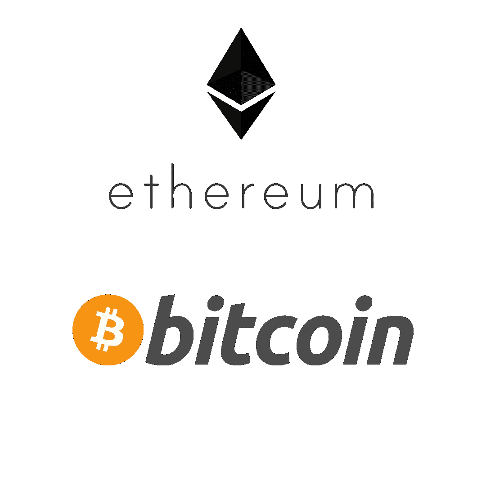
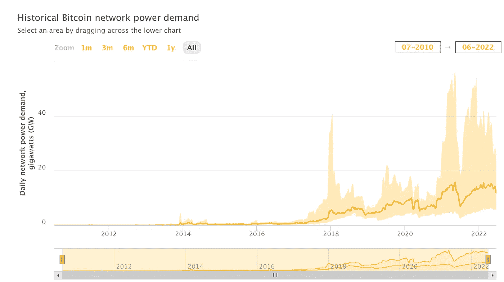
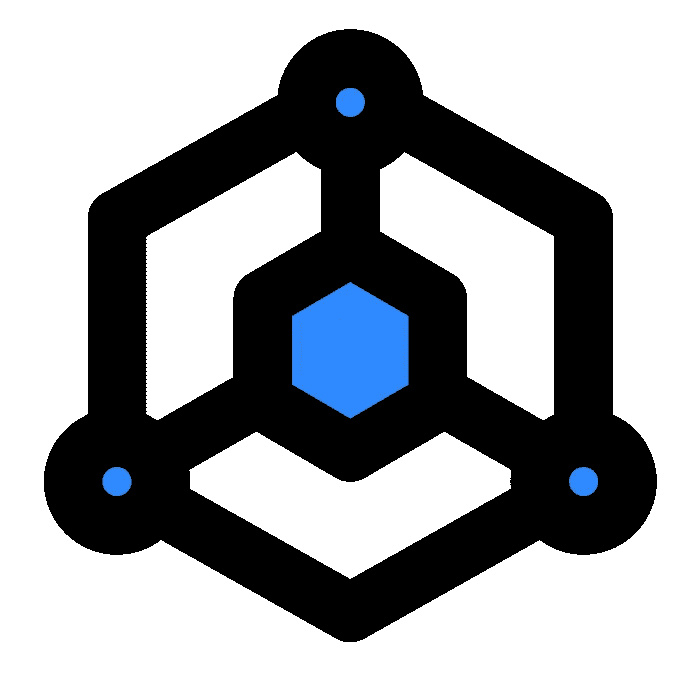

# 区块链如何运作|网站 3 解释

> 原文：<https://medium.com/codex/how-blockchains-operate-web3-explained-ca1e6229580?source=collection_archive---------6----------------------->

从表面上看，区块链是非常简单的工具。它们是组织成块的交易列表。然后，这些块通过块 A 的“当前散列”连接在一起，成为块 B 的“先前散列”,这将永远继续下去。如果你想重温这方面的知识，[请查阅 Web3 解释系列中的前一篇文章](/@block-ops.eth/blockchains-web3-explained-cc1e8e5a2e20)。在这篇文章中，我将解释是谁和什么在**操作**这些区块链，他们的**动机**，以及这样做的**环境影响**。

# 二等兵区块链

我们还没有讨论过，但绝对重要的是，区块链既可以是私有的，也可以是公开的。你可能熟悉，或者至少听说过，大众区块链:**比特币** & **以太坊**。然而，也有像 [Ripple](https://ripple.com/) 和 [Hyperledger](https://www.hyperledger.org/) 这样的私人区块链。这些私有链的目标是希望保持对**访问**和**不变性**的控制的企业。私有区块链通常有一个集中的机构来决定谁可以访问网络以及向网络中写入什么数据。把这个权限想象成一个管理员。这些特性吸引了企业，因为它们允许企业与其他公司在**订阅模式**上创建流程和数据共享操作，如果需要“更改”或“更正”数据，管理员有权这样做。

涟漪来源:[https://1000logos.net/](https://1000logos.net/)|总账来源:[https://en.bitcoinwiki.org/](https://en.bitcoinwiki.org/)

# 公共区块链

当大多数人谈论区块链时，他们指的是公共场所。首先，**节点**是**参与**区块链的任何计算机。但是一个人如何“参与”区块链呢？还记得我们在以前的文章中谈到区块链是如何连接的吗:一个块的当前哈希*变成了下一个块的前一个哈希*。鉴于这些区块链是公开的，并且可能有数百万个节点同时使用区块链，谁说哪个块的哈希匹配并在 chain 上发布呢？我们要问的是，是什么决定了所有节点的**一致性**？**

**

*以太坊来源:[https://logos-world.net/](https://logos-world.net/)|比特币来源:【https://upload.wikimedia.org/】T2*

*这个问题的答案是，这取决于区块链使用什么样的**共识机制**。[共识机制](https://ethereum.org/en/developers/docs/consensus-mechanisms/)是一组代码，允许不知道或不一定信任彼此的节点就应该将什么数据写入块达成一致。这些共识机制通常是开源的，这意味着世界上的任何人都可以看到、编辑和查看谁编辑了代码库。这种透明性给了大多数人对代码的信任感。虽然有许多共识机制，但有两个流行的机制主导着区块链领域:**工作证明** & **利益证明。***

> *共识机制——一组代码，允许不认识或不一定信任彼此的节点就应该将哪些数据写入数据块达成一致。*

*是时候说出我自己对 Web3 技术的偏见了:我认为拥有一个中央集权的权威违背了区块链的宗旨。当区块链由所有参与者的一致意见管理时，它是数据、许可和动作的奇妙存储。以我们上一篇文章中的[夏季旅行为例，如果一个演员，比如 AirBnb 的主持人，有能力改变扎克发给戴夫或戴夫发给莎莉的金额，那么区块链**只对中央集权**有利。私有区块链将会被企业广泛采用，但是随着用户越来越期望拥有网络的所有权和控制权，他们最终将会推动公共区块链的采用。](/codex/blockchains-web3-explained-cc1e8e5a2e20)*

# *工作证明*

*两者中使用更广泛的是工作证明(PoW)是最古老的共识机制，并对 Web3 空间的**环境破坏**和当前的**声誉**负责。这是比特币的共识机制，目前也是以太坊的共识机制*(我们将在下一节讨论这个)*。但是为什么对环境不好呢？*

*PoW 是一个允许节点竞争确定下一个块散列应该是什么的过程。在上一篇文章中，我们了解到这个块的**当前散列**成为下一个块的**先前散列**。为了简单起见，这是我对真相的一个*延伸。实际上，有一些规则可以决定什么是有效的下一个散列。这些规则**推动计算机之间的竞争**在寻找下一个有效哈希的比赛中，参与这场竞争的人和计算机被称为**矿工，**获胜者将获得**区块链本地加密货币的奖励。**例如，比特币矿工[目前因开采下一个区块获得 6.25 比特币](https://www.coindesk.com/learn/what-happens-when-all-bitcoin-are-mined/#:~:text=The%20reward%20for%20mining%20each,2009%20to%20just%206.25%20bitcoin.)(约 131，145 美元)的奖励。**

*以比特币为例。在撰写本文时，比特币散列只有在以 19 个零开头时才有效。那么，如何找到一个以 19 个零开始并包含**以前的事务散列**和**记录**的事务散列呢？请记住，加密哈希既有[确定性，又不能被去除](/@block-ops.eth/blockchains-web3-explained-cc1e8e5a2e20)，这意味着确定有效哈希的唯一可行选项是通过**猜测和检查**。这种猜测和检查的术语叫做**挖掘**。是的**，就这么简单**。*

*虽然这一过程很简单，但目前完成这一任务所需的计算能力非常高。例如，尝试为短语“*找到下一个有效哈希，我要分享这篇文章！*“使用下面我们最喜欢的交互式哈希工具。*

 *[## 凯克-256

### Keccak-256 在线哈希函数

emn178.github.io](https://emn178.github.io/online-tools/keccak_256.html)* 

*我[写了一些代码](https://gist.github.com/zbloss/c60cb839f3d804469318fffd60538e88)来做同样的事情，发现在我的 Macbook pro 上花了近 22 分钟的时间尝试了 1，542，635，643 次才猜出只有 8 个前导零的正确哈希。正因为如此，人们购买和操作更强大的机器，所以他们有最好的机会**开采**有效区块。*

*全世界的比特币矿工都在以最快的速度猜测和检查下一个哈希，因为谁先找到有效的哈希，谁就有 [**比特币**](https://www.coindesk.com/price/bitcoin/) 的**奖励。这意味着那些拥有最强大机器的人最有可能猜出正确的散列值并获得奖励。当我们说[比特币比阿根廷国家](https://ccaf.io/cbeci/index)消耗更多的能量时，我们谈论的是竞相寻找下一个有效哈希的矿工的能量。***

**

*[https://ccaf.io/cbeci/index](https://ccaf.io/cbeci/index)*

*比特币是第一个实现这种精心策划的挖掘、验证、哈希和交易混乱的区块链。虽然它对环境的影响不容忽视，但它确实是一项革命性的技术，值得庆祝和改进。如果你想了解更多关于比特币的知识，我强烈推荐你阅读中本聪出版的白皮书。*

# *利害关系证明*

*利益证明(PoS)直接**减轻了工作证明带来的环境负担**，因为它只允许网络中的一个节点开采新块**，而不是让整个网络竞争**开采下一个块。在 PoW 通过矿商之间的竞争获得其安全性和交易完整性的情况下，利益相关证明要求**验证者**提供抵押品以参与保护网络。提供这种抵押品也被称为**标桩**，因此被称为**标桩**。然后，可以通过编程的方式从任何恶意的验证者那里拿走这个抵押品。*

*PoS 的另一个能效是它可以在功能不太强大的计算机上运行，从而进一步减少对环境的影响，并降低有意成为验证者的新用户的准入门槛。随着验证器数量的增加，区块链的安全性也随之增加，因为恶意行为者对网络实施攻击变得更加困难。PoS 的不利一面是成为验证者所需的资本会阻止人们参与。例如，当以太坊切换到 PoS 验证器时，将需要花费大约 40，000 美元。*

***51%攻击***

*有几个关于区块链安全性的大问题，有些是针对工作证明的，有些是针对利益证明的。也就是说，可怕的 51%攻击是两种共识机制都关心的问题。简而言之，当一个**恶意实体能够控制网络的 51%** 时，这种攻击就是可能的。这种多数使他们能够向区块链写入他们想要的任何数据。在 PoW 网络中，这意味着控制一半以上的计算资源。在 PoS 网络中，这意味着控制网络中一半以上的资本。*

# *结论*

*在本文中，我们了解了两个最重要的[共识机制](https://ethereum.org/en/developers/docs/consensus-mechanisms/)以及它们的用途。我们讨论了谁在参与保护不同的区块链，以及他们具体是如何做的。在下一篇文章中，我将介绍**以太坊区块链**，并介绍**智能合约**。以太坊区块链是区块链最受欢迎的开发项目，其市值排名第二，仅次于比特币。以太坊也正在经历一场令人难以置信的有趣转变，他们将从*工作证明转变为*利益证明，这是一场前所未有的转变，我们将在 2022 年第四季度见证这一转变。*

# *社会*

*推特:[https://twitter.com/altozachmo](https://twitter.com/altozachmo)*

*领英:[https://www.linkedin.com/in/zachary-bloss/](https://www.linkedin.com/in/zachary-bloss/)*

*ETH/BTC/DOGE/LTC/SOL—[block-ops . ETH](https://metamask.app.link/send/pay-block-ops.eth@1?value=5e16)*

*block-ops . XYZ:[https://block-ops . XYZ](https://block-ops.xyz/)*

**