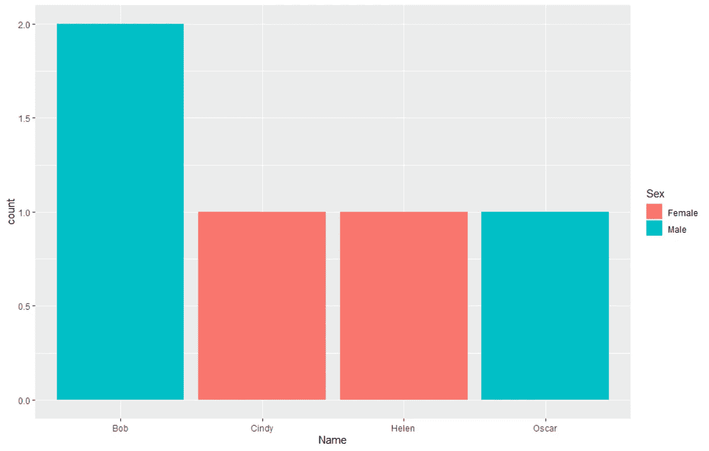

# 如何才能在 R 中产生一个有效的科学数字？ggplot2 柱状图。

> 原文：<https://medium.com/codex/how-can-i-produce-an-effective-scientific-figure-in-r-ggplot2-barplot-f7faaa27acd2?source=collection_archive---------6----------------------->

## [法典](http://medium.com/codex)

# **简介:**

好的数字是伟大出版物或演讲的标志。好的数字可以提供大量的信息，不管是什么学科的，都可以推进论点。塑造一个好身材并不容易。正如科学探究的其他方面一样，深思熟虑…