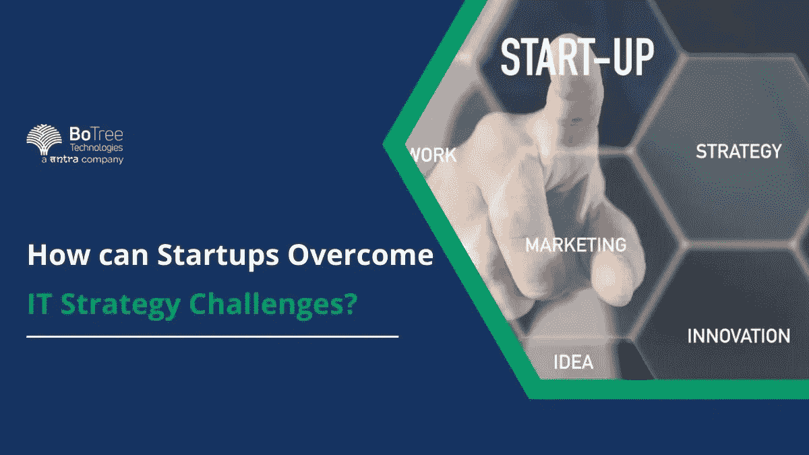

# 创业公司如何克服 IT 战略挑战？

> 原文：<https://medium.com/codex/how-can-startups-overcome-it-strategy-challenges-3fcca344c10b?source=collection_archive---------8----------------------->

初创公司面临巨大的挑战。IT 策略是很快变成问题的重要部分。虽然创业公司可以获得最新的技术，但他们没有正确的指导来执行它。这些 IT 战略挑战最终会导致失败。

如今，初创公司利用技术来获得优势。他们不拘泥于使用遗留系统。因此，他们有更好的创新机会。然而，如果他们不小心，他们的技术很容易成为一个挑战。

IT 战略的挑战和机遇在创业公司中比比皆是。许多人相信科技会把他们带到更高的高度。但是创始人经常忘记技术不是一切——他们需要专业知识和指导。这时, [IT 咨询服务](https://www.botreetechnologies.com/it-consulting-services)出现了。

IT 顾问以多种方式帮助创业公司。他们评估现有的 IT 策略并提供改进。它们提供了如何最好地使用该技术的蓝图。IT 咨询公司经常让濒临灭绝的创业公司起死回生。

让我们看看初创公司面临的最大 IT 战略挑战以及如何克服这些挑战。

> **阅读更多:** [**聘请专业 IT 咨询公司的 7 大理由**](https://www.botreetechnologies.com/blog/7-reasons-to-hire-a-professional-it-consulting-company/)

# 启动 IT 战略挑战和解决方案

IT 战略涉及很多因素。使用哪种技术？如何执行？是否需要更新或替换现有系统？所有这些问题都带来了挑战，需要适当的解决方案。

以下是公司在早期阶段面临的一些主要 IT 战略挑战，以及如何克服这些挑战

1.  无法决定技术堆栈:技术堆栈是初创公司 IT 战略的重要组成部分。有数百种技术选择可以达到同样的效果。然而，企业面临的基于技术的 IT 战略挑战通常包括优柔寡断。

**解决方案—** 初创公司可以找到以前 IT 战略挑战的例子，这些例子通过多种技术找到了解决方案。然而，并不是每种技术都适用于所有人。解决方案是考虑产品的成本、复杂性和功能性。雇佣 IT 咨询公司也有帮助，因为他们评估需求并为产品工程提供最好的技术。

**2。规模和加速的问题**:很多创业公司都是匆忙创造产品。他们的重点是尽快推出原型。但是，他们不会过多考虑软件或应用程序架构。它们留下了有限的扩展空间。

**解决方案—** IT 战略挑战实例表明，初创公司应该从第一天起就考虑扩大规模。处理 100 个用户的应用程序也应该能够处理 1000 个用户。架构的设计应该能够轻松扩展。当需要扩展时，更多的计算能力和存储容量应该随叫随到。

**3。未能维护安全的部署环境**:糟糕的网络安全让全球的初创公司损失了数十亿美元。网络攻击可能会在初创阶段削弱初创公司的运营。初创公司面临的最大 IT 战略挑战之一是他们无法专注于创建一个安全的技术环境。

**解决方案—** 围绕云安全、电子邮件安全、数据和设备安全以及托管 IT 安全的安全 IT 生态系统至关重要。网络安全应该是软件部署的核心。创业公司应该投资雇佣一家网络安全公司来评估 pan 点并保护部署环境。

**4。拥有一个普通而低效的公司网站**:创业公司的业务开发团队面临着巨大的 IT 战略挑战。其中之一就是没有任何东西可以展示给客户。如果没有客户可以信任的东西，那么 IT 战略是没有用的。网站是创业公司的大门——如果它不在那里，就很难进入。

**解决方案—** 初创公司应该在公共云中托管一个网站。如果流量成倍增加，它可以提供安全性和更强的计算能力。建立一个网站可以提供关于创业公司产品和服务的可靠性。

**5。选择内部开发而不是外包**:很多创业公司觉得雇佣内部团队会更划算、更可行。然而，他们很快就会面临人才匮乏、长期成本和无序开发的挑战。他们雇佣一般的开发人员，他们几乎可以完成任务。

**解决方案—** 外包给[软件开发公司](https://www.botreetechnologies.com/)是有意义的，因为他们有合适的经验和专业知识。内部开发人员需要持续的指导。外包合作伙伴知道做什么和如何做。他们有适合这项工作的人。从长远来看，外包节省了大量的时间、金钱和精力。

**6。更新和维护的挑战**:工程团队面临的最大的 IT 战略挑战之一是永远不要更新产品。就产品而言，更新技术也很重要。坚持一种技术或发布的创业公司往往会倒闭。

**解决方案—** 策略应规划定期更新的计划。企业家、技术领导者和项目经理应该确保他们更新产品以满足客户的需求。更新技术也很重要。它有助于解决网络安全问题，并保持在市场中的相关性。

**7 .认为他们可以自己完成所有事情**:即使是获得大量资金的初创公司也不能自己完成所有事情。创始人需要专注于业务计划和每件事的正确执行。如果有科技创始人，他们不可能独自完成所有事情。他们要么陷入编码或营销，导致灾难性的结果。

**解决方案—** 雇佣一家 [IT 咨询公司](https://www.botreetechnologies.com/blog/what-does-it-consulting-company-actually-do/)对每家初创公司来说都是一个很好的建议。该公司为信息技术部门提供了一个蓝图。他们评估、评估和修改计划。他们从事的活动让企业家们能够专注于更重要的事情。

> **请继续阅读:** [**聘请 IT 咨询服务的前 5 大优势**](https://www.botreetechnologies.com/blog/top-5-benefits-of-hiring-it-consulting-services/)

# 包扎

信息技术战略是任何初创公司运营的关键部分。如果没有适当的策略，初创公司可能会面临失败。通过识别正确的技术，雇用正确的人，并相信他们能做正确的事情，一家初创公司可以为自己省去很多麻烦。他们能够克服信息技术战略挑战，踏上成功之路。

信息技术咨询需要以前做过的专家。BoTree Technologies 是一家领先的[企业软件开发公司](https://www.botreetechnologies.com/enterprise-software-development-company)，致力于帮助初创公司满足其 IT 战略开发和技术需求。今天就联系我们，在接下来的 24 小时内开始您的信息技术战略项目。

*原为发表于 2022 年 8 月 26 日*[*https://www.botreetechnologies.com*](https://www.botreetechnologies.com/blog/it-strategy-challenges/)*。*