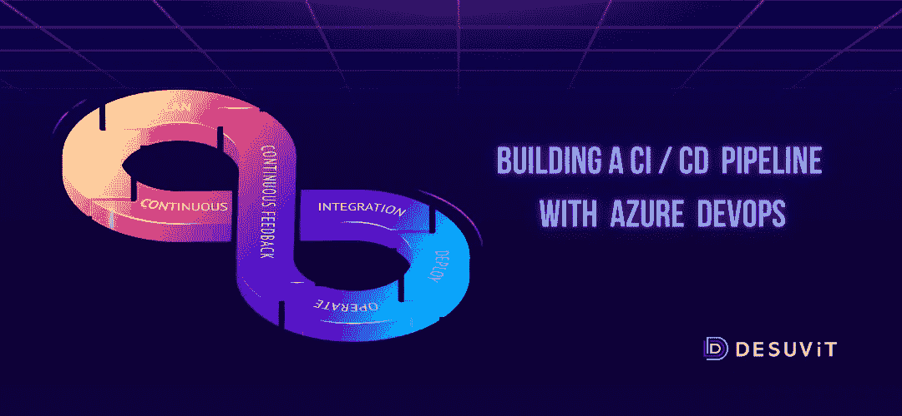

# 如何使用 Azure DevOps 建立 CI/CD 管道:综合指南

> 原文：<https://medium.com/codex/how-can-you-establish-a-ci-cd-pipeline-with-azure-devops-a-comprehensive-guide-44c62d66c6e8?source=collection_archive---------6----------------------->

在 Azure DevOps 中使用 CI/CD 管道来持续创建、测试和部署项目。在本指南的帮助下，您将能够在 Azure DevOps 中设置 CI/CD 管道。

# 了解 Azure DevOps