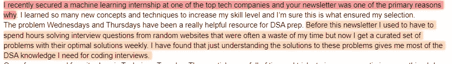
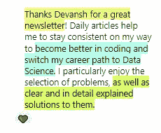

# 计算机算法如何利用懒惰

> 原文：<https://medium.com/codex/how-computer-algorithms-use-laziness-936b9f02782a?source=collection_archive---------8----------------------->

## 计算机如何通过不做事达到最高性能

我知道这个标题让我看起来像是在勾引你，

但是相信我。有一系列技巧都要求你的代码做得尽可能少。好的软件程序总是使用这些技巧来提高性能，而不会耗尽所有的计算资源。理解它们是如何工作的是构建更好的解决方案的好方法。


Graham Holtshausen 在 [Unsplash](https://unsplash.com?utm_source=medium&utm_medium=referral) 上拍摄的照片

# 火花笔记突出显示

1.  **懒评-**OG 时间开始了。引用维基百科的话， [*中的*编程语言理论**](https://en.wikipedia.org/wiki/Programming_language_theory)****懒惰评估*** *或者* ***按需调用****[*【1】**是一种*](https://en.wikipedia.org/wiki/Lazy_evaluation#cite_note-1) [*评估策略*](https://en.wikipedia.org/wiki/Evaluation_strategy) *这有几个好处。首先，如果一个昂贵的例程很少被调用，那么它将不会运行，直到它真正需要的时候。第二，如果你正在构建一个系统的一小部分，你不需要构建整个系统。这篇文章是一篇关于懒惰评估的好文章。我发现他们关于动态编程解决方案是一种懒惰评估的观点非常有见地。画这样的平行线有助于你更好地学习。这里有一个例子-***

```
**p= function (args) #the code won't actually compute what p is here
.... 
if (p == value) #this is where the code will finally call function(args). Before this point we have not run a thing.**
```

1.  ****部分求值-** 假设我给你一个复杂的布尔代数语句，有 1000 个谓词。有没有什么方法可以加快计算速度，而不用经历所有的事情？为什么，是的有！！如果你有一个像((A1 boolOp A2)和(A2 boolOp A4)和(A *q* boolOp A *p* )这样的语句…)，其中 boolOp 代表布尔运算。然后你需要做的就是找到第一个(Aq boolOp Ap)计算是假的。由于这是一系列 and，**只要一个这样的值为假，整个语句就为假**。这是对你的一个挑战——我们如何使用部分求值来捕捉一个大的为真的陈述？让我知道。**
2.  ****实时编译**——这是一种执行[计算机代码](https://en.wikipedia.org/wiki/Computer_code)的方式，涉及在[运行时间](https://en.wikipedia.org/wiki/Run_time_(program_lifecycle_phase))期间[编译](https://en.wikipedia.org/wiki/Compiler)而不是在执行之前。想想有巨大地图的电子游戏。如果游戏一次加载所有的地图，那么会给系统带来很多不必要的压力。相反，它将只运行你所在的那部分地图。因为你在地图的一个级别/部分，其他部分不需要被装载。**

****

**你不需要加载其他图形，直到你遇到他们。[图像来源](https://giphy.com/gifs/space-exploration-pACp5lpLEDZ3G)**

1.  **在 AI- 中，我们甚至看到了这个概念在 AI 中的应用。虽然实现略有不同。这些天来，越来越多的 ML 人已经转向稀疏趋势。这个想法不是依赖整个神经系统来完成一项任务，而是只使用其中的一小部分来完成任何一项任务。这可以降低成本。假设，这允许我们使用非常大的网络，能够执行更强大的任务，同时保持成本可控。下面的视频展示了我最喜欢的稀疏实现。**

**每种技术都有自己的细微差别，所以我将对每种技术进行单独分析。如果你真的想让我报道什么，你知道怎么联系我。**

****

**如果你喜欢这篇文章，你会喜欢我的每日电子邮件简讯[技术使之变得简单](https://codinginterviewsmadesimple.substack.com/)。它涵盖了算法设计、数学、人工智能、数据科学、最近的技术事件、软件工程等主题，让你成为更好的开发人员。 [**我目前正在进行全年八折优惠，所以一定要去看看。**](https://codinginterviewsmadesimple.substack.com/subscribe?coupon=1e0532f2) 使用此折扣会降低价格-**

*****每月 800 印度卢比(10 美元)→ 533 印度卢比(8 美元)*****

*****每年 8000 印度卢比(100 美元)→6400 印度卢比(80 美元)*****

**[你可以在这里了解更多关于时事通讯的信息](https://codinginterviewsmadesimple.substack.com/about)**

****

# **向我伸出手**

**使用下面的链接查看我的其他内容，了解更多关于辅导的信息，或者只是打个招呼。另外，查看免费的罗宾汉推荐链接。我们都得到一个免费的股票(你不用放任何钱)，对你没有任何风险。**所以不使用它只是失去免费的钱。****

**为了帮助我了解你[填写这份调查(匿名)](https://forms.gle/7MfQmKhEhyBTMDUD7)**

**查看我在 Medium 上的其他文章。https://rb.gy/zn1aiu**

**我的 YouTube:[https://rb.gy/88iwdd](https://rb.gy/88iwdd)**

**在 LinkedIn 上联系我。我们来连线:[https://rb.gy/m5ok2y](https://rb.gy/f7ltuj)**

**我的 insta gram:[https://rb.gy/gmvuy9](https://rb.gy/gmvuy9)**

**我的推特:[https://twitter.com/Machine01776819](https://twitter.com/Machine01776819)**

**如果你想在科技领域发展事业:[https://codinginterviewsmadesimple.substack.com/](https://codinginterviewsmadesimple.substack.com/)**

**获得罗宾汉的免费股票:[https://join.robinhood.com/fnud75](https://join.robinhood.com/fnud75/)**