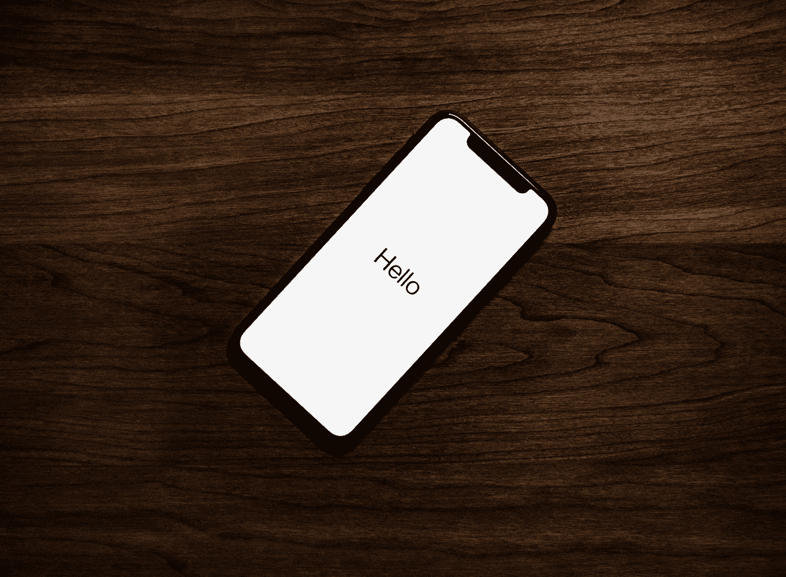

# CPU 如何用简单的话工作

> 原文：<https://medium.com/codex/how-cpu-works-in-easy-words-83f7ce11fe51?source=collection_archive---------7----------------------->

## 从曾经有一个大房间那么大的电脑到现在你口袋里一直有一台电脑，我们已经走了很长的路。

泰勒·拉斯托维奇在 [Unsplash](https://unsplash.com?utm_source=medium&utm_medium=referral) 上的照片

CPU 是计算机中所有处理过程背后的大脑。

为了理解计算机如何工作，我们需要知道它的 CPU 是如何工作的。