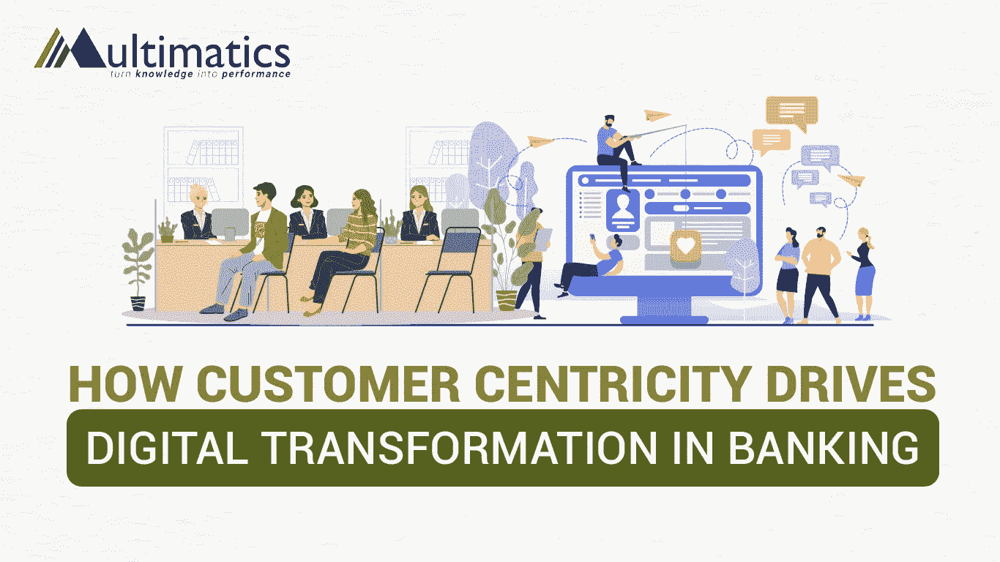

# 以客户为中心如何推动银行业的数字化转型

> 原文：<https://medium.com/codex/how-customer-centricity-drives-digital-transformation-in-banking-30a6ae41cf84?source=collection_archive---------8----------------------->

如今的客户严重依赖数字或移动优先的方法，并希望银行提供增强的超个性化服务。因此，现代银行通过利用新兴技术来转变业务，改变了他们的经营方式。

*以客户为中心正在引领银行业进入数字化转型的新时代。*

定义以客户为中心

Shivakoti & Mohanavelu (2020)将“以客户为中心”定义为了解客户在产品特性方面的需求以及他们与业务流程中根深蒂固的业务互动。这也与 Rajagopal(2020)的研究相一致，该研究声称以客户为中心的方法的概念是理解消费者的需求并创造合适的产品。

“以客户为中心”是一个强有力的行动号召，它提升了客户关系、客户服务和客户终身价值的理念。当有良好的以顾客为中心时，重要选择的焦点就放在消费者身上。忠诚度、客户满意度和宣传都可以通过提供卓越的产品、服务和体验来培养。

为了促进回头客业务和更高的盈利能力，以客户为中心指的是确定你的品牌在多大程度上受到客户满意度的影响，以及你的银行从始至终在每个环节中给予客户多少关注。

**以客户为中心在银行业数字化转型中的重要性**

以客户为中心意味着预测客户的需求、需要和沟通偏好。然后把它做好。如果你能做到这一点，你就能创造难忘的体验，并与客户建立持久的关系。然而，一个错误可能会让你失去宝贵的客户。

客户的期望达到了前所未有的高度，金融科技公司正在伺机争夺市场份额，因此银行必须重新致力于直观地了解他们的客户，并尽可能地取悦他们。虽然技术可以帮助你实现这些目标，但如果没有一个坚实的以客户为中心的战略来采取行动，它只不过是昂贵的装饰而已。

随着金融科技公司改变了客户体验和参与模式，银行必须对客户洞察有一个全面的 360 度视角，以开发创新的高质量服务。银行必须专注于为客户提供数字化体验的数字化转型之旅。

**以客户为中心如何推动银行业的数字化转型？**

**1。数字化劳动力转型**

拥抱数字工具将从根本上改变人们的工作和协作方式。通过数字工具，员工可以一起工作，更加敏捷，自由地分享知识。因此，跨职能团队可以密切合作，营造一个富有创造性和创新性的环境。

**2。大数据作为竞争优势**

客户洞察是市场中的新货币。将大数据与非结构化程度较低的数据流相结合，并将其用于机器学习，可以为银行提供灵活性和高性能计算能力。因此，他们可以管理自己的风险敞口，并获得更多的客户洞察。

**3。云刺激数字化转型**

云基础设施是成功银行业的基础。它充当可由云托管和维护的操作和按需软件的基础。这导致内部和面向客户的业务流程通过基于互联网的技术，允许有效的协调和自动化。

**4。高级网络安全**

银行必须准备好抵御网络威胁。为了向客户保证他们的数据是安全的，需要先进的安全技术。那些授权给自己的防御团队，并使用人工智能来评估运营和支持决策的银行将具有竞争优势。

**结论**

银行业的数字化转型是运营和文化的转变，旨在整合数字技术以优化运营和客户价值交付。此外，在您的流程中优先考虑以客户为中心可以利用客户数据和见解，这是非常有益的。

**访问我们的网站** [**了解更多关于数字化转型和 IT 战略的见解！**](https://multimatics.co.id/Insight.aspx)