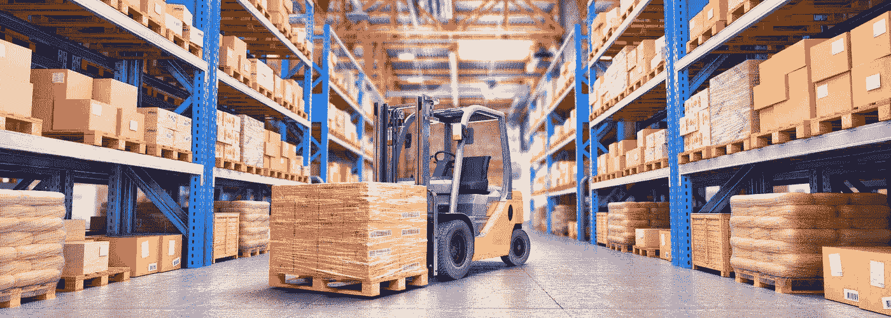

# 数据标签服务如何赋能物流机器人？—第二部分

> 原文：<https://medium.com/codex/how-data-labeling-service-empowers-logistics-robot-part2-c840fe730323?source=collection_archive---------11----------------------->

dazzlemagnet.com

# **物流智能化转型加速**

如今，物流的智能化转型是一种必然趋势，这也意味着物流机器人的发展前景将是一片光明。

随着物流机器人的各种技术，包括智能导航和控制技术的不断成熟，其应用和场景的多样化将成为发展趋势。

因此，物流机器人公司需要细分市场，结合 AI 等新技术，创造高度智能和灵活的产品和解决方案。

**无人物流机器人的应用将不再局限于仓储，将用于转运和终端配送**，以更好地解决复杂的人工劳动问题，提高效率。

毫无疑问，在资本、政策、市场的助力下，物流机器人行业将成为各路玩家的新战场。

**其实，这只是物流智能化转型的一个缩影。**

随着无人物流车、AGV、AMR 分拣机器人、智能配送系统等智能设备的普及，以及智能物联网终端操作系统的赋能，整个物流运输产业链的堵塞正在被不断打通，运行效率将不断提升。

这让快递物流公司可以从容应对庞大的订单量。企业利用数字化、智能化技术，盘活物流生态链中的每一条管道，带给消费者越来越好的体验。未来 1–2 年，整个物流行业将迎来第一个智能化年。

# **技术创新是企业发展的核心力量**

**目前物流机器人上的玩家还是以电商公司和 AI 新兴事务所为主**。

相比较而言，前者不仅在仓储和物流领域推出了码垛机器人、分拣机器人等产品，还在终端配送领域进行了部署，利用从仓储到配送的闭环智能服务，更好地发展电子商务业务。

后者专注于仓储的运输管道，推动智能物流的发展。但在资本的搅局下，物流机器人市场暗流涌动，相关公司应继续寻求技术创新。

就仓储领域而言，在早期，由于传统的仓储、搬运、分拣作业存在诸多痛点，许多公司开始使用 AGV 机器人。然而，随着电子商务市场的快速发展，**单一的少量固定路径机器人已经难以满足物流自动化和降低成本的要求。**

## **AMR 分拣机器人**

机器人已经从传统的 AGV 发展到多功能搬运机器人，甚至是攀爬搬运机器人。

与传统 AGV 相比，AMR 具有环境感知、自主导航、智能避障、智能跟随等功能，可以省去劳动力铺设引导线、附着地标等重建环境的工作，尤其是在生产过程交替进行的情况下。

同时，它还打破了 AGV 能力的界限，可以在不同的场景下完成搬运、选择和分拣任务。尤其在大规模集群调度和复杂工作场景下，搭载 VSLAM 的 AMR 更具优势。

对此，业界也普遍认为，基于 SLAM 技术的 AMR 是物流机器人企业的重要技术发展方向。可以预见的是，随着仓配模式的向前推进，AMR 将能够更好地发挥优势，市场容量将逐渐打开。

然而，AMR 仍处于早期实施阶段。未来，企业能否明确用户痛点，能否快速移植核心技术，能否实现产品平台化，是赢得接下来竞争的关键。

# 没有被标记的数据，就没有人工智能

从人工智能技术的研究方向来看，无论是在传统的机器学习领域还是深度学习领域，基于训练数据的监督学习仍然是一种主要的模型训练方法。尤其是在深度学习领域，需要更多的标记数据来提高模型的有效性。

随着 AI 商业化进程的加快，以及辅助驾驶、客服聊天机器人等 AI 技术在各行各业的应用，人们对特殊场景下的数据质量的期望越来越高。高质量的标签数据将是人工智能公司的核心竞争力之一。

如果说之前的算法模型使用的一般数据集是粗粮，那么算法模型目前需要的是定制的营养餐。如果公司想要进一步提高某个模型的商业化，他们必须逐步从通用数据集向前发展，创建自己独特的数据集。

## 快递中常见的标签类型

*   2D 包围盒
*   [3D 边界框](https://tinyurl.com/u7u4me)
*   [语义分割](https://tinyurl.com/48w576p7)

**更多信息:** [**八种常用数据标注工具**](https://tinyurl.com/u7u4me)

## 快递中常见的贴标签场景

*   **物体识别**
*   **视频中的物体跟踪**
*   **工业机器人导航**
*   **机器人手臂引导裂纹检测**

① **机器人分拣和材料处理，如包裹递送、仓库库存处理**

② **质量保证检查、维护**

# 结束

将你的数据标注任务外包给 [ByteBridge](https://tinyurl.com/uz978snv) ，你可以更便宜更快的获得高质量的 ML 训练数据集！

*   无需信用卡的免费试用:您可以快速获得样品结果，检查输出，并直接向我们的项目经理反馈。
*   100%人工验证
*   透明和标准定价:[有明确的定价](https://www.bytebridge.io/#/?module=price)(包括人工成本)

为什么不试一试呢？

资料来源:https://www.163.com/dy/article/GILMKPNU0552HYDR.html