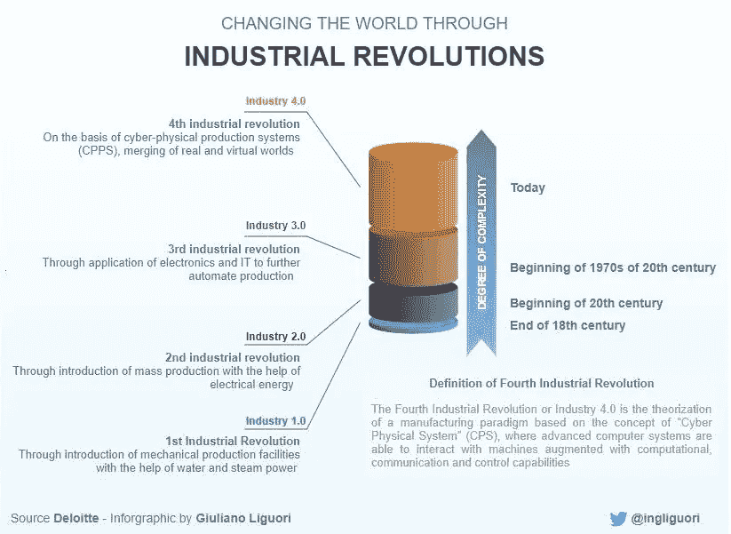
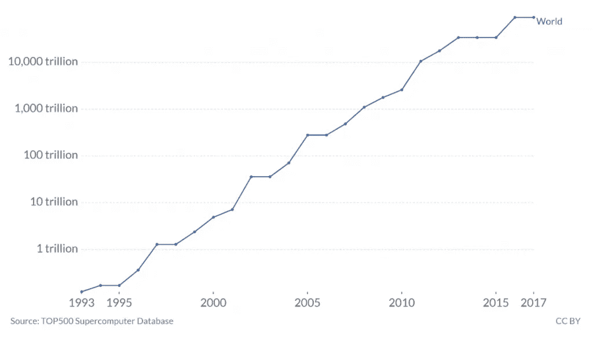
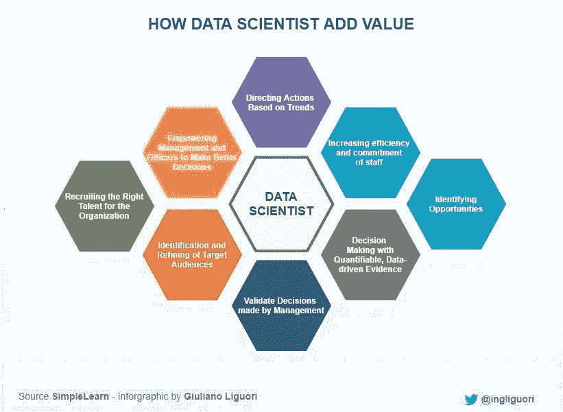
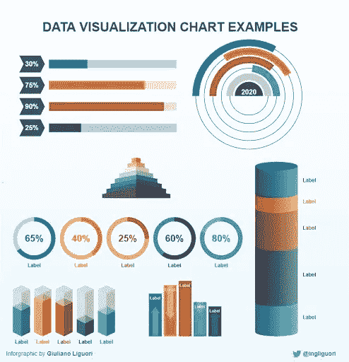
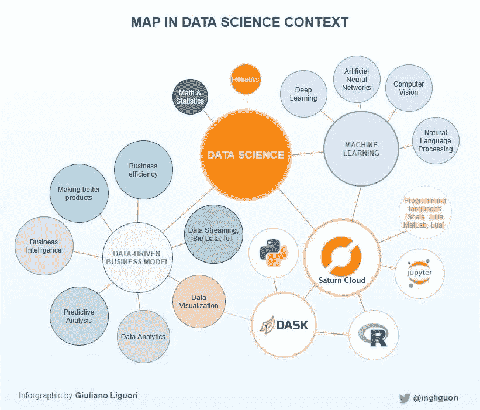
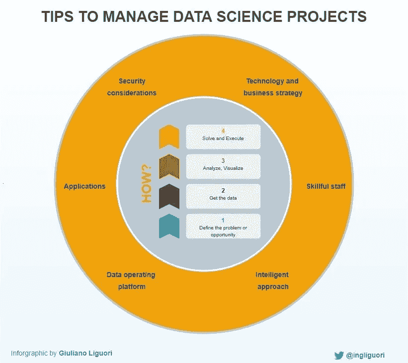

# 数据科学如何推动数字化转型

> 原文：<https://medium.com/codex/how-data-science-is-driving-digital-transformation-now-59f9ea1c3793?source=collection_archive---------2----------------------->

克里斯·利维拉尼在 [Unsplash](https://unsplash.com?utm_source=medium&utm_medium=referral) 上的照片

*   简介:清晰的数字视觉
*   数字革命
*   数据科学:方法和解决方案
*   管理数据科学项目的技巧
*   摘要

**1。简介:清晰的数字视觉**

在一个竞争日益激烈的世界中，我们应该深入了解我们所经营的业务，它是如何发展的，以及我们可以接受或构建的新创新，以保持竞争力并征服新的细分市场。要做到这一点，我们必须能够制定一个清晰的转型愿景，将我们带到另一个绩效水平。

通过拥抱数字化转型，我们将处理人工智能、机器和深度学习、虚拟现实以及许多其他创新技术。乍一看，将企业引向如此复杂和错综复杂的方向，听起来甚至有些可怕。考虑到这一点，我们将考虑一些策略，以更好地理解和利用当前数字革命时代的巨大数据流的竞争优势。

**2。数字革命**

如今，世界越来越充满了先进技术带来的新的可能性。我们的社会已经充满了人工智能、物联网、机器人、无人机、机器学习能力、增强现实等令人难以置信的能力。在过去的几十年里，数字化和新技术一直在摇摆，人类面临着第四次工业革命的时代。第四次工业革命，或称工业 4.0，是基于“网络物理系统”(CPS)概念的制造范式的理论化，其中先进的计算机系统可以与增强了计算、通信和控制能力的机器进行交互。

**图 1** —通过工业革命改变世界

让我们快速了解一下数字化的进展。我们如何理解它？一个想法是使用翻牌的概念。FLOPS 是浮点运算的每秒计算量。对于非常大或非常小的实数或需要大动态范围的计算，需要浮点运算。因此，这是一个比每秒指令数更精确的度量。

**图 2** —计算能力增长 **(** [**来源**](https://ourworldindata.org/technological-progress) **)**

随着计算能力的不断提高和处理更高的复杂性，计算机能够运行考虑到人脑特征的应用程序。最近关于智能流程自动化的研究表明，实施数字自动化可以将转型项目的成功率提高 70%。例如，使用机器人流程自动化(RPA)可以帮助组织获得高达 4 倍的 ROI(投资回报)，有意识地有效采用 AI 可以将业务生产率提高高达 40%。

> 也阅读[在你的人工智能策略中包含模型操作](https://towardsdatascience.com/dont-let-tooling-and-management-approaches-stifle-your-ai-innovation-5fcee5ec8b2f)

为了保持竞争力，现代公司必须跟上数字革命的步伐，开发这些智能技术的用途，并将它们集成到企业数字网络中。产生的大量数据可以被处理并转换成战略信息，从而有利于生产和商业。

但是，如何将收集到的原始数据转化为有价值的商业信息呢？

当预测分析被认为对商业目的很重要时，跨学科领域的人员必须使用科学方法、流程、算法和系统从结构化和非结构化数据中提取知识和见解。我们称这个领域为数据科学，它与数据挖掘和大数据相关。数据科学家负责从数据中提取、处理和生成预测。

这里会出现一个问题:为什么企业应该利用数据科学家？数据处理和分析有着巨大的价值——这也是数据科学家成为焦点的地方。为公司增加实际价值的一个例子是创建预测模型，将所有相关领域的数据结合起来。通过这种方式，数据科学家知道如何从千兆字节的数据中获得可操作的洞察力，从而释放其推动商业价值的力量。

**图 3** —数据科学家如何创造价值

**3。数据科学:方法和解决方案**

数据的复杂性和为企业寻找有意义的解决方案产生了对数据可视化的需求。正确实现算法的可视化让我们能够更快地吸收信息，提高洞察力，理解适当的下一步，保持观众的兴趣和许多其他优势。

**图 4**-数据可视化图表

数据科学家需要有效地管理他们的项目，以获得更高的产出和更快的结果。在调查过程中，他们可能会使用 Python 或 R 等工具来开发算法，探索数据并制作图表，或者使用其他一些数据可视化应用程序。像 [Jupyter Notebooks](https://www.saturncloud.io/s/jupyter-notebooks-cloud/?utm_source=Blog&utm_medium=digitaltransformation) 这样的软件应用程序允许数据清理和转换、数值模拟、统计建模、数据可视化、机器学习等等。像 Julia 这样的软件是专门为快速实现作为大多数数据科学基础的基本数学而设计的，如矩阵表达式和线性代数。然而，在本地机器上处理大型数据集可能会导致最简单的机器学习任务的机器过热。**解决这个问题的一个好方法是将工作转移到基于云的数据科学企业平台。这为数据科学家提供了做他们想做的一切事情的工具:无缝协作、轻松扩展的计算资源和简单的分析。土星云是可用的最佳解决方案之一，它由** [**AWS**](https://aws.amazon.com/marketplace/pp/Saturn-Cloud-Saturn-Cloud/B081KB4JLJ) **高可用性基础架构提供支持。**

土星云允许数据科学家使用云中的 Jupyter 笔记本来部署、管理和扩展 PyData 堆栈。这个基础设施被优化以支持 DASK，DASK 是 Python 中一个灵活的分布式并行计算库。它提供了更自然地扩展 Pandas、Scikit-Learn 和 Numpy 工作流的方法，只需最少的重写。许多数据科学家非常欣赏 DASK，因为它是一个非常通用的工具，可以处理各种工作负载。

**图 5**-数据科学背景下的思维导图

> 另请阅读[不要让工具和管理方法扼杀你的人工智能创新](https://towardsdatascience.com/dont-let-tooling-and-management-approaches-stifle-your-ai-innovation-5fcee5ec8b2f)

**4。管理数据科学项目的技巧**

让我们来看看一些有助于我们更好地处理数据科学计划的好技巧。

**图 6** —管理数据科学项目的技巧

> 也可以阅读[安全可靠的人工智能模型操作](/codex/model-operations-for-secure-and-reliable-ai-2cf0ced9945b)

**技术和业务战略**

企业在实施现代创新技术时会获得某些优势。但是，技术的实施和使用必须反映企业的战略愿景。显而易见，公司必须清楚地认识到他们试图通过技术实现的目标，以确保积极的结果。

**巧手**

很明显，进入这个新的数字化时代将为我们带来新的工作，数字化转型需要全新的技能组合。因此，公司应该努力培训现有员工掌握这些技能和/或招聘具有不同能力的新人。

**智能方法**

我们需要通过将我们的智慧集中在进一步的创新和数据驱动的决策制定上来尝试改进我们的方法，这可以给我们带来强大的优势。我们必须开发基于新商业智能的预测模型，这需要人类和人工智能的正确结合。

**数据操作平台**

数据处理和存储应该基于云。众所周知，企业在转向云后会看到性能和安全性的提高。土星云是最具适应性的基于云的数据科学平台之一。数据科学团队以及选择了基于云的平台的企业不需要在基础架构的管理上花费时间，而是可以从轻松扩展的计算资源中受益。

**应用**

数据科学涵盖的领域非常广泛，因此它的应用数不胜数。银行、交通、电子商务、医疗保健和许多其他行业都在使用数据科学来改善他们的产品和服务。通过选择正确的平台，我们可以尽可能提高数据科学项目的效率。例如，像 DASK 这样的平台为数据科学家提供了构建可处理大规模数据集的可扩展项目的工具，使他们远远领先于竞争对手。

**安全注意事项**

考虑到挑战和风险，我们需要对网络安全和数据保护进行一些考虑，当企业决定迁移到云时，这些仍然是 CISOs 的主要关注点。

对于 CISO 来说，信息安全和隐私是最重要的，尽管从数据科学家的角度来看，安全意味着自动化版本控制，以便您永远不会忘记提交。事实上，管理数据版本和代码版本的能力确保了科学的可重复性。

> 也请阅读[ModelOps 如何帮助你执行你的人工智能策略](/codex/how-modelops-helps-you-execute-your-ai-strategy-a8c007d49623)

**5。总结**

任何组织都可以创新，快速交付，并参与每个新的风险投资。只要企业接受并受益于数字时代的机遇，推动快速实施就变得越来越容易。每天都有各种可能性、工具和强大的创新技术涌现出来，组织需要基于正确的数据驱动型业务模式来抓住商机。

数据驱动的决策制定更加有效和现实，因为决策是基于实际信息而不是假设。数据可视化的一个重要方面是，它不仅考虑过去的数据，还基于各种整体因素预测未来。

因此，数据科学必须是任何数字化转型工作的基本组成部分。

**关注我的每日技术和创新更新**

https://bit.ly/m/ingliguori