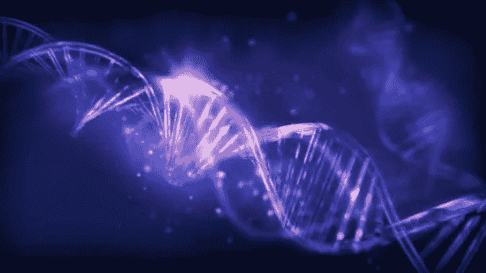

# 数据科学和机器学习如何在基因组学中发挥作用？

> 原文：<https://medium.com/codex/how-data-science-machine-learning-can-play-a-role-in-genomics-393551465ddd?source=collection_archive---------3----------------------->

从 iStock.com 回来的

大多数数据爱好者都知道或有一些关于什么是数据科学和机器学习的想法，但我们许多人对我们周围的各种数据以及我们可以在数据科学和机器学习的帮助下解决的各种问题没有深刻的想法。今天，我要谈一点生物数据和基因组数据科学，给那些想开始这一领域之旅的人一些介绍性的想法。

**基因组数据科学**面向那些对学习如何分析生物数据感兴趣并希望为直接改善生活的领域做出贡献的数据科学家。它在现实生活中有多种应用，可以用来准确预测疾病，发现治疗病人的新药，分析我们肠道中的细菌等。

为了更好的理解，让我们先简单定义一下**基因组**的真正含义。一个**基因组**是一个有机体的 DNA 或遗传物质，它包含了构建这个有机体所需的所有信息。另一方面，一个相关的行话，**基因组学**是研究**基因组** 和现代基因组学技术，如产生大量基因组数据的高通量 DNA 测序技术。

**基因组数据科学**是指一个多学科领域，它使用统计学和**数据科学**的工具来分析和解释现代基因组技术产生的数据。由这些技术产生的数据通常被称为多组学数据，可以包括关于 DNA、RNA、蛋白质、外遗传修饰和代谢物等的信息。**基因组数据科学**让我们能够更好地理解生物系统，并利用基因组技术来造福科学、医学、社会和整个经济。

**基因组数据科学**中的另一个重要术语是**生物信息学**。它是一个多学科领域，利用计算机编程、机器学习、算法、统计和其他工具来分析大量数据。生物学中有一些主要领域会产生大量的数据，如— **基因组学**、**转录组学**、**蛋白质组学**、**代谢组学**。**转录组学**是对基因组产生的核糖核酸或 RNA 的研究。蛋白质组学是对蛋白质的研究，蛋白质执行细胞活动并调节身体器官。最后，代谢组学是对代谢物的研究，代谢物是细胞内的小分子。

现在，让我们看看机器学习如何通过解决现实的生物学问题在这里发挥关键作用。机器学习的主要功能是开发适用于特定问题的计算机算法，并通过经验学习进行改进。体验式学习需要持续的数据供应。更多的数据可以确保机器学习模型或人工智能从数据中发现更多隐藏的模式，并能够更准确和精确地预测未来。目前，基因组数据非常丰富，数据不再是问题。据估计，在未来十年内，基因组学研究将产生大约 2-40 艾字节的数据。生物技术的出现，如 DNA 测序，继续促使这些数据集变得更加复杂。

人工智能和机器学习在基因组学中的一些应用如下—

1.  通过分析人脸图像数据准确识别遗传病。
2.  使用机器学习技术从液体活检中识别原发性癌症。
3.  预测和提供关于某些类型的癌症将如何在患者体内发展的有用见解。
4.  通过区分样本和良性变异，使用机器学习来识别致病的基因组变异。
5.  使用深度学习改进基因编辑工具的功能，如— CRISPR。
6.  利用 AI/ML 预测流感病毒和新型冠状病毒病毒基因组的未来变异。

对于那些想开始从事生物数据工作的人来说，两个主要的研究领域是——**生物信息学** & **计算生物学。计算生物学**使用计算机科学、数学和统计学来分析少量数据，而生物信息学处理大量数据，并使用机器学习和人工智能，而不是计算生物学。如果你想成为一名生物信息学家，这比成为一名计算生物学家需要更多的编码和技术技能。生物信息学中最常用的编程语言是——Python、Perl、R、C 和 C++。

今天到此为止。我希望这篇文章对希望从基因组数据科学、生物信息学和计算生物学开始的爱好者有所帮助。

如果你喜欢我的文章，请发来掌声，这鼓励我写更多，并将传播我的话。非常感谢你的阅读。下次博客再见。到那时，再见:)