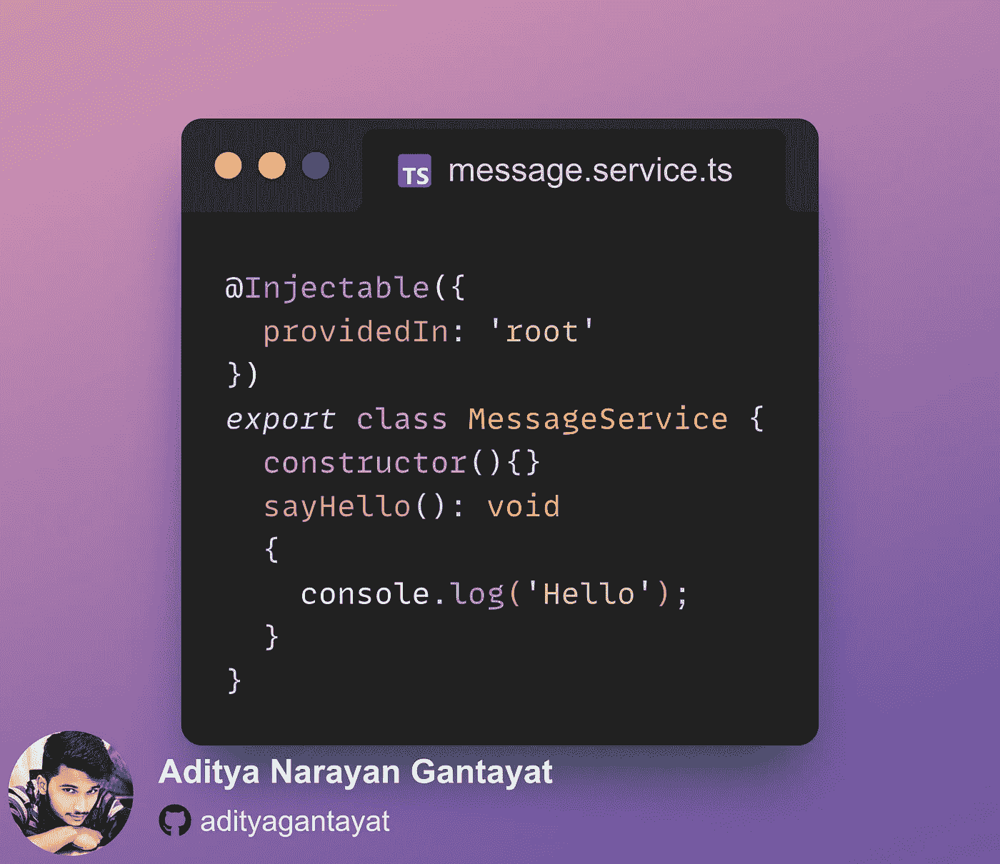
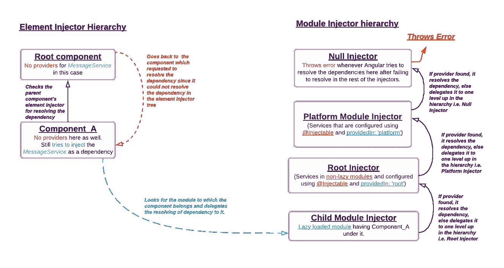

# Angular 中的依赖注入是如何工作的？

> 原文：<https://medium.com/codex/how-dependency-injection-works-in-angular-1773110a60a4?source=collection_archive---------8----------------------->

在我们的编码之旅中的某个时刻，我们都使用过依赖注入，而不考虑技术栈。但是用它的理由是什么呢？

想象一下，每当我们需要访问一个类时，就实例化它！可怕，是的！我们使用 DI 来避免类之间的硬依赖。

在组件的构造函数中注入 MessageService 实例

依赖注入确保组件不会自己创建服务类的实例，而是将*实例化过程*委托给*注入器，后者负责创建相应类的实例并将其注入构造器。*

## *注入器如何解析依赖关系？*

*注射器基本上有一个*注册表*，所有的实例都在这里被创建*(通常当我们在类之前使用****@ Injectable****注释)*并存储。*

**

*使用**提供的 **@Injectable** decorator 的**属性来确保这个服务类可以在任何需要的地方作为依赖项注入。*

*每当组件*(上例中的****Component _ A****)*被执行时，它会解析对现有实例的依赖，而不是创建一个新实例。在编译期间，如果在 *@NgModule* 的 *providers 数组*中没有提到该类，或者该类没有使用 *@Injectable* decorator 的 providedIn 属性进行配置，就会发生这种情况；它将抛出一个错误，指出它无法解析依赖关系。*

*这就引出了一个问题,“根”是干什么的？对吗？*

*为此，让我们了解注入器层次结构和解析规则:*

**

*解决依赖关系的注入层次结构*

*正如我们在图中看到的，有两种层次结构:元素注入器层次结构和模块注入器层次结构。*

**

*组件有自己的提供者数组来解决依赖关系*

*先说元素注入器层次！适用于用***@指令*** 和***@组件***decorator 声明的类。在这种情况下，依赖关系是在元素注入器树本身中**解析的，即在 ComponentA 本身中。***

**但是，如果有* ***没有提供者数组*** *里面提到的组件呢？**

*正如我们从上面的注入树图中看到的，如果它不能解析组件内部的依赖关系，那么它会请求元素注入树*(本例中是根组件)*中的父组件来解析它。如果 providers 数组中提供了该类，它将解析依赖关系并返回到*组件*。*

**但是如果根组件也没有 providers 数组呢？**

*它返回到请求解析依赖关系的*组件 A* ，因为它在元素注入器树中没有被解析，结果是搜索在其中声明了*组件 A* 的模块。*

*现在来看**模块的作用*注射器树*注射器树**。*

*由于 ***子模块*** 是惰性加载的，并且在其作用域中声明了 *ComponentA* ，因此它被委托负责解析依赖关系。如果 Angular 能在*子模块*中找到依赖项的提供者，它会在*组件*中注入依赖项。但是如果没有找到，它会进一步将解析委托给 ***根模块注入器*** 。然后同样的过程发生，如果没有找到提供者，它被进一步委托给 ***平台模块注入器*** ，然后最后是 ***空注入器*** ，最终 ***在 Angular 试图解决依赖关系时抛出错误*** 。*

*简化了吧？*

*本文灵感来自 Youtube 上的[解码前端](https://www.youtube.com/c/DecodedFrontend)频道。*

*我真的很想让你对这篇文章鼓掌。不要委托给下一位读者，好吗？无红利*