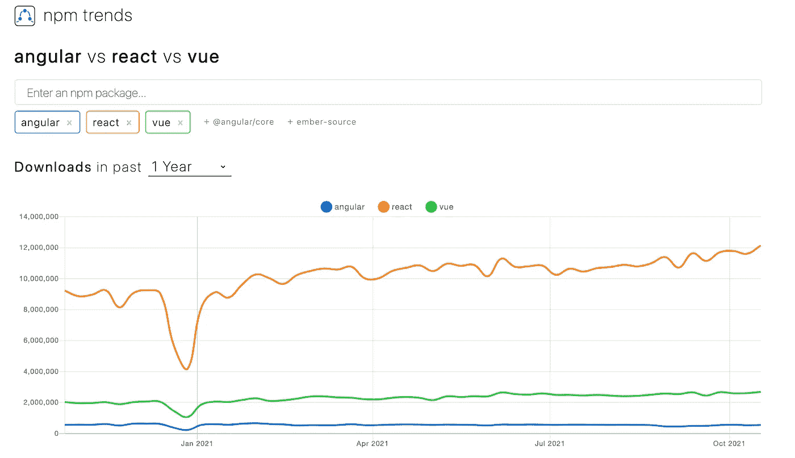

# 开发人员如何利用 NPM 趋势选择 JavaScript 依赖项

> 原文：<https://medium.com/codex/how-developers-use-npm-trends-to-select-javascript-dependencies-c23a1a1f8f89?source=collection_archive---------1----------------------->

约翰·波特开发的 npm 趋势为谷歌趋势创建了同样的图表，但是是针对 NPM 包的。(图片来源:皮埃尔·德博伊斯截图)

如今，规划一个应用程序如何工作让人感觉很混乱，尤其是使用 NPM——安装 Node 的包管理器。Js 模块。NPM 是世界上最大的框架生态系统，支持各种 JavaScript 框架，从 Vue.js 到 D3.js。因此，寻找正确的依赖关系成为一个挑战。