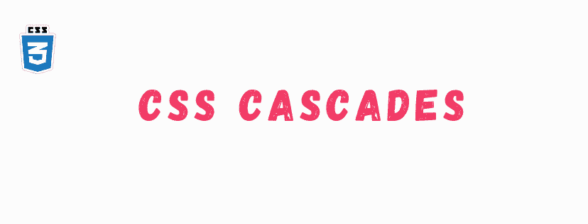
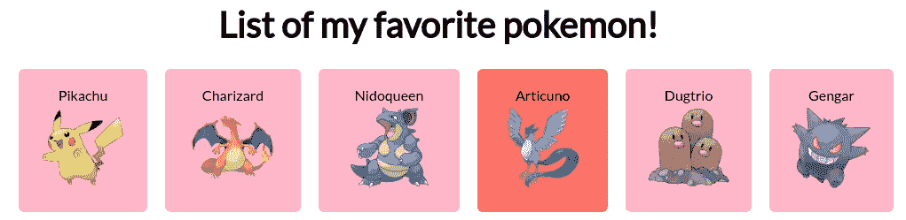
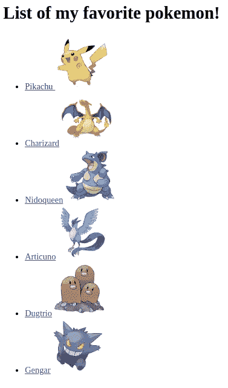

# CSS 级联是如何工作的？杜克编年史

> 原文：<https://medium.com/codex/how-do-css-cascades-work-the-dukh-chronicles-be1d6f47f4c5?source=collection_archive---------8----------------------->



这篇文章的主题是 CSS 级联。欢迎光临！

我们需要知道不同的 CSS 规则是如何应用到元素上的，这样我们才能写出干净的结构化风格。我们需要知道如何真正地向具有普通类或 id 的元素，或者可能是其他元素的子元素的元素添加样式。这通常很简单，我们只需创建一个简单的选择器，样式规则就会自动完成工作。但是，当我们为较重的应用程序编写样式时，代码的复杂性会相应增加。在这种情况下，我们可能会遇到一些规则相互冲突的情况，我们需要预测某些规则集将如何表现，以及如何编写规则以创建可能的最佳样式表。

知道 ***级联*** 在那种情况下可能会派上用场。

# 创造一些结构

我们将通过构建一个由我最喜欢的口袋妖怪组成的简单卡片视图来学习级联:



我最喜欢的口袋妖怪列表

首先，我们将创建一个简单的 HTML 结构和一个附带的样式表。我们将在 codepen 中这样做，以减少编写完整 HTML 文档和将样式表链接到 id 的配置时间。(是的，我们最多可以节省 5 秒钟😀 ).我们的代码如下所示:

```
<div class="favorite-pokemon-container">
  <h1 id="main-title" class="title">List of my favorite pokemon!</h1>
  <ul id="main-list" class="list">
    <li>
      <a href="https://www.pokemon.com/us/pokedex/pikachu"
        >Pikachu
        </a>
    </li>
    <li>
      <a href="https://assets.pokemon.com/assets/cms2/img/pokedex/full/006.png"
        >Charizard</a>
    </li>
    <li>
      <a href="https://assets.pokemon.com/assets/cms2/img/pokedex/full/031.png"
        >Nidoqueen</a>
    </li>
    <li>
      <a
        class="rare"
        href="https://assets.pokemon.com/assets/cms2/img/pokedex/full/144.png"
        >Articuno</a>
    </li>
    <li>
      <a href="https://assets.pokemon.com/assets/cms2/img/pokedex/full/051.png"
        >Dugtrio</a>
    </li>
    <li>
      <a href="https://assets.pokemon.com/assets/cms2/img/pokedex/full/094.png"
        >Gengar</a>
    </li>
  </ul>
</div>
```



基本结构

当两个或多个规则针对页面上的同一个元素时，就会产生冲突。我们将展示这是如何可能的。我们将针对标题，改变其风格。如果我们仔细观察，会发现我们可以用几种不同的方法来定位标题，下面列出了一些方法:

```
h1 {
  color: red; /* tag */
}

#main-title {
  color: blue; /* id */
}

.title {
  color: black; /* class */
}
```

所有这三个规则都针对同一个元素，并且所有这些规则都试图改变标题文本的颜色。

浏览器适用哪种风格？浏览器遵循一组规则来确定将应用哪个规则集。在我们的例子中，根据 CSS 规则，使用 ID 声明符的第二个声明将获胜，标题的颜色为蓝色。我们称这套规则为**级联**。级联将决定如何解决不同的冲突，这是 CSS 脚本语言的基础之一。级联经常被误解，许多开发人员对它有疑问(我们中有多少人使用和误用了操作符仅仅是因为？)

# 级联如何解决冲突？

当声明发生冲突时，级联需要考虑几个因素:

*   样式表的起源，或者说样式的来源。我们编写的样式与浏览器的默认样式一起应用
*   选择器的特异性，哪个选择器优先
*   源顺序—样式在样式表中声明的顺序

有了这些规则，浏览器可以在解决 CSS 中任何不明确的声明冲突时做出相应的行为。

# 基于起源的冲突

这些不太为人所知。基本上，每个浏览器都有自己的默认样式集，当没有其他样式适用时，浏览器会应用这些默认样式。这些被称为*浏览器*风格。它们通常比你的样式表优先级低(称为*作者*样式)，但是它们通常做基本的样式，它们样式化标题、段落、列表，给它们基本的浏览器外观(顶部和底部边距、左边距、链接的蓝色等等)。).

在我们的例子中，我们可以看到一些基本的*浏览器*样式——我们的列表应用了一个*list-style-type*disc 来生成这些项目符号。此外，链接是蓝色的，并带有下划线。标题有上边距和下边距。

这些可以简单地用我们自己的样式覆盖。考虑到它们不会做任何意想不到的事情，并且很容易被覆盖，它们实际上很容易解决，只需在样式表中设置自己的值。通过打开开发人员工具并查看 elements 部分，可以看到所有被覆盖的浏览器样式的列表。

## 的！重要操作员

除了 *browser 和 author*ruleset 之外，还有另一个操作符覆盖了样式表中的所有其他操作符。如果我们的样式有被标记为重要的声明，通过在声明的末尾添加`!important`，那么这些声明被视为*更高优先级的规则集*。按照偏好的顺序，它们出现在**之后**之前。这是一个简单的修复方法，它现在解决了这个问题，但是我们以后可能会遇到很多麻烦，特别是如果我们一直在多个声明中添加`!important`的话。我不会建议你反对它，但它的使用应该受到控制。

# 基于特殊性的冲突

如果冲突的声明不能根据它们的来源来解决，浏览器会尝试根据它们的特性来解决它们。特殊性通常分为两部分:HTML 中内嵌应用的样式和使用选择器应用的样式。

## 内嵌样式

如果我们使用 HTML 的 *style 属性来应用样式，那么这些声明只应用于该元素，并且它们会覆盖您可能拥有的任何其他声明。它们没有选择器*，因为它们直接应用于元素。例如，在我们的口袋妖怪列表中，我们有一个带有“稀有”链接的口袋妖怪。我们可以对特定的元素应用内联样式。

```
<li>
      <a
        class="rare"
        style="background-color: purple;"
        href="https://assets.pokemon.com/assets/cms2/img/pokedex/full/144.png"
        >Articuno</a>
    </li>
```

这仅将该元素的背景色设置为紫色。

可以覆盖内联声明的唯一方法是使用`!important`操作符，实际上将样式转移到更高优先级的原点。如果内联样式本身被标记为`!important`，那么实际上没有什么可以覆盖它们。因此，在样式表中而不是直接在 HTML 代码中改变我们的样式总是更好。我们将恢复这一变化，并做一些选择器的工作。

## 选择器样式

现在才是真正有趣的时候。当我们实际上谈论 CSS 级联时，我们大多只参考选择器特异性。例如，有两个类的选择器比只有一个类的选择器具有更高的特异性。

如果一个规则将背景颜色设置为橙色，而另一个具有更高特异性的规则将背景颜色设置为绿色，则应用绿色样式。怎么回事？如果我们试图用一个类选择器来覆盖我们的“稀有”元素…它不起作用！因为第一个选择器比第二个选择器更具体，所以它由一个 ID 和一个标记名组成，而第二个选择器只由一个类名组成。

```
#main-list .rare {
  background-color: salmon; /* this rule has an ID and it overrides the one below that consists of two classes */
}

.list .rate {
  background-color: grey;
}
```

为什么？因为 ID 选择器比类选择器具有更高的特异性，更准确地说，单个 ID 选择器比类选择器具有更高的特异性，而类选择器比标签选择器具有更高的特异性。

**ID >类>标签**

基本上，如果一个选择器有一个 ID，它会覆盖任何其他样式，如果它们有相同数量的 ID，那么拥有最多类的选择器获胜，否则，拥有最多标签的选择器获胜。例如，如果我们想再次选择标题，并改变其颜色，我们应该做一些类似于下面的清单。

```
html body div h1 {
  color: red; /* fifth most specific rule, consists of tags */
}

body .favorite-pokemon-container h1 {
  color: blue; /* fourth most specific rule, has a class */
}

.title {
  color: pink; /* third most specific rule, only one class */
}

.favorite-pokemon-container .title {
  color: skyblue; /* second most specific rule, having two classes */
}

#main-title {
  color: orange; /* most specific rule, only one ID */
}
```

这里最具体的选择器是最后一个，它只包含一个 ID，然后是包含两个类名的那个，然后是只有一个类名的那个，然后是前两个，由于所使用的类，第二个优先于第一个。

通常情况下，对您的风格没有影响的声明是由于更具体的规则覆盖了它。初级开发人员经常使用 id，它本身创建了非常高的特异性，使得以后很难覆盖它们。我们只能用一个更具体的 ID 来覆盖它们。让我们再回顾一下我们所学到的——id 总是比其他任何东西都更具体，更多的 id 比一个 id 更具体，当谈到具体性时，类在 id 之后，而标签最不具体。

在覆盖其他样式时编写声明的最佳实践是:创建具有更高特异性的规则集，以便它们覆盖现有的规则集(使用更具体的元素)，或者降低我们要覆盖的规则集的特异性，以便更容易用新的声明对其进行样式化。

# 源顺序冲突

这些是解决级联的第三步，也是最后一步。如果来源和特性相同，那么出现在样式表后面的声明优先于出现在它前面的声明。

我们可以通过直接管理样式表来轻松地操纵它。如果你创建了两个具有相同特异性的选择器，那么最后出现的将会胜出。

```
a.rare {
  color: pink;
}

.list a {
  color: blue;
}
```

## 伪样式

伪元素也应该遵循一定的结构，因为伪元素的源顺序影响级联。伪元素的正确顺序是，`:link`，`:visited`，`:hover`，`:active`。我们需要遵循这些规则，因为较新的样式可以覆盖较早的样式。如果用户悬停在链接上，悬停优先，但如果用户单击链接，则活动样式优先。

简单回顾一些最重要的提示，*不要在你的选择器中使用 id*和*不要使用* `*!important*`。IDs 可能会弄乱整个样式表的特性，而且几乎不需要重写重要的操作符。

这是我们的密码笔:

请查看[thedukh.com](http://thedukh.com)上的其他博文。更多 CSS 文章请点击下面的链接:

*原载于 2021 年 4 月 8 日 https://thedukh.com*[](https://thedukh.com/2021/04/how-does-css-cascading-work/)**。**