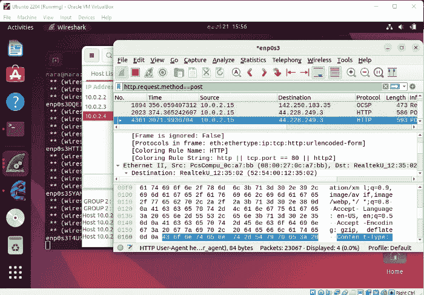
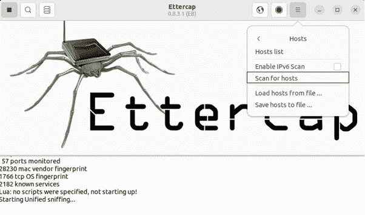

# 黑客是如何从 HTTP 网站盗取你的密码的？

> 原文：<https://medium.com/codex/how-do-hackers-steal-your-password-from-http-websites-ac5670629565?source=collection_archive---------10----------------------->

# 什么是 HTTP？

HTTP 代表超文本传输协议。它是一个应用层。该协议有助于在网络上传输超媒体文档，如 HTML。它用于在 web 服务器和客户端(web 浏览器)之间进行通信。HTTP 是一种无状态协议。

计算机通常使用一种称为 ARP(地址解析协议)的协议。

什么是 ARP(地址解析协议)？

ARP 用于将动态地址映射到 LAN(局域网)中的永久物理机器地址。物理机器地址被称为 MAC(媒体访问控制)地址。

ARP 是如何工作的？

当客户端需要浏览某个网站时，客户端会向网络广播一条消息，告诉网络谁拥有该网站，并询问网关 IP 地址。网络中的每个人都在听这条消息。然后网关用 MAC 地址响应客户端。然后，当你向网关发送消息时，网关会将该消息转发到你希望浏览的目的地。

响应接收网关接收响应并将响应发送给您。

# 什么是 ARP 中毒？

ARP 中毒是一种网络攻击。这滥用了广泛使用的 ARP 的弱点来扰乱、重定向或监视网络流量。

# ARP 中毒是如何工作的？

当客户端向网关请求 IP 地址时，攻击者正在发送一条消息，让客户端感觉攻击者就是网关，即攻击者操纵消息。现在，客户端忘记了原始网关，并开始与攻击者通信。客户端将流量转发给攻击者。攻击者读取流量，然后让请求转发到真正的目的地。在网络中间，攻击者处理所有请求和响应。我们可以称攻击者为中间人攻击。

ARP 中毒

例如:

要做这个演示，你需要做一些准备工作。

1.  macOS / Linux (Ubuntu/ Kali Linux..等等)

*   如果您无法找到上述资源，您可以在 windows 上使用 VM(虚拟箱)。使用虚拟机，你可以运行上述操作系统。

Oracle 虚拟机

虚拟机上的 Ubuntu

2.通常流量都是到电脑，电脑只是处理而已。所以我们必须转发流量。必须启用流量转发。

在 Ubuntu 中，我们可以使用这个命令-

*   $ sudo sysctl-w net . IP v4 . IP . forward = 1

在 macOS 中，我们可以使用这个命令-

*   % sudo sysctl-w net . inet . IP . forwarding = 1

3.在操作系统中设置 Ettercap。

在 Ubuntu 中，我们可以使用这个命令来安装 Ettercap -

*   $ sudo apt-get install etter cap-graphical

完成了几个步骤。出于教育目的，很容易将一台机器作为攻击者，而将其他机器作为受害者。

4.现在我们得找到受害者的 IP 地址。

不知道受害者 IP，可以攻击吗？

是的，出于教育目的，你可以攻击你的另一台机器，所以你必须找到 IP 地址来识别它。如果你不知道 IP 地址，你可以攻击整个网络。

使用 Ubuntu 终端查找 IP 地址

在 Ubuntu 中，我们可以使用这个命令来查找 IP 地址-

*   $ sudo ifconfig

5.查找 arp 缓存

在 Ubuntu 中，我们可以使用这个命令来查找 arp 缓存-

*   $ arp -a

6.开始攻击

打开 Ettercap

点击显示的按钮开始

添加到目标 1 →添加攻击者

添加到目标 2 →添加受害者

我们可以使用 Wireshark 检查真实的 arp 协商。

7.安装 Wireshark

第一步:

第二步

*   $ sudo 安装 wireshark

第三步

*   选择

第四步

运行 Wireshark→＄Wireshark

8.使用 Wireshark 捕获流量

这就是如何使用 Wireshark 捕获所有流量

9.使用 Ettercap 启动 arp 病毒

10.使用 POST 方法过滤流量以捕获哪些请求

11.使用测试目的站点从受害者的机器发送 POST 请求

用户名:Nisitha

密码:123456@

12.现在，您可以在 POST 请求中获取受害者的用户名和密码

我们如何防止这些类型的攻击？

当攻击者攻击受害者的机器时，不要发出任何警报或警告，因为它使用 HTTP。所以机器认为这是有效的网关。然后攻击者开始窃取你的数据。这很容易做到，因为所有的请求和响应都要经过中间人攻击。

为什么不是 HTTP？

*   你可能成为男人攻击的牺牲品
*   您可能成为通过路由器记录您的数据的受害者。
*   在你和目的地之间的任何地方，你都可能成为别人记录你的数据的受害者

解答—使用 HTTPS。浏览 HTTPS 网站。

谢谢大家！

参考资料:

1.  [https://youtu.be/zOgAxV3nBwI](https://youtu.be/zOgAxV3nBwI)
2.  [https://www . oreilly . com/library/view/learn-kali-Linux/9781789611809/6b1a 3181-5c 05-46cf-b32c-26 df 1 AE 54 e 00 . XHTML](https://www.oreilly.com/library/view/learn-kali-linux/9781789611809/6b1a3181-5c05-46cf-b32c-26df1ae54e00.xhtml)

下载 Oracle 虚拟机—[https://www.virtualbox.org/wiki/Downloads](https://www.virtualbox.org/wiki/Downloads)