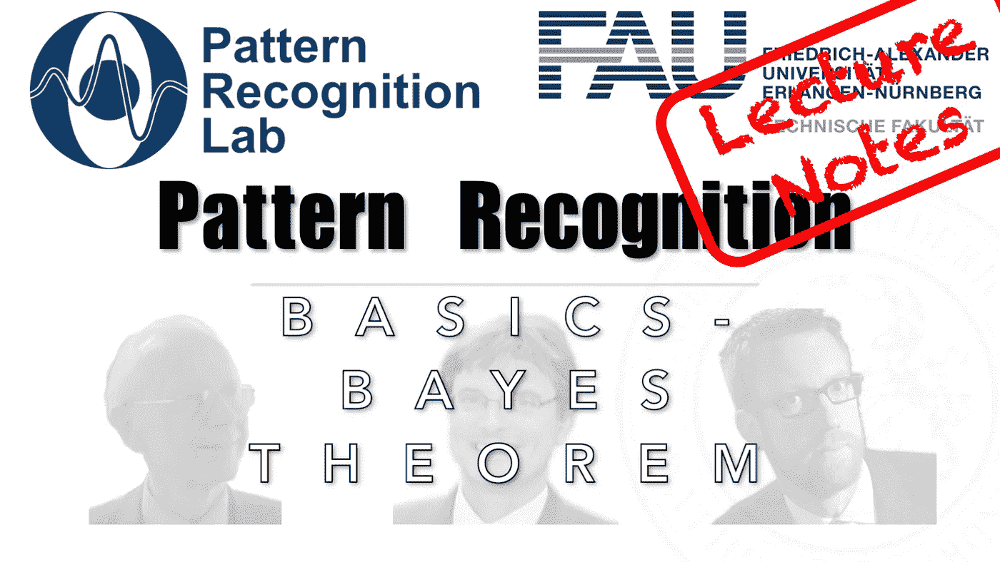

# 我如何计算我无法观察到的事物的概率？

> 原文：<https://medium.com/codex/how-do-i-compute-probabilities-for-things-that-i-cannot-observe-5503bde33ad9?source=collection_archive---------2----------------------->

## 模式识别中的 FAU 讲义

## 贝叶斯定理简介

来自[模式识别讲座](https://www.youtube.com/playlist?list=PLpOGQvPCDQzsWvT_bqmexrJ359RTQQuMO)的 [CC BY 4.0](https://creativecommons.org/licenses/by/4.0/) 下的图像。

**这些是 FAU 的 YouTube 讲座“** [**模式识别**](https://www.youtube.com/playlist?list=PLpOGQvPCDQzsWvT_bqmexrJ359RTQQuMO) **”的讲义。这是讲座视频&** [**配套幻灯片**](https://doi.org/10.5281/zenodo.4429576) **的完整抄本。幻灯片的来源可在** [**此处**](https://github.com/akmaier/pr-slides) **获得。我们希望…**