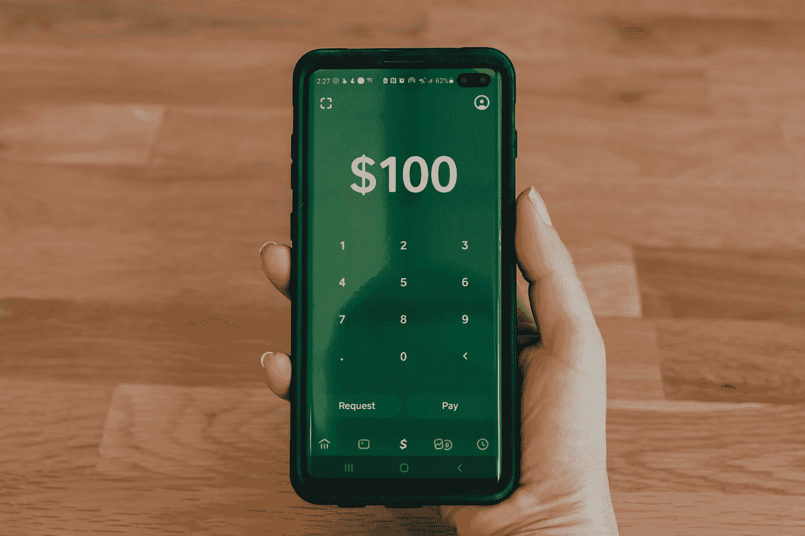

# “黑掉”Robinhood.com 的任何证券历史价格数据

> 原文：<https://medium.com/codex/how-do-i-hack-robinhood-com-to-download-any-securities-historical-price-info-programmatically-c61bc407bd65?source=collection_archive---------4----------------------->

[科技日报](https://unsplash.com/@techdailyca?utm_source=medium&utm_medium=referral)在 [Unsplash](https://unsplash.com?utm_source=medium&utm_medium=referral) 上拍摄的照片

在上一篇短文[用 Python 追踪 Dogecoin 实时价格](https://xhinker.medium.com/track-dogecoin-real-time-price-with-python-e09a1cae6b71)中，我利用 Python 的`requests`和`BeautifulSoup`包抓取 web HTML 来抓取实时 Dogecoin(或 Robinhood.com 中的任何其他 cryptos 交易)。

我持有的 Dogecoin 的数量就像硬币本身一样，是一个笑话。主要目的不是为了交易，而是弄脏手，看看如何…