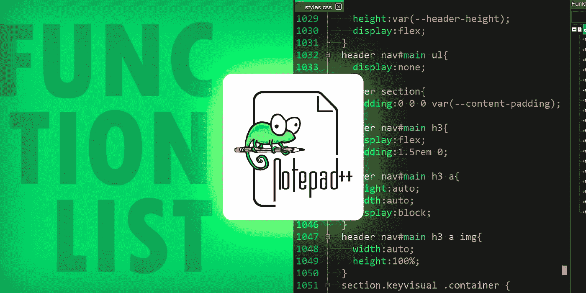
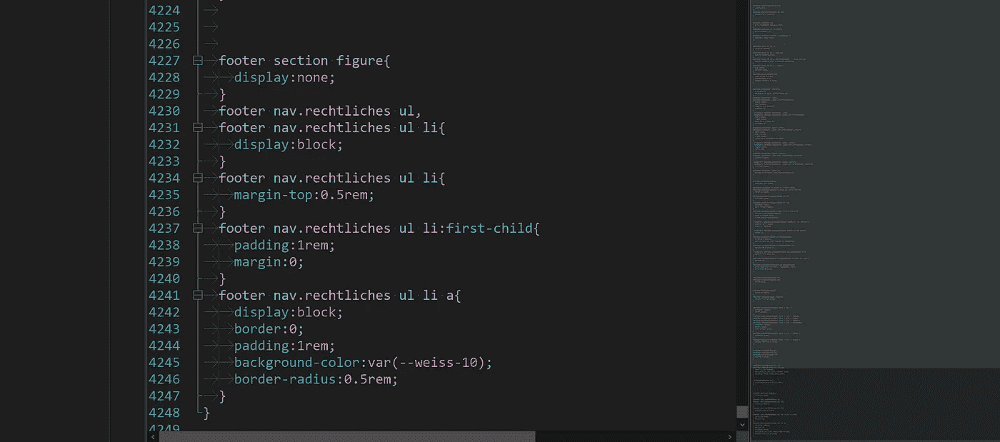
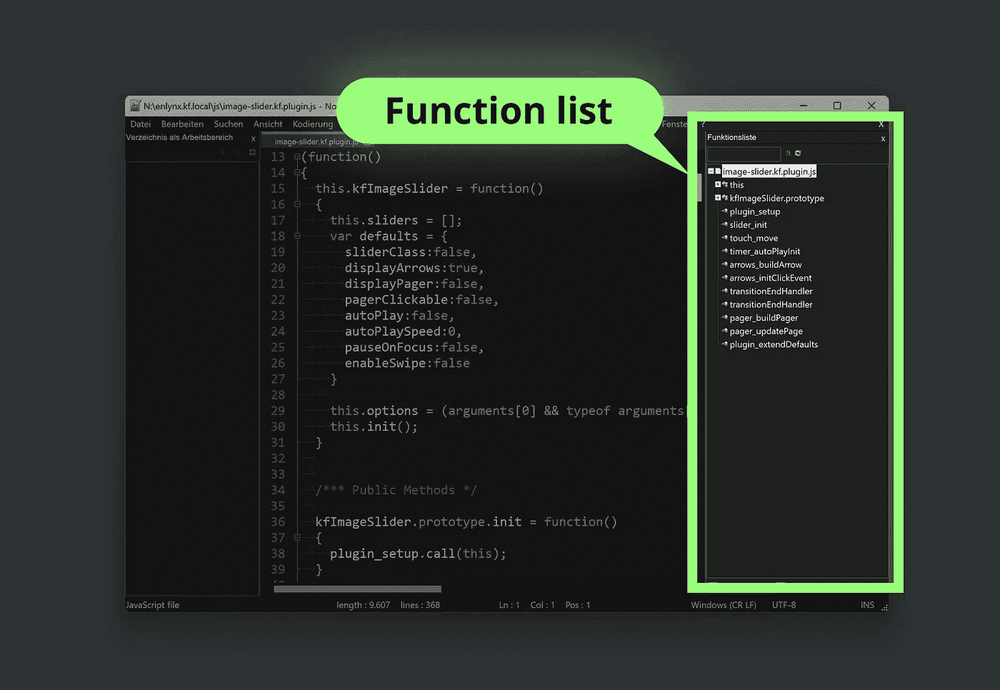
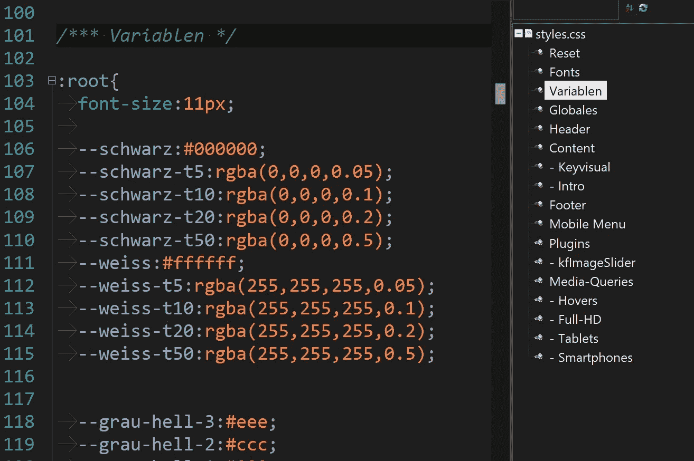
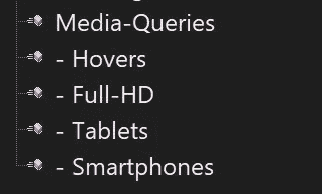

# 我如何用 Notepad++和函数列表跟踪大型 CSS 文件

> 原文：<https://medium.com/codex/how-do-i-keep-track-of-large-css-files-with-notepad-and-the-function-list-6b3ec567937d?source=collection_archive---------10----------------------->

## 本文展示了我如何配置 Notepad++并编写 CSS 代码来更快地在定义之间导航。



*大家都知道:*网站项目越来越大，CSS 文件越来越长。一些较大的项目通常有几千行样式定义。几个月后，保持概述、快速发现错误或编写补充内容变得越来越困难。



4000+行 CSS 文件截图。

# 多档策略？

处理大量代码的一种方法是将网站的 CSS 分成多个文件。然而，我尽量将 HTML 页面的文件链接保持在最低限度，这样 web 服务器就有更少的文件传送要做。理想情况下，每个 web 项目我只使用一个 CSS 文件。

所以多档策略对我不适用。

# 框架和预处理器？

我不是 CSS 框架的粉丝，因为它们有很多缺点，比如缺乏个性( *Bootstrap* ！)，缺乏概述和糟糕的语义( *Tailwind CSS* )和过大的文件大小(*语义 UI* ，~ 700+kb，说真的？).

[](/@stephan.romhart/semantics-how-i-structure-html-without-divitis-dd0d376f193) [## 我如何构建 HTML 以获得更好的搜索引擎优化结果

### 这篇文章展示了我如何使用语义 HTML 标签优化网站，为更好的机器准备内容…

medium.com](/@stephan.romhart/semantics-how-i-structure-html-without-divitis-dd0d376f193) 

同样，我也不使用像 *Sass* 或 *Less* 这样的 CSS 预处理器，因为我认为它们在 2021 年就过时了。

# 我目前的解决方案:Notepad++中的函数列表

在这个短片中，我演示了如何使用 Notepad++的函数列表在 CSS 文件中导航。

# 什么是函数列表？

在 Notepad++中，根据语言的不同，可以在函数列表面板中显示一个*函数*和*方法*的列表。双击一个元素后，Notepad++会滚动到文档中定义函数的相应行。



我使用这个行为，它实际上是为动作和方法设计的，来导航和跟踪我的 CSS 注释。

为了实现这一点，我编写了带有三个介绍性星号的 CSS 注释，然后将它们列在函数列表中:

```
/*** Appears in the functionlist */... /* Appears NOT in the functionlist */...
```

有了这个系统，我还可以编写没有出现在函数列表中的注释——它故意忽略了所有带有一个星号的注释。

这样我就可以注释掉那些还不清楚他们会留下来还是写内容注释的定义。

# 所需的 XML

为了使 Notepad++将该系统应用于函数列表，必须创建一个 XML 文档`css.xml`，并将其放入 Notepad++程序文件夹内的 *functionList* 文件夹中:

```
C:\Program Files (x86)\Notepad++\functionList
```

*注意:*因为我在我的大部分项目中使用德语，所以正则表达式`\xe4\xf6\xfc\xc4\xd6\xdc\xdf`包含德语元音(*)。对于纯英文项目，正则表达式中的这一部分是不需要的。*

**重启 Notepad++* 后，你的 CSS 文件的所有 CSS 三星号注释都应该作为跳转目标出现在函数列表中。*

**

*为 CSS 注释修改的工作函数列表的屏幕截图*

# *命名层次结构*

*通过巧妙地命名 CSS 注释，您可以创建一个清晰的层次结构，带来更多的定位。例如，您可以注释*媒体查询*来获得下面的跳转目标。通过使用`hyphen`缩进，你可以得到更多的视觉结构。*

**

# *结论*

*我知道很多人不喜欢用 Notepad++工作。它看起来不酷，GUI 感觉有点过时。*

*我尝试过使用 *Visual Studio 代码*，但是我发现自己在 Notepad++中工作时速度更快，错误更少。函数列表工作流帮助我跟踪我的代码——简化并加速了我的过程。*

*也许我的文章能帮到你。编码快乐！💻😎*

**

*我，在画素描。好的想法往往始于纸上。*

***感谢阅读。** 期待您的反馈。😍*

*请评论、书签或关注我，支持我的频道。*

*如果你心中有一个特定的主题，你会希望我写下来，让我在 twitter 上知道:[https://www.twitter.com/@stephan_romhart](https://www.twitter.com/@stephan_romhart)*