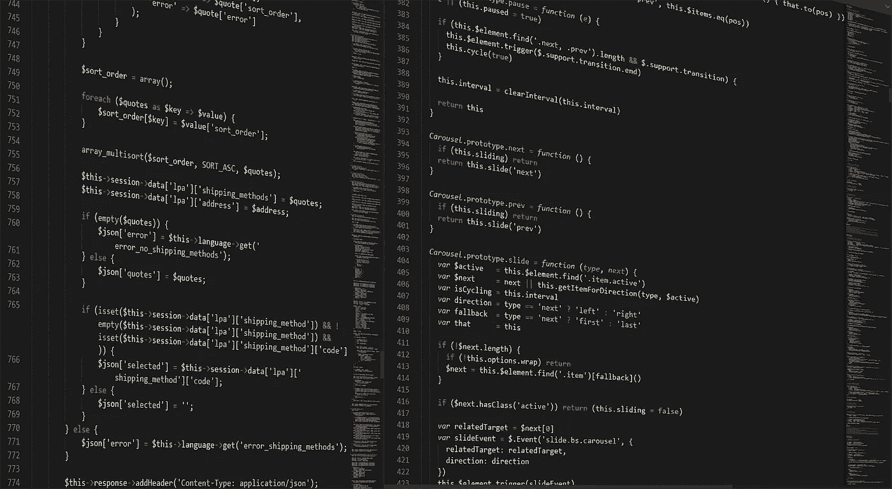
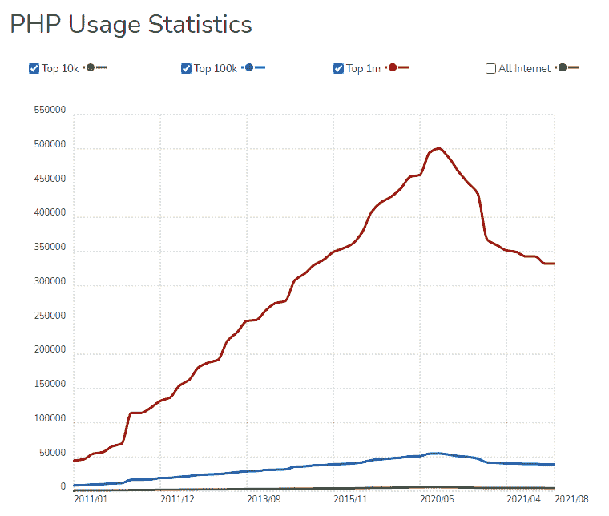

# PHP 开发者如何赋予一个网站生命？

> 原文：<https://medium.com/codex/how-do-php-developers-give-life-to-a-website-d1ea61e71124?source=collection_archive---------5----------------------->

在当今的技术世界中，企业可以使用大量的编程语言来构建网站和应用程序，包括 Python、Java、Kotlin、Swift、Node、C#、C 以及 C++、PHP 等。然而，大多数企业更喜欢[雇佣 PHP 开发人员](https://bootesnull.com/hire-developers/hire-php-developers/)进行 web 开发，因为它是一种开源且灵活的编码语言。此外，由于其功能性，PHP 比其他编程语言(如 JavaScript)更容易学习。因此，市场上对 PHP 开发人员的需求相当高。此外，根据使用统计， [PHP 在所有网站中的使用率约为 78.4%](https://w3techs.com/technologies/details/pl-php) 。简单地说，10 个网站中有 8 个是用 PHP 建立的。

# 为什么 PHP 仍然是 Web 开发的热门？

PHP ( *超文本预处理器*)是一种通用脚本语言，用于开发动态、交互式网站。此外，它是第一种嵌入 HTML 的服务器端语言。简单地说，在不调用外部数据的情况下，很容易向网页添加功能。

此外，PHP 在市场上出现已经超过 25 年了，但这种编程语言的魅力仍然通过定期升级、令人难以置信的特性和新功能继续打动着 web 开发行业和程序员。尽管 PHP 的排名明显下滑，但它仍然被全球 80%的网站使用，包括像 WordPress 和脸书这样的主要平台。

PHP 使用统计

来源: [trends.builtwith](https://trends.builtwith.com/framework/PHP)

# **PHP 的核心特性**

探索 PHP 的核心特性:-

1.  **性能** —执行 PHP 脚本比用其他语言编写的脚本要快得多，比如 JSP 和 ASP。由于 PHP 使用自己的内存，服务器工作负载和加载时间会自动相应减少，从而提高处理速度。
2.  **开源** —使用 PHP 的源代码和软件是免费的。它的所有组件都是免费下载和使用的，你可以根据自己的需要进行定制。
3.  **熟悉代码语法** — PHP 的语法很容易理解，所以程序员使用起来感觉很舒服。
4.  **嵌入式** —可以在 [HTML 标签](https://atulhost.com/wordpress-vs-html)和脚本中嵌入 PHP 代码。
5.  **独立平台** —在一个操作系统中开发的 PHP 应用程序也可以很容易地在另一个操作系统中执行。PHP 可用于 Windows、Mac、Linux 和 UNIX 操作系统。
6.  **数据库支持**——在 PHP 中，支持大多数主流数据库，包括 MySQL、SQLite 和 ODBC。
7.  **错误报告** —在运行时，如果遇到错误，PHP 会自动生成错误通知或警告。
8.  松散类型语言 — PHP 允许使用无数据类型变量。数据类型将在执行时根据变量包含的数据自动获取。
9.  **Web 服务器支持** — PHP 运行在几乎所有的本地服务器上，包括 Apache、Netscape、Microsoft IIS 等。
10.  **安全性** —为了保护网站免受威胁和恶意攻击，PHP 是一种安全的开发语言。它包含多层安全性。
11.  **控件** —与其他编程语言不同，PHP 只需要几行代码就可以完成同样的任务。它也让你对你的网站有很大的控制权，因为你可以在任何你想要的时候进行简单的修改。
12.  **社区** —一些大型社区提供文档、教程、在线帮助和常见问题解答。这是一个显著的好处，因为它使学习 PHP 变得更容易。

# **PHP 使用的主要优势**

对于 web 开发，PHP 是常用的。此外，PHP 能够轻松开发动态网站。此外，使用 PHP 进行 web 开发有很多好处。但是，其他的[编码语言](https://atulhost.com/tips-to-improve-your-career-as-a-programmer)和技术学习起来同样重要。

*   PHP 可以处理网站的动态内容、数据库以及会话跟踪。
*   通过 PHP，创建会话很容易。
*   PHP 访问 cookie 变量并设置 cookie。
*   PHP 对于加密数据和应用验证非常有用。
*   PHP 支持许多协议，例如 HTTP、POP3、SNMP、LDAP、IMAP 等等。
*   通过使用 PHP，很容易控制用户对网站某些页面的访问。
*   PHP 很容易安装和设置。
*   PHP 可以嵌入 HTML。
*   PHP 是一种面向对象的语言。
*   PHP 是一种开源脚本语言。
*   PHP 是一种简单易学的语言。
*   PHP 不需要任何编译。
*   PHP 比其他脚本语言更快
*   使用 PHP，可以通过表单从用户那里收集信息，保存在数据库中，并将有用的数据返回给用户。

# 用 PHP 建立网站的好处

自从 PHP 进入这个行业以来，它是最通用的编码语言之一。凭借其卓越的特性、各种扩展功能的插件以及出色的在线社区支持，PHP 已经成为新培训的开发人员以及全球知名机构的长期最爱。

# **用 PHP 进行 Web 开发的主要好处**

*   PHP 开发人员可以使用框架更容易地扩展系统。
*   MVC 模式保证了快速开发。
*   框架使 web 应用程序更容易保护自己免受常见威胁。
*   一个叫做“不要重复自己”的原则优化了代码，使复杂性最小化。

# **PHP 与其他编码语言的比较**

即使是最有经验的 web 开发人员在数百种选择中选择最佳编程语言时也会感到头晕。然而，每个 PHP 开发人员都很清楚 PHP 因其简单灵活的特性而广受欢迎。

除了简单、易学、快速之外，PHP 还提供了许多优于其他复杂编程语言的优势。PHP 是一种开源语言，这使得 web 开发更具生产力和交互性。

## **PHP Vs React**

React 基本上是一个 JavaScript 库，用于构建 UI(用户界面)。它由脸书、Instagram 和各种其他开发者和公司维护。这两种编程语言都非常受欢迎，但是当涉及到构建健壮和功能丰富的网站时，企业家们仍然更喜欢 PHP。为什么？PHP 在开发网站时有很多好处，它是比 React 更可靠的编程语言。

## **PHP Vs .Net**

的。NET framework 允许开发人员构建和运行 web、移动和基于 windows 的应用程序。与 PHP 相比，没有一种编码语言能像 PHP 那样高效、快速地运行。它在编译和执行代码时表现出很差的性能。因此，人们倾向于使用 PHP 而不是. Net。

# **结论注释**

最后，我们会说，这完全取决于您的需求，哪种技术、编程或编码语言是最好的。因为它是关于网站对最终用户的功能有多好，而不是用什么最新或先进的技术来建立网站。此外，一个企业的成功高度依赖于简单而健壮的网站，PHP 是实现这些要求的一个很好的资源。尽管如此，如果你对网站开发应该选择哪种编程语言有所怀疑，那就依靠最好的网络开发公司吧。